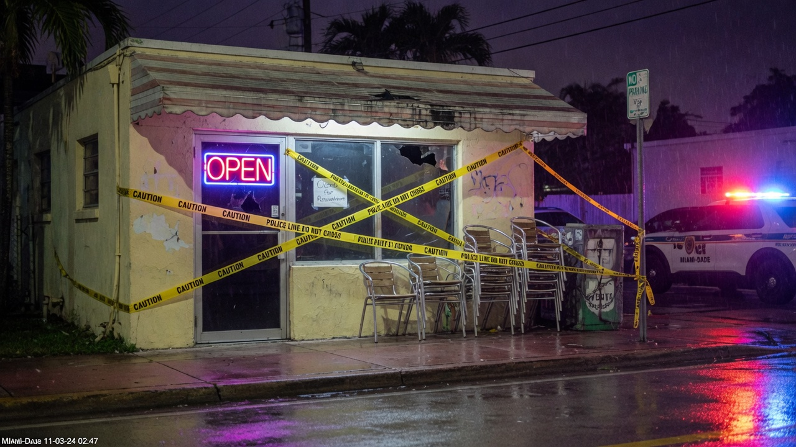
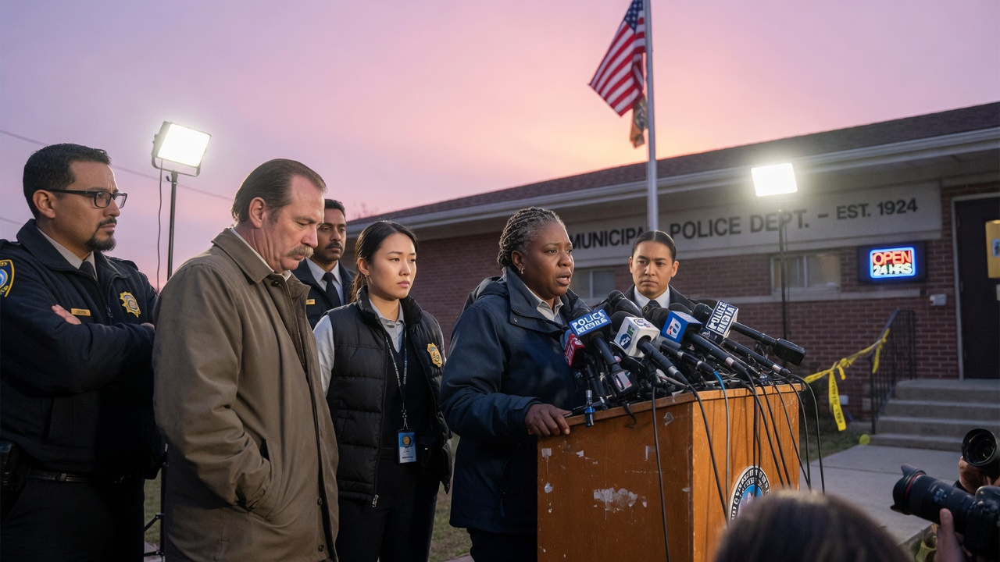
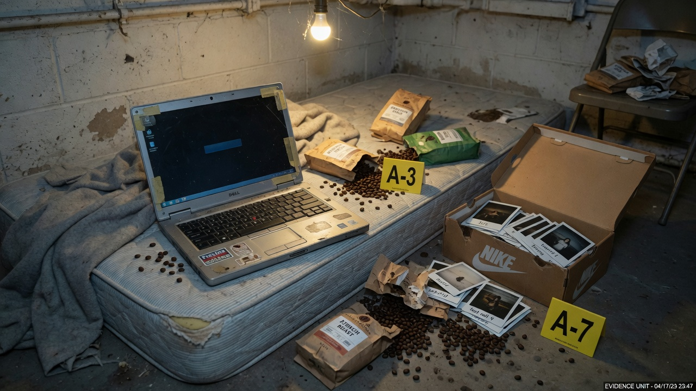

**Miami, FL** — In a chilling end to one of the most elusive manhunts in modern American history, authorities announced the arrest of 42-year-old Theodore “TeyTey” Harlan early Wednesday morning in a quiet suburb of Miami, Florida. Harlan, long suspected of being the notorious “Barista Butcher,” faces multiple counts of first-degree murder, kidnapping, and false imprisonment in connection with the disappearances and deaths of at least seven young women—all baristas at independent coffee shops across New York and, later, Florida.

The breakthrough came after a tip from a vigilant neighbor who grew suspicious of strange noises emanating from Harlan’s rented bungalow basement. Miami-Dade Police, acting on the anonymous call, executed a search warrant at 4 a.m., uncovering a macabre “apartment” fashioned from cinder blocks and duct tape, complete with a makeshift kitchenette, a single twin bed, and the mummified remains of three unidentified women hidden behind false wall panels.

> “It was like stepping into a nightmare,” said lead investigator Detective Maria Lopez during a press conference outside the station. “This wasn’t just a crime scene; it was a prison he’d built for his delusions.”

Harlan, a former IT consultant with no prior criminal record, earned his gruesome moniker from the precision of his abductions: Each victim was snatched in the early morning hours after closing shifts, lured or forced into unmarked vans parked near dimly lit coffee shops. Autopsies from earlier cases revealed that the women were held captive for weeks or months, subjected to psychological torment before being strangled and dismembered.

> “He didn’t just kill them,” Lopez added grimly. “He collected them, like trophies in his twisted gallery.”

What set Harlan apart—and ultimately aided in his identification—was his bizarre habit of narrating his crimes in the third person, as if starring in his own deranged autobiography. Detectives recovered a 147-page manifesto, typed on a battered laptop and titled *TeyTey’s Exes: A Love Story in Lattes and Loss*, stashed in a shoebox under his bed. The document, a stream-of-consciousness ramble blending unrequited romance with caffeinated poetry, painted Harlan’s victims not as strangers, but as a rotating cast of “ex-girlfriends” who’d “abandoned” him after failed dates at their workplaces.

Excerpts from the manifesto, released in redacted form by prosecutors, offer a haunting glimpse into Harlan’s fractured psyche:

> “TeyTey met Ex #4 at the corner roastery on Bleecker Street. She frothed the milk just right, with a smile that said ‘forever.’ But exes always leave, don’t they? TeyTey brought her home to the basement suite—cozy, with steamed windows from the espresso dreams. She stayed for 47 days, whispering break-up lines through the chains. TeyTey forgave her, in the end. One last pour-over, and peace.”

> “The pandemic came like a bad brew, too bitter, too cold. TeyTey packed the van with Ex #3’s Polaroids and drove south, where the sun steams the foam off everything. Florida’s baristas are spicier, with hips like Cuban sandwiches. Ex #5 tried to ghost TeyTey after shift drinks at the beach shack. Silly girl—ghosts don’t get to leave the haunt.”

Harlan’s trail first heated up in 2017, when the first two victims vanished from Brooklyn coffee houses within months of each other. DNA evidence linked him to a discarded coffee cup at one scene, but he slipped away like steam from a pour-over. Then, in March 2020, as COVID-19 lockdowns gripped New York, Harlan abruptly relocated to Florida—abandoning his cramped Astoria apartment and a part-time gig at a tech startup.

> “The move was our biggest blind spot,” admitted NYPD cold case detective Jamal Rivera. “With the world shut down, coffee shops shuttered, and travel records in chaos, his pattern just… evaporated. We chased ghosts for five years.”

Resurfacing in Miami under the alias “T.J. Harlan,” he blended into the city’s transient vibe, taking odd jobs as a delivery driver for local roasteries. It was there, investigators say, that he resumed his hunts, targeting women at spots like the trendy “Bean Dream” in Coconut Grove and “Latte Lagoon” in Key Biscayne. The latest victim, 24-year-old Sofia Ramirez, had been missing since October 15—her abandoned apron found in a dumpster behind her workplace.

Harlan offered no resistance during his arrest, reportedly smirking at officers as they cuffed him in his threadbare living room, surrounded by stacks of coffee bean bags and Polaroid prints. In custody, he continued his third-person soliloquies, telling interrogators, “TeyTey always knew the brew would bubble over eventually. Tell my exes I said hi.”

The case has sent shockwaves through the barista community, prompting nationwide safety alerts from the Specialty Coffee Association.

> “These women were the heartbeat of our neighborhoods—up at dawn, fueling our commutes with kindness,” said association president Lila Chen. “Harlan didn’t just steal lives; he poisoned the ritual of the morning cup.”

Harlan is being held without bail at the Miami-Dade County Jail. Extradition proceedings to New York are underway, with Florida prosecutors vowing to pursue the death penalty for the Sunshine State slayings. As the full scope of *TeyTey’s Exes* unravels, one thing is clear: The Barista Butcher’s final pour has been served—with justice, black and unsweetened.

For tips on the case or victim identification, contact the NYPD tip line at 1-800-CALL-NYPD or Miami-Dade Crimestoppers at 305-471-TIPS.
