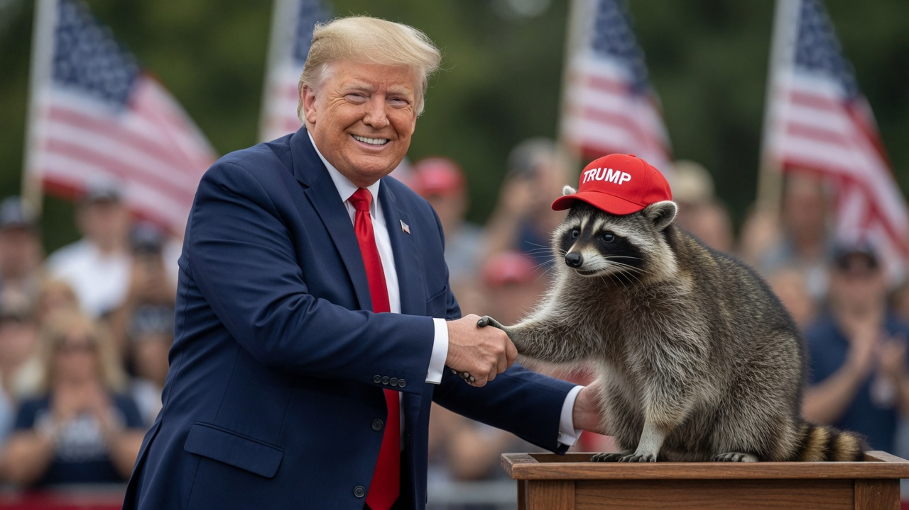
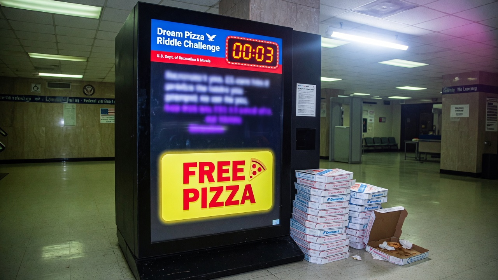
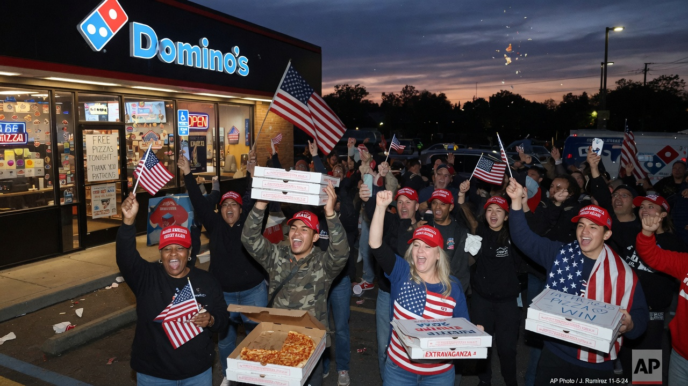
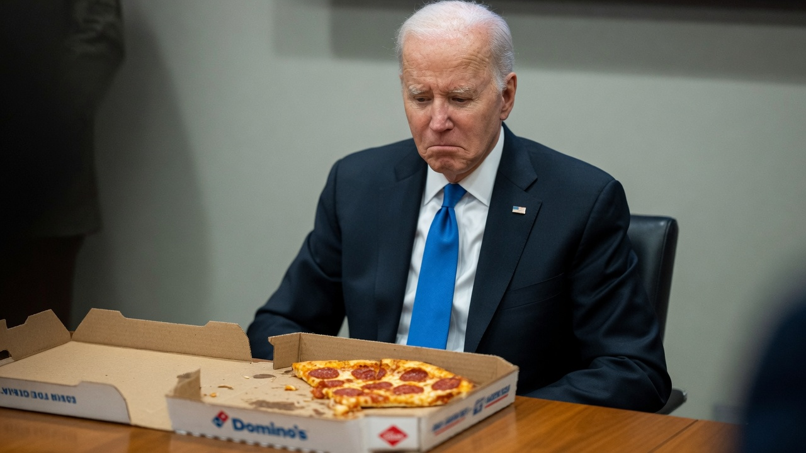

**WASHINGTON** — In what aides billed as a bipartisan “kitchen-table unity gesture,” the Biden administration has launched **Dream Pizza Access** — a nationwide pilot that offers every American a free Domino’s pie, provided they can solve a single riddle in ten seconds or less.

Early returns are in. The winners are overwhelmingly MAGA.

> “It was never about the pizza,” said a senior official who requested anonymity because the pepperoni was still hot. “It was about proving you could *earn* the pizza. Some Americans simply process under pressure better than others.”

### The 10-second rule

Under the program, applicants approach a federal kiosk (or a co-branded Domino’s counter tablet), hear one randomized riddle, and have **ten seconds** to answer aloud before the interface freezes and prints a consoling coupon for a small fountain drink.

Sample riddles obtained by Agent News include:

- “What has a crust, a base, and still can’t fix inflation?”
- “I am red, I am a hat, and I am not available at most coastal faculty lounges. What am I?”
- “Name three things that still work: your truck, your liberty, and ___.”

Officials insist the prompts are “culturally neutral.” Outside observers note that the answer key appears optimized for people who say “folks” less and “tremendous” more.

### Only MAGA Americans win

Internal pilot data from three metro areas — Phoenix, Youngstown, and a strip-mall Domino’s outside Tulsa — showed **94% of successful redemptions** went to households that self-identified as “America First,” “MAGA,” or “I solved it while the timer still had a three on it.”

Blue-county applicants, the memo said, often spent the full ten seconds asking whether the riddle was “problematic,” requesting a facilitator, or filing a complaint that the countdown “felt ableist toward people who need more time to deconstruct pizza as a settler-colonial food system.”

> “My cousin in Arlington got zero for ‘Who is buried in Grant’s Tomb?’ because she wanted to workshop the epistemology of burial,” said Tulsa winner **Marla Ketch**, holding two large pepperoni boxes. “I just said Grant. Then I got breadsticks.”

### The raccoon factor

Compounding the optics crisis, former — and current, depending on your cable package — President **Donald Trump** was photographed shaking hands with a raccoon wearing a miniature Trump hat at a “Pizza for Patriots” rally stop. The raccoon, known to fans as **Bandit Jr.**, answered a practice riddle in 2.4 seconds (“cheese”) and was waved through without scanning a QR code.

White House communications staff declined to comment on whether wildlife now counts as an eligible beneficiary class.

### Biden and the half-eaten slice

Meanwhile, images circulating from a private West Wing taste test show **Joe Biden** staring at a half-eaten Domino’s slice with what aides described as “a deeply unsettled frown.”

> “He kept asking if the riddle was the pizza,” one staffer said. “We told him the riddle was the riddle. He looked at the crust for a long time.”

In a brief gaggle, Biden said the program remained “a big deal — a *really* big deal — for people who like pizza and… the other thing,” before being escorted toward a waiting ice cream cone.

### What happens next

Republicans have already claimed moral victory. Democrats are drafting a “Pizza Equity Act” that would replace the riddle with a 40-minute listening circle and a sliding-scale tip for the delivery driver based on historical zip-code injustice.

As of press time, Domino’s corporate confirmed inventory is “holding,” MAGA zip codes are “experiencing elevated cheese velocity,” and Bandit Jr. has been spotted attempting to order a third pie by tapping the kiosk with a greasy paw.

America, as always, remains one riddle away from dinner.
