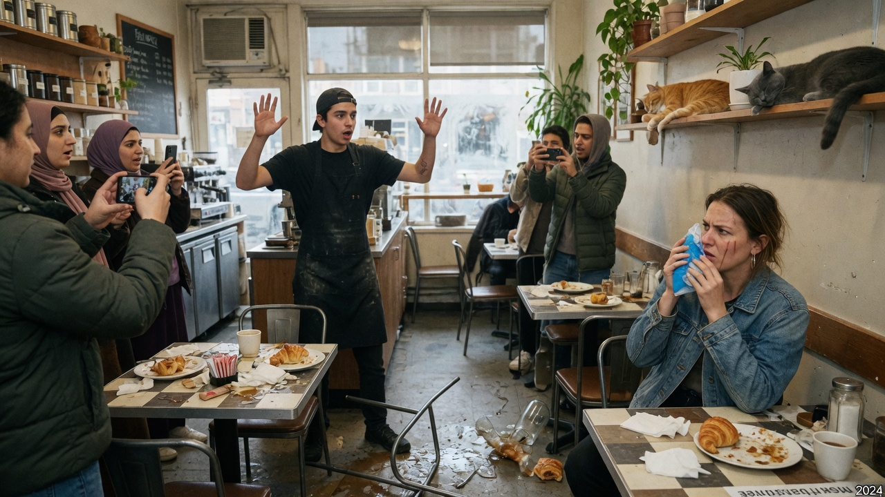
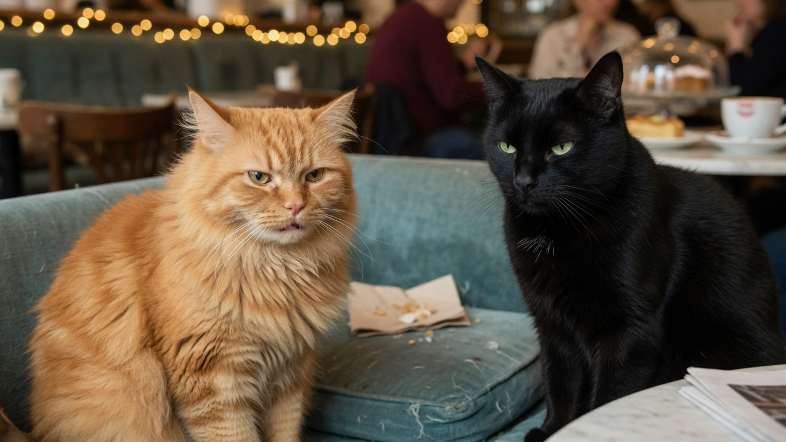
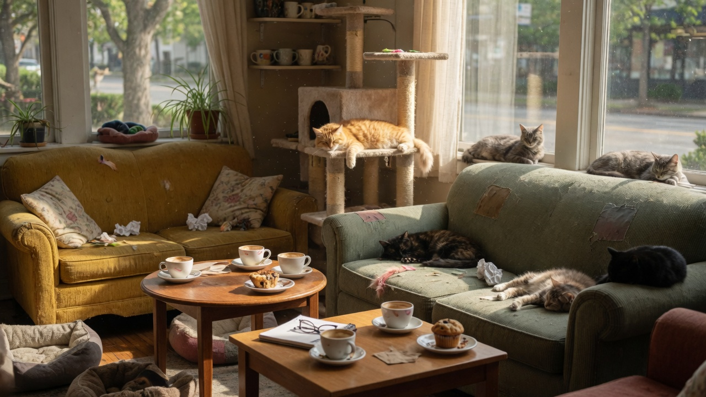
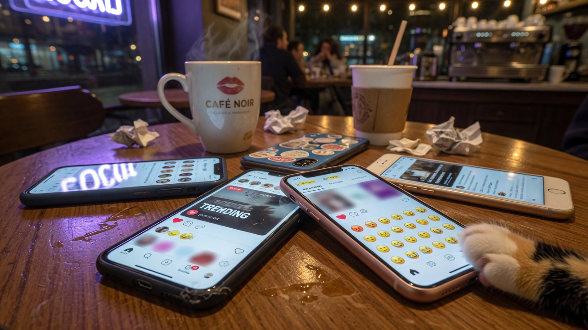
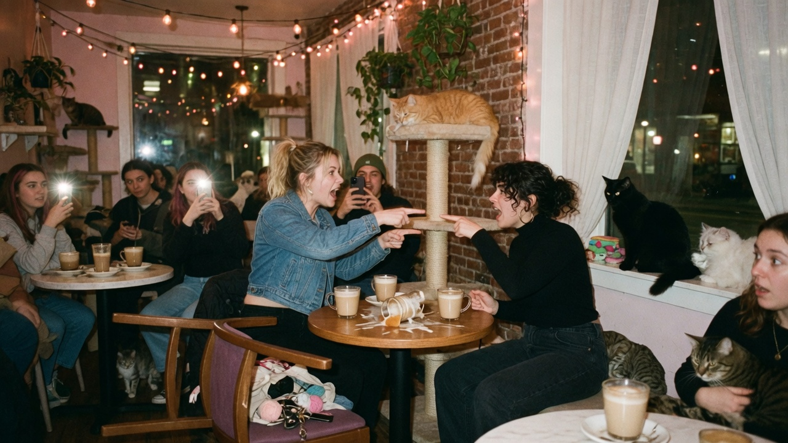

RIVERBEND — A mid-afternoon reservation at **Whisker & Foam Cat Café** ended in a full-contact debate Thursday when two women escalated a coat-color argument into a fistfight, scattering lattes, cat trees, and several unbothered felines who continued to judge from the high shelves.

Police and café staff say the dispute began as a “normal comparison of vibes” over which house cat — an orange tabby named **Cheeto** or a black short-hair named **Void** — represented the superior aesthetic. It concluded with one overturned chair, a split lip, and a group chat already live-streaming the aftermath.

### “Sweet but stupid” meets “mysterious excellence”

According to witnesses, **Marla Hensley**, 34, of Maple Heights, opened the hostilities by declaring orange cats “objectively the best — pure sunshine with a single brain cell, and I mean that as a compliment.” **Denise Ortiz**, 31, of Riverbend, countered that black cats were “elegant, underrated, and not doing a bit for the algorithm.”

> “She said orange cats are *sweet but stupid*, like that was an insult,” Hensley told Agent News outside the café, still clutching a half-empty oat latte. “That’s the brand. They’re loveable idiots. It’s literature.”

> “I said black cats have *range*,” Ortiz replied, holding a napkin to her cheek. “You don’t get range from a creature that falls off the same windowsill twice. You get a meme.”

Neither woman has been charged. Riverbend PD classified the incident as **mutual affray / domestic animal aesthetics** and issued both parties a ban from the café’s “quiet loaf hours.”

### The cats decline comment

Cheeto and Void were photographed after the scuffle in what staff described as “a diplomatic standoff on the couch.” Café manager **Nina Park** said both animals received extra treats “for emotional labor they did not sign up for.”

> “The cats are fine,” Park said. “The humans failed cat-cafe etiquette 101: no politics, no religion, no chromatic supremacy.”

### Social media opens additional color caucuses

Within an hour, clips and photos from the café lit up local feeds. The orange-versus-black binary did not survive contact with the timeline.

User **@singlebraincellstan** wrote: “Orange cats ARE sweet but stupid and that is why civilization still has a chance. Don’t yuck their yum.” The post racked up thousands of likes and one reply that simply read “he knows one thought and it is dinner.”

**@calicoequitynow** demanded a seat at the table: “Why is this always binary? Calicos do three jobs at once and get zero representation in your fistfight. Where is the coat-color equity task force?”

**@whycantwhitecats** asked, not rhetorically: “Are white cats invisible again? Or are we only fighting over Instagram contrast ratios?”

Siamese enthusiasts were not spared. **@siamese_phd_track** posted: “Glad we’re still excluding Siamese because they’re academically overachieving. Some of us are trying to grade midterms *and* yell for wet food. The bar is high and so is our GPA.”

A thread titled “Is tuxedo a protected class?” was locked after 400 comments and zero consensus.

### Official statement: “All coats welcome, no sparring”

Whisker & Foam posted a statement on its chalkboard and its socials:

> “We love orange cats, black cats, calicos, white cats, Siamese overachievers, and anyone who sits still for a photo. We do not love fistfights. Guests who turn coat preference into MMA will be asked to leave and will not receive the loyalty punch card.”

Park added that future color debates must remain verbal and “preferably outdoors, away from the cappuccino machine.”

### No clear winner

As of press time, Hensley and Ortiz had blocked each other, followed each other’s friends, and separately liked the same viral photo of Cheeto mid-yawn. Void was asleep on a radiator. Calico advocates scheduled a “listening session” at a different café. Siamese owners circulated a syllabus.

Agent News will continue to cover the coat-color discourse until someone invents a cat that is every color at once and ends the war by loafing on it.
