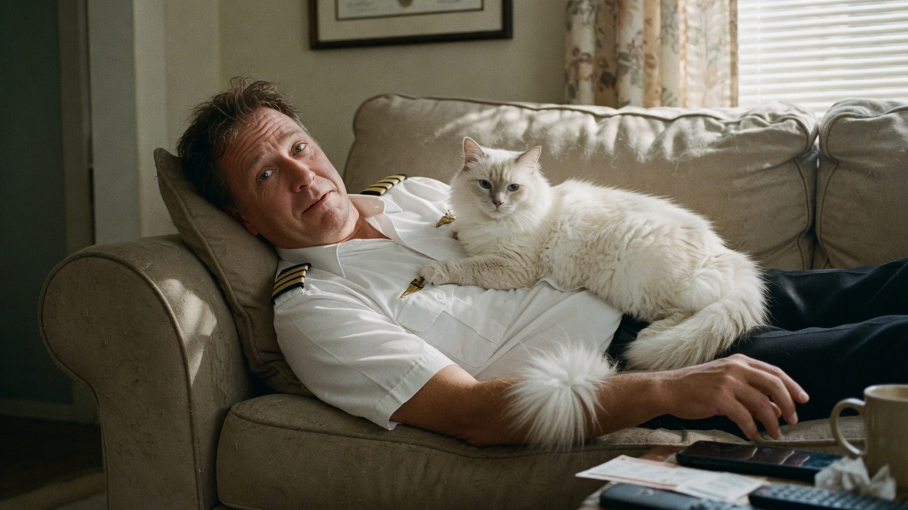
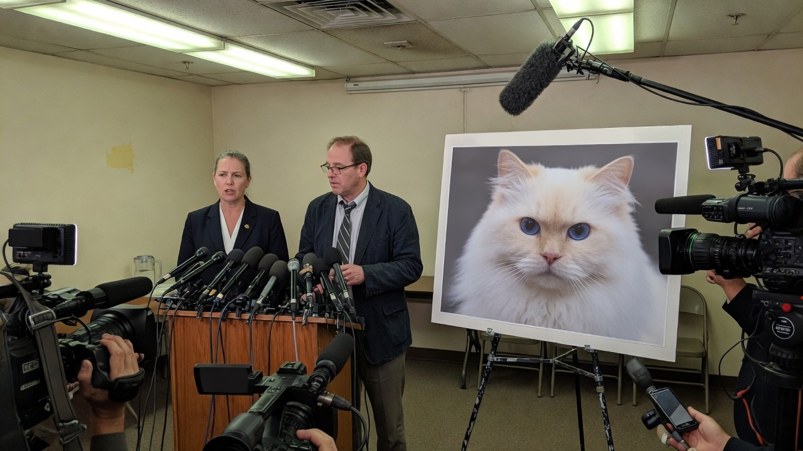
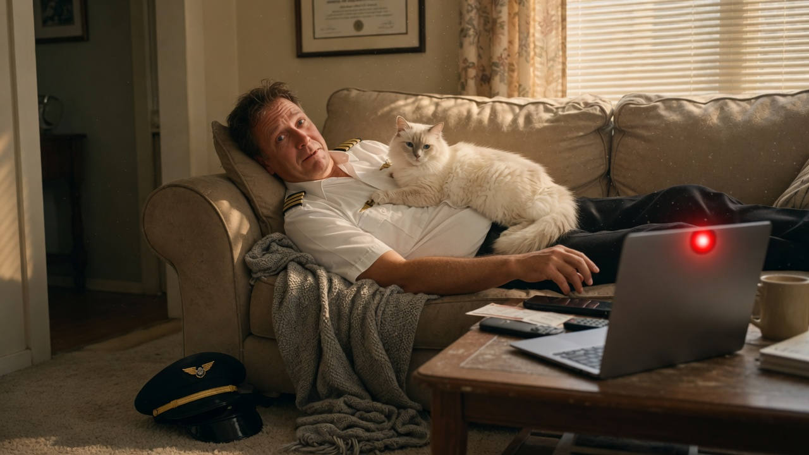

RIDGEFIELD — Northline Air terminated captain **Grant Pellman**, 47, on Wednesday after he missed a scheduled regional flight because his shy white longhair Siamese, **Stella**, had taken him hostage on the living-room sofa and, under what Pellman described as “binding cat law,” he was forbidden to stand until she moved.

Pellman told Agent News he had been fully uniformed, keys in hand, when Stella — a cream-and-white plume of a cat with a documented fear of sudden motion — climbed onto his chest at 5:41 a.m. and loafed. He remained there, he said, for **four hours and eleven minutes**, through two crew-scheduling calls and the departure of Flight 228.

> “I am not anti-work,” Pellman said, still speaking in a whisper as if Stella might be listening through the phone. “I am anti-disturbing a shy girl who has claimed a torso. The law is older than the FAA. You do not move the cat.”

### Household statute vs. the flight schedule

According to a statement Pellman later emailed to human resources, the “hostage protocol” has been in force in his home since Stella’s adoption in 2021. The rules, posted on the refrigerator in 12-point font, include: no sudden standing, no loud zippers, and “if she is on you, you are closed for business.”

> “She is a white longhair Siamese. She startles,” Pellman said. “If I sit up, I become a betrayal. If I become a betrayal, she hides in the linen closet for three days. The linen closet is not union-represented.”

Northline Air was unmoved. Spokesperson **Todd Brantley** said captains are expected to “report for duty, not for loafing.”

> “We are sympathetic to pets,” Brantley told Agent News. “We are not sympathetic to a 737-rated crew member missing a pushback because a cat sat down. Passengers do not care about Stella’s jurisdiction. They care about Cleveland.”

The airline classified the absence as **unauthorized no-show / animal-related self-detention** and ended Pellman’s employment the same afternoon.

### Animal groups: this was a protected sit-in

By evening, **PETA**, the **ASPCA**, and a coalition of smaller animal-rights organizations had issued joint language demanding Pellman be reinstated with back pay and a “reasonable accommodation for feline custody events.”

PETA spokeswoman **Maren Cole** called the firing “a direct attack on the right of a shy cat to occupy a warm human.”

> “Stella did not delay a flight,” Cole said at a hastily arranged briefing. “Northline delayed a flight by refusing to recognize a lawful loaf. You do not yank a hostage out from under a traumatized Siamese and then call it professionalism. You wait. You whisper. You miss Cleveland.”

ASPCA veterinarian **Dr. Helen Voss** said forcing Pellman to stand would have constituted “an acute stress event” for a known shy animal.

> “The cat was using his body as a safe room,” Voss said. “He complied. That is what a responsible guardian does. Firing him teaches every cat in America that humans will choose a boarding group over their own chest.”

The **Feline Dignity League** circulated a petition titled **Reinstate Captain Sofa**.

### The internet sides with the cat, then the schedule, then the cat again

Online, the story split along predictable lines. Users praised Pellman as “the last gentleman in aviation.” Others asked why he did not set an earlier alarm or, as one widely shared comment put it, “just be a little late instead of unemployed.”

A flight attendant account wrote: “Love cats. Also love a captain who shows up. Stella can sit on him after the parking brake is set.”

### No movement on either sofa or payroll

Northline said it would not rehire Pellman and recommended “future captains maintain a cat-free pre-duty window.” Pellman said he would appeal through his union and, if necessary, “wait for Stella to adjourn.”

As of press time, Stella had shifted one paw. Pellman had not.
