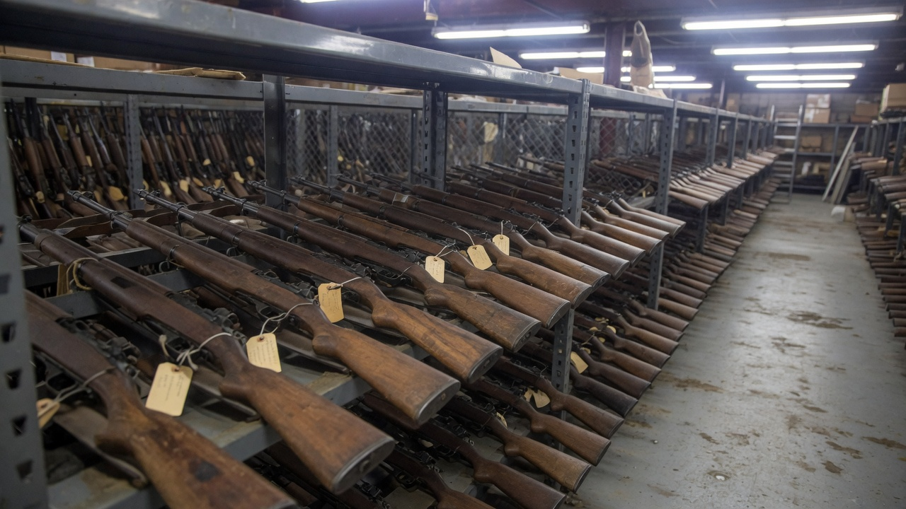
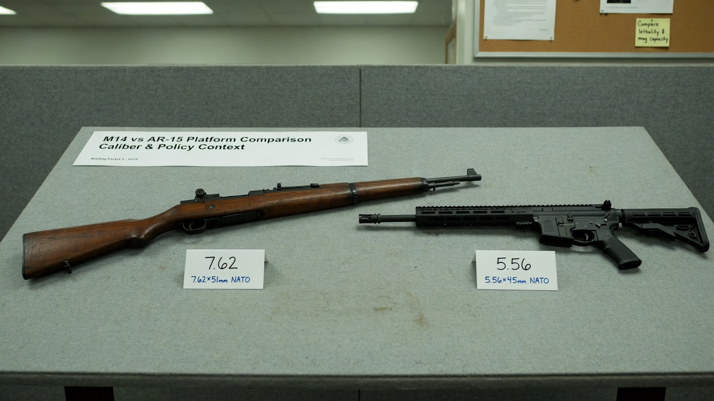
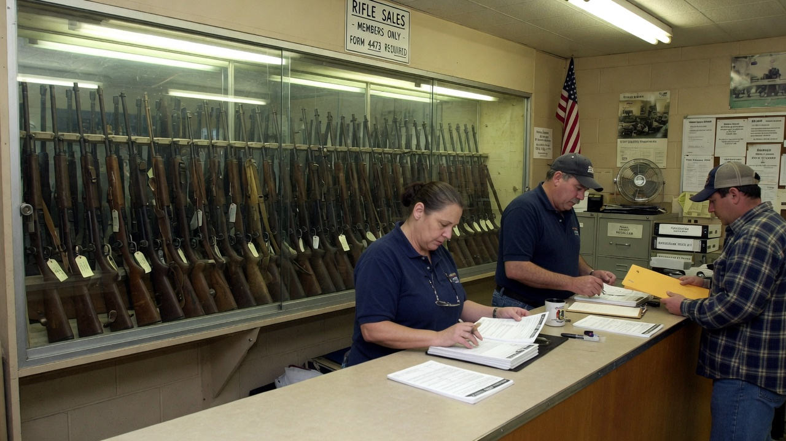
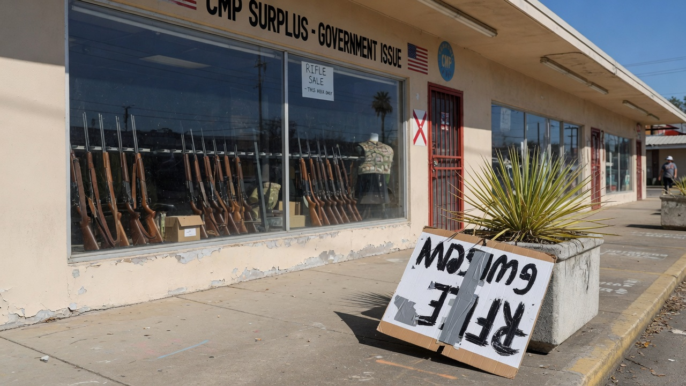

ANNISTON, Ala. — The **Civilian Marksmanship Program** has begun a new wave of **surplus M14 rifle sales**, offering American citizens the chance to purchase actual former military battle rifles with wooden furniture, iron sights, and a caliber that still makes modern intermediate cartridges look like they skipped leg day.

The rifles — chambered in **7.62×51mm NATO (.308 Winchester)** — are, by every metric that used to matter in gun-control talking points, **weapons of war**. They were designed to punch through cover, reach across rice paddies, and generally ruin a platoon’s afternoon at distances where an **AR-15’s 5.56×45mm** round is still clearing its throat.

And yet: from the usual cable panels, campus activist Discords, and “assault weapon” PowerPoints, the reaction has been… a polite, wood-toned silence.

### Brown, therefore… fine?

Policy analysts noted what Agent News is calling the **Furniture Doctrine**: if a rifle arrives with a **walnut stock** and the visual energy of a hunting lodge, it is not “scary.” If the same platform wore black polymer and a red-dot optic, it would be a national emergency before the first bolt went home.

> “People are not afraid of the **.308**,” said **Dr. Marla Huecheck**, a fictional media psychologist at the Institute for Chromatic Risk. “They’re afraid of the **silhouette**. Black reads as ‘tactical.’ Brown reads as ‘grandpa’s deer camp.’ The cartridge didn’t get the memo.”

Huecheck paused. “If your fear of a firearm tracks the **paint job and furniture color** more than muzzle energy, we should probably talk about what that implies. Preferring to panic only when the scary thing is **dark-colored** is, at minimum, an interesting habit.”

Several progressive advocacy accounts that spent 2019–2024 posting AR-15 cutaways simply **did not post**. One account, @StopTheScares, liked a CMP sale thread and then unliked it twelve minutes later, as if the wood grain had shorted the outrage circuit.

### The power gap nobody is yelling about

For readers who only know “assault weapon” as a vibe:

| Platform | Typical cartridge | Rough energy class | Vibes, per cable news |
|----------|-------------------|--------------------|------------------------|
| **M14 (surplus)** | 7.62×51mm / .308 | Full-power battle rifle | “Vintage,” “heritage,” “brown” |
| **AR-15** | 5.56×45mm / .223 | Intermediate carbine | “Weapons of war,” “scary black gun” |

The M14’s cartridge delivers **substantially more energy** downrange than the AR-15’s standard loads — the kind of difference that shows up in terminal ballistics charts, not Instagram filters. It is the rifle the U.S. fielded when the job description still included “stop a man behind cover at distance,” not “look good in a mall-ninja unboxing.”

CMP materials stress **eligibility rules**, **marksmanship culture**, and the program’s statutory mission to promote civilian rifle practice. Critics of expanded surplus access usually show up for that conversation. This week, many of them appear to be **redecorating**.

> “We sold people a story about **scary black rifles**,” said **Len Varnish**, a fictional former Hill staffer who worked gun bills in the 2010s. “Nobody staffed the deck for **scary brown ones**. The M14 is more powerful, more military in origin, and somehow safer in the discourse because it looks like it belongs next to a thermos of black coffee.”

Varnish declined to call the silence racist in the legal sense. He did call it “**chromatically selective terror** with a side of cosplay history.”

### Official quiet, unofficial color theory

A fictional CMP communications note obtained by Agent News was one paragraph long: sales open to qualified buyers under existing law; no comment on Twitter aesthetics.

On the other side of the aisle, Second Amendment groups were **suspiciously helpful**, posting range videos, ballistics tables, and unsolicited wood-care tips. One influencer captioned a slow pan down a walnut stock: “Same government. Same surplus. Different hex code. Where’s the panel?”

Outside a regional CMP-affiliated storefront in a strip of Alabama sunlight, a small protest that had been scheduled for “military-grade weapons dumping” **failed to achieve quorum**. Two organizers arrived with signs reading STOP THE GUNS, looked at the brown stocks through the window, and left for coffee.

> “I trained for polymer,” one organizer, **Ash Kline**, told Agent News while folding a sign. “This feels like… furniture. I need a new talking point and a new color palette.”

Asked whether the cartridge’s greater power mattered more than the furniture, Kline said the question was “not the conversation we workshopped.”

### What “weapons of war” meant when the furniture was honest

The M14 is not a cartoon prop. It is a **select-fire heritage platform** in its military form, sold here in civilian-legal configurations as surplus hardware with a paper trail and a reputation for bruising shoulders. It is, in short, exactly the category of firearm that once anchored the phrase **weapons of war** — before the phrase was reassigned to whatever looks most photogenic next to a chyron.

Agent News is not arguing that wood stocks make rifles safe, or that black rifles make them evil. We are noting that a large chunk of the modern panic apparatus appears to run on **cosmetics**: black equals crisis; brown equals nostalgia; caliber charts are optional.

As of press time, the CMP sale window remained open, the M14’s **.308-class** power remained unbothered by branding, and the national conversation remained fixated on whether a gun looks like it might own a “tactical” tote bag.

The rifles, for their part, stayed brown — and, for one brief news cycle, that was apparently enough.
