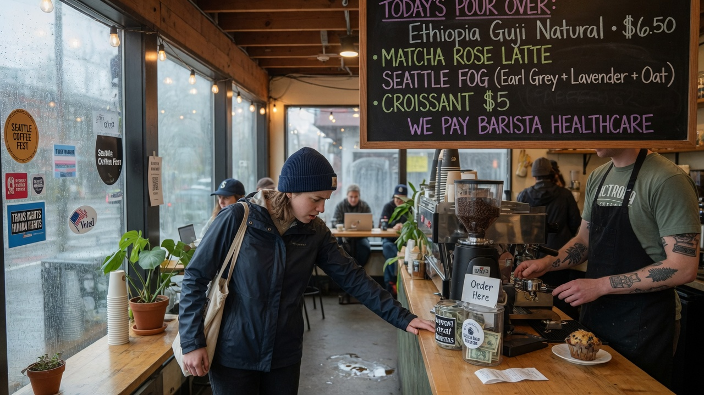
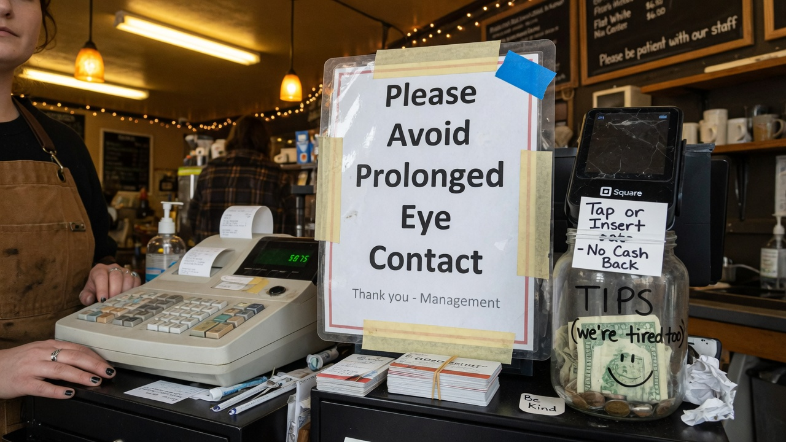
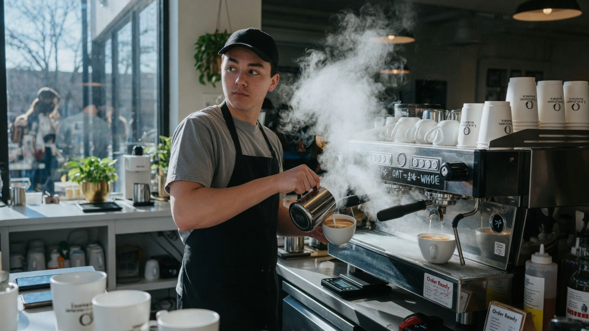
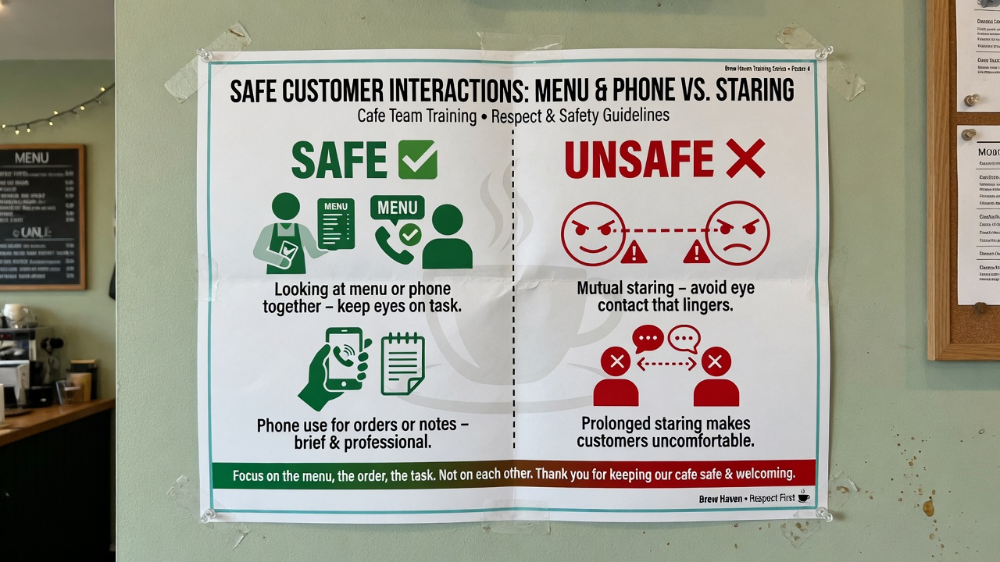

SEATTLE — A popular Capitol Hill coffee shop has banned **“aggressive” eye contact** after a barista filed a workplace trauma report alleging “visual assault” by a customer who maintained normal conversational gaze while ordering a flat white.

Under the new policy at **Hearth & Circuit**, direct eye contact longer than **1.7 seconds** triggers a formal incident report. Customers must look at the menu board, their phone, or a designated **Gaze Neutral Zone** (a potted fern near the tip jar). Staff are trained to break contact first and document “pursuit looks.”

> “We are not anti-human,” owner **Mira Solano** said in a laminated statement taped beside the pastry case. “We are anti-unconsented ocular intensity during peak foam. Hospitality should not require staring contests with strangers holding debit cards.”

### The policy, in HR

The **Visual Boundaries Protocol (VBP-03)** was drafted overnight with help from a consultant who previously designed “silence rooms” for open-plan offices. Highlights:

- Max mutual eye contact: 1.7 seconds, measured by a $40 kitchen timer rebranded as a **Gaze Metronome**  
- Acceptable focus points: menu, phone, floor decal, fern  
- “Soft peripheral awareness” is allowed; “locking on” is not  
- Violations → verbal redirect → written incident → temporary “order by sticky note only” status  

The shop also created a part-time **Gaze Compliance Officer** role, currently held by shift lead **Devon Park**, who carries a clipboard and a foam finger that says *LOOK ELSEWHERE*.

> “My job is de-escalation of pupils,” Park said, deliberately examining the ceiling lights. “If someone says ‘how are you’ and waits for eyes, I point at the specials board. Connection is optional. Oat milk is not.”

### How it feels on the line

Baristas describe the change as “lighter,” “safer,” and “weirdly efficient.” One regular was redirected three times in a single cold-brew order and left a 22% tip labeled “sorry for my face.”

> “I used to smile at people,” said barista **Casey Rios**, eyes fixed on the steam wand. “Now I smile at the cup. The cup never asks what I’m doing later.”

Customers are split. Confused regulars shuffle in sunglasses. Supporters call it “long overdue boundary technology.”

> “I don’t come here to be perceived,” said remote worker **Aiden Cho**, typing while facing a wall outlet. “I come here for Wi-Fi and the illusion of leaving the house.”

Across the room, retiree **Helen Pratt** held her latte like evidence.

> “I looked at the nice young man for two seconds and got a form,” she said. “In my day that was called manners.”

### Social media pile-on

- **Reddit r/Seattle:** “1.7 seconds is shorter than reading the dairy alternatives. This is a literacy tax.”  
- **Bluesky:** “Eye contact is unpaid emotional labor with a face. Unionize your gaze.”  
- **TikTok stitches:** ASMR of people ordering into their phones while the fern watches.  
- **Nextdoor:** “Is this the place next to the yoga studio? Asking because my nephew makes eye contact for a living and I need a list of safe cafés.”

A rival shop two blocks away posted a chalkboard: **WE STILL MAKE EYE CONTACT (WITH CONSENT)**. It sold out of drip by 10 a.m.

### Training day

Staff studied a wall poster: **Safe vs Unsafe Gaze** — green icons of menu-board focus, red icons of “searching soul contact during payment authorization.”

> “We are protecting labor,” Solano said. “If your order requires a shared emotional arc, try a therapist. We sell beverages.”

### What happens next

City health inspectors have no jurisdiction over pupils. A neighborhood Facebook group proposed a “staring hour” protest; organizers later clarified it would be done through mirrors. Hearth & Circuit says the policy stays through summer, with a possible pilot of **order kiosks that never look back**.

Asked whether couples on dates may still glance at each other in the seating area, Park checked the clipboard.

> “Seating is a different zone,” Park said to the fern. “But if you order while in love, please schedule it after the pour.”
