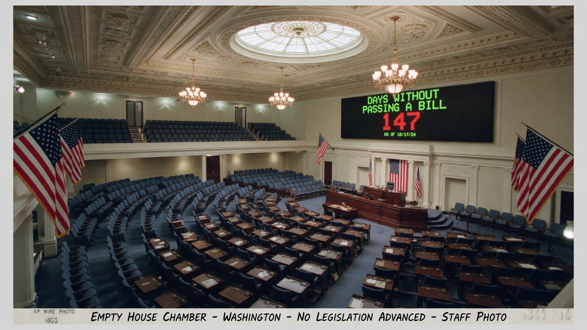
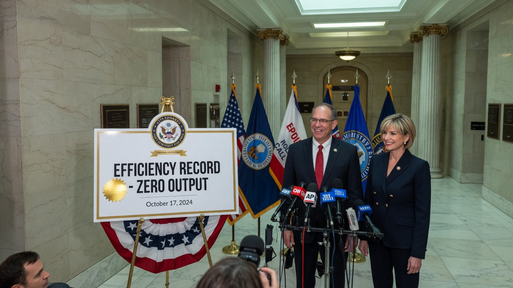
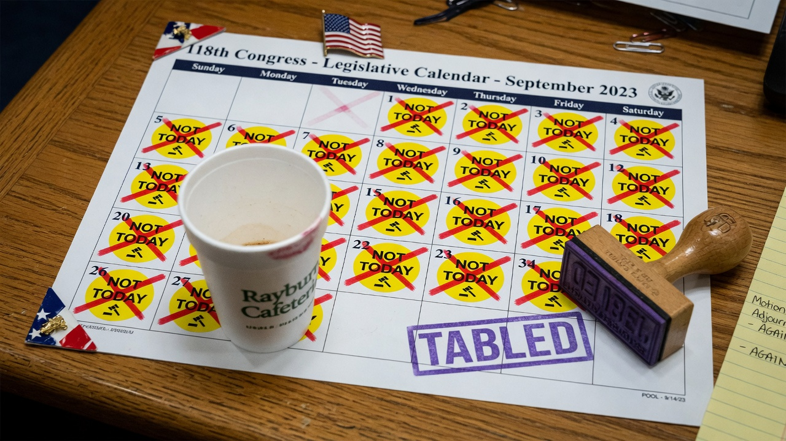
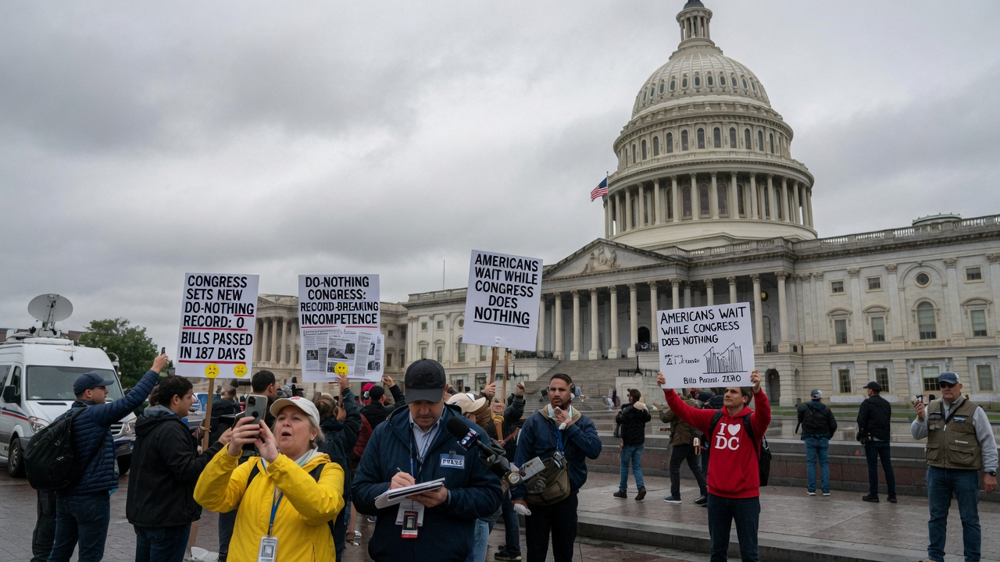

**WASHINGTON** — Congress has broken its own record for legislative inactivity, completing a stretch of **zero bills advanced to the president’s desk** with what leadership is calling “unprecedented operational excellence.”

According to the nonpartisan **Congressional Inertia Office**, which staffers insist is “real enough for a press release,” the chamber achieved **147 consecutive legislative calendar days** without passing a single substantive measure — surpassing the prior mark of 146, set last year after a similar round of “listening tours” that produced no legislation and three competing branded water bottles.

> “We didn’t just fail to act,” said **House Process Chair Delia Crane** at a hallway briefing. “We failed to act *on purpose, on schedule, and under budget.* That is governance.”

### How the record was measured

Analysts credited a suite of process upgrades:

- Morning “stand-downs” in which members agreed not to introduce anything before lunch  
- Bipartisan “working groups” that met, took attendance, and adjourned without working  
- A digital dashboards that converted stalled bills into **green status indicators** labeled *optimized*  
- A rubber stamp reading **TABLED**, issued to every committee chair as a wellness item  

The previous record, officials noted, was “messy” — achieved through filibusters, sniping, and accidental votes. This year’s run was cleaner: **no accidental votes, no accidental amendments, and no accidental progress.**

### Both parties claim the win

Republicans framed the achievement as a stand against “over-legislation.” Democrats framed it as a stand against “under-funding the standing.” Both sides agreed the empty floor photograph looked statesmanlike.

> “When you streamline the pipeline to zero, the variance drops to zero,” said **Senate Throughput Whip Arthur Voss**. “That’s continuous improvement. Toyota would be proud, if Toyota wrote laws, which we also did not.”

A junior staffer, speaking anonymously because the record is “fragile,” said the only near-miss came when a resolution congratulating a high-school robotics team briefly appeared on a calendar. It was tabled in under four minutes. The robotics team sent a thank-you note anyway.

### Constituents respond

Outside the Capitol, tourists photographed the dome while holding printouts of the record and debating whether “doing nothing efficiently” was better than “doing something badly.”

> “I called my rep about potholes,” said visitor **Nina Okoye** of Arlington. “They sent me a survey about how the pothole conversation made me feel. No asphalt. Extremely efficient.”

Interest groups across the spectrum issued statements praising or condemning the milestone, then scheduled follow-up meetings that will not produce legislation either.

### What’s next

Leadership said the chamber would “build on this momentum” by aiming for a **full session of optimized non-output**, pending a recess to study whether recesses themselves can be made more efficient.

Asked whether the country needs laws, Crane smiled the way people smile when the metric board is green.

> “The American people deserve a Congress that can do nothing without waste,” she said. “We heard them. We did not act. On time.”

As of publication, the ceremonial TABLED stamp remains in service, the calendar remains largely blank, and the record is, for now, holding — which leadership called a “strong quarter.”
