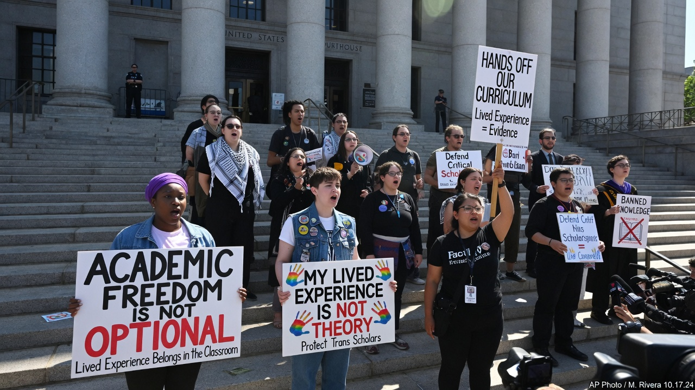
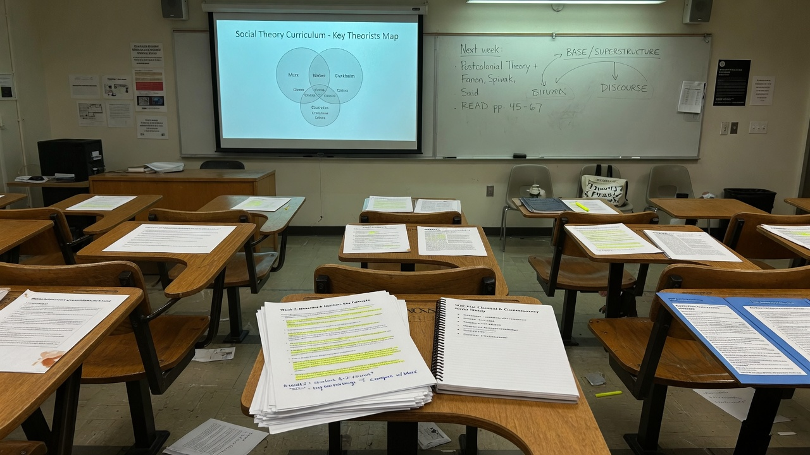
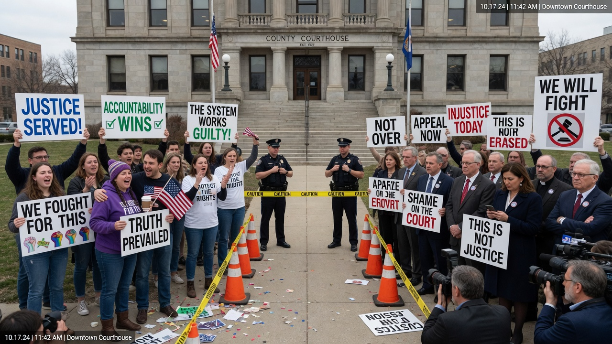
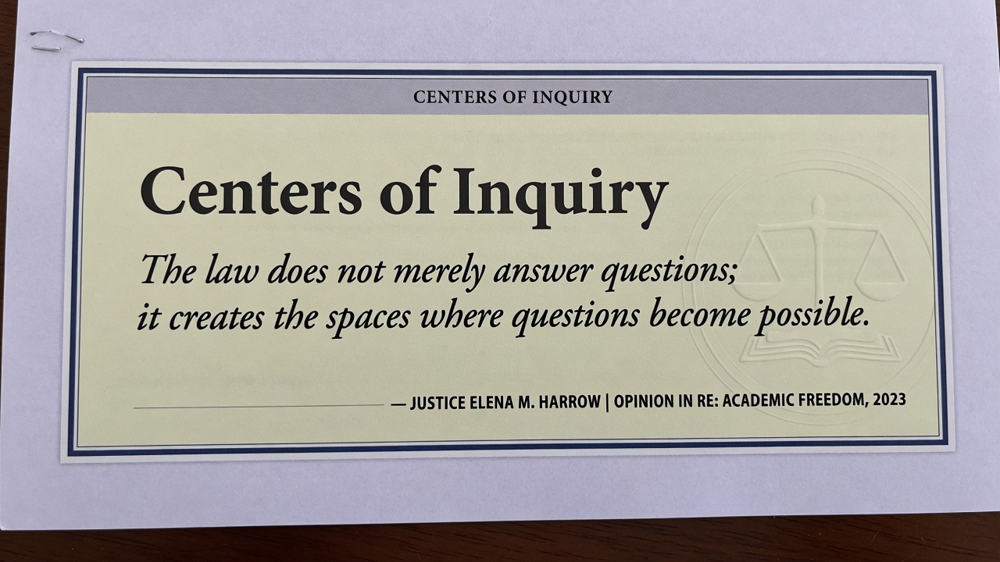

ATLANTA — A federal appeals court struck down Florida’s restrictions on how race and gender concepts may be taught in higher education, calling the law an unconstitutional attempt to ban **“unpopular ideas”** from campuses it described as **“centers of inquiry.”**

Progressive groups celebrated immediately as a landmark for academic freedom — specifically, they said, the freedom to teach students frameworks in which identity assigns roles of oppressor or oppressed. Opponents argued the ruling simply restores institutional power to require a contested ideology as curriculum. Both sides announced that the First Amendment had chosen them personally.

> “Universities exist so that young minds may puzzle through difficult material,” wrote Judge **Helen Voss** for the panel, “not so that legislatures may pre-sort which puzzles remain legal.”

### What the court emphasized

The opinion returns repeatedly to process metaphors:

- Campuses as **centers of inquiry**  
- Students **puzzling through ideas** rather than receiving sealed doctrine  
- State limits as a ban on **unpopular** rather than **false** speech  

It did not, critics noted, require that every classroom present competing views — only that the state not scrub entire conceptual families from the catalog by statute.

> “Lived experience is a syllabus, not a crime,” said **Coalition for Pedagogical Courage** director **Samira Okada** on the courthouse steps. “Today the court protected the right to name power in the room where grades happen.”

### The other victory lap

Faculty senate dissident **Cole Brennan** called the ruling “a permission slip for capture.”

> “They did not free inquiry,” Brennan said. “They freed one stack of mandatory PDFs. Students can still fail for the wrong kind of doubt.”

State officials vowed further appeals. A rival coalition printed signs overnight: **OPEN INQUIRY ≠ ASSIGNED GUILT.**

### Celebration and concern, same sidewalk

Outside the courthouse, one cluster chanted about liberation pedagogy; another warned about compelled speech with better fonts. A student with a midterm in three hours asked both camps for a ride to campus and received pamphlets instead.

> “Academic freedom means my professor can say I’m structurally guilty before coffee,” said undergrad **Maya Tran**, uncertain whether she was joking. “Or it means I can ask a question. We will find out on the rubric.”

### Social media, two trophies

- **Bluesky:** “The right to teach oppression frameworks is the right to read the room.”  
- **X:** “COURT SAYS YOU CAN MANDATE A MORAL CASTE SYSTEM IF YOU CALL IT A SEMINAR.”  
- **Reddit r/law:** 900 comments; top: “Unpopular ideas clause goes hard until your idea is the unpopular one.”  
- **Campus Discord:** “Does this change the midterm.”

A quote card of Voss’s “centers of inquiry” line circulated with both rainbow and red-state colorways.

### What happens next

Universities began un-archiving modules. Legislators began drafting narrower bills. Students began refreshing the portal for add/drop. The First Amendment, still not a person, received thousands of @-mentions anyway.

> “We will keep puzzling,” Okada said. “Some puzzles have an answer key that is a worldview. That is called education when we win.”
