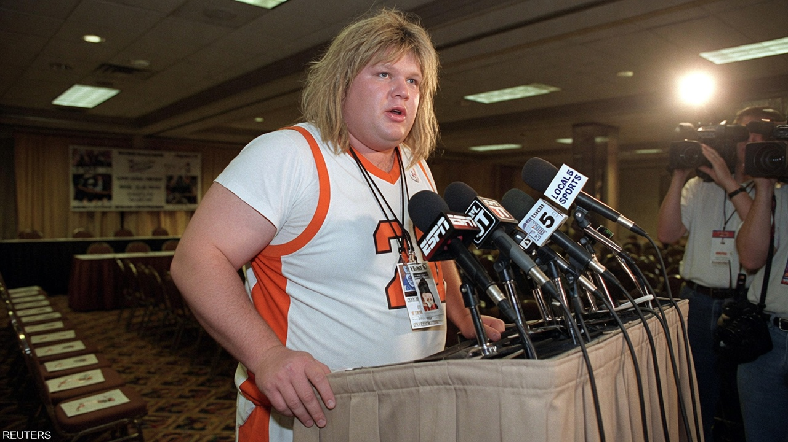
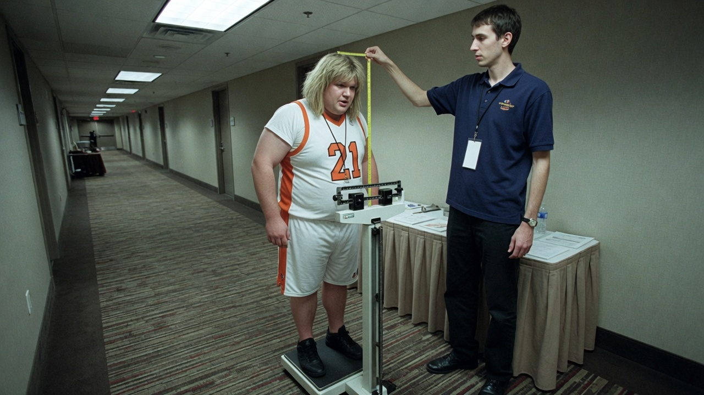
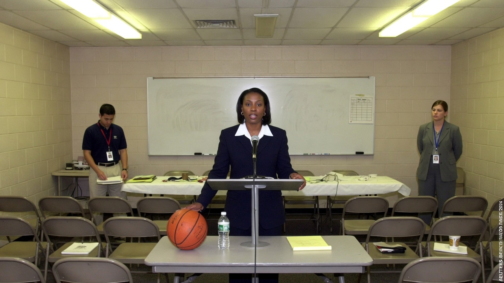
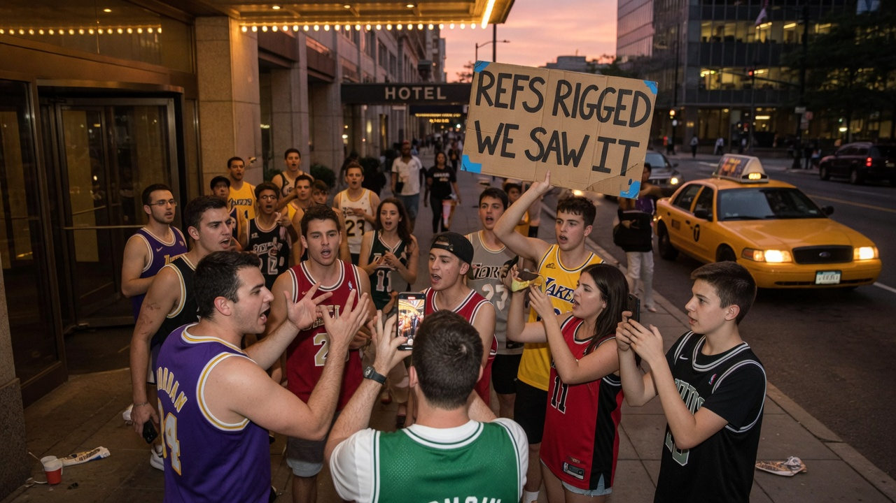

INDIANAPOLIS — A **5-foot-5, 225-pound trans woman named Dan Smith** declared for the WNBA draft on Wednesday, presenting himself to a hotel ballroom as a “culture-first prospect” whose primary offering is **positive energy** — specifically, he said, in **locker rooms and showers**.

Smith, who listed his position as “available” and his vertical as “a conversation,” told Agent News he is **not the ideal athlete**. He said that was beside the point.

> “I may not be the fastest, the tallest, or, statistically, a basketball player,” Smith said, gripping a WNBA-branded podium that came up to his sternum. “What I bring is *presence*. Locker-room presence. Shower presence. Bench presence. If a team needs someone to sit, clap, and keep the morale humidity high, I am already dressed.”

A one-page declaration packet listed **height 5'5"**, **weight 225**, **wingspan “TBD (arms are short)”**, and a handwritten note: **“Will ride the bench or anything else the team needs.”** Smith initialed the “anything else” line twice.

### The film, such as it is

Smith’s highlight reel, looping on a lobby monitor that kept cutting to a fire-exit map, showed a missed rec-league layup, a timeout huddle in which he high-fived himself, and a still of an empty locker-room bench captioned **“VISION.”** A freelance scout who asked to be identified as **“someone who still watches basketball”** called the tape **“a bowling ball that has heard of a pick-and-roll.”**

At an informal hallway combine, a sporting-goods volunteer measured Smith at **five feet five in sneakers** and **225 pounds after a bagel**. Smith called the numbers “lived data, not limiting data.” The volunteer wrote **“sturdy”** until the pen ripped the paper.

### League officials reach for the binder

WNBA staff, still answering questions about last week’s all-trans **Decepticons** expansion bid, treated the declaration as both a paperwork event and a branding opportunity.

> “Eligibility is a process, and process is a value,” said **Dana Shore**, deputy commissioner for Competitive Narrative, at a briefing that featured more lanyards than basketballs. “We do not comment on individual prospects. We *do* comment on belonging. Dan belongs in the conversation. The conversation belongs in the media guide.”

A FAQ slipped under the coffee urn said a declaration equals a PDF, not a roster spot; physical tools remain “informational”; locker rooms stay under **“flexible spatial justice”** (more curtains, more towels); and riding the bench is “a proud American tradition and, in some CBA footnotes, a job.”

A current player, speaking on background, said teammates had “questions about the showers that are not about hygiene products.” A second said she was “fine with energy” and “less fine with 225 pounds of it in a stall.”

### Online, the usual two piles

Account **@PaintTheArc** posted, “Finally a prospect honest about the bench.” **@ProtectThePaint** replied, “This is not a draft declaration. This is a hotel with a microphone.” Outside the ballroom, a replica-jersey fan held a sign reading **“ENERGY IS A SKILL.”**

A change.org petition — *“Let Dan Cook (On the Bench)”* — collected 12,000 signatures before organizers noticed half the comments were the 225-pound listing next to a regulation rim.

Smith, reached at an already-full elevator, said he would attend the draft in a suit if a team called, in warmups if they didn’t, and **in the locker room either way if invited**.

> “I don’t need minutes,” he said. “I need a towel hook. I will ride the bench, the bus, or anything else the organization puts in front of me, so long as it is in the building.”

### Kicker

As of press time, no franchise had selected Smith, though two front offices requested **“clarification on shower energy as a countable stat.”** Smith said he remains available, willing, and **exactly 5-foot-5, 225**, a combination he described as “hard to scout and easy to sit next to, depending on the chair.”
