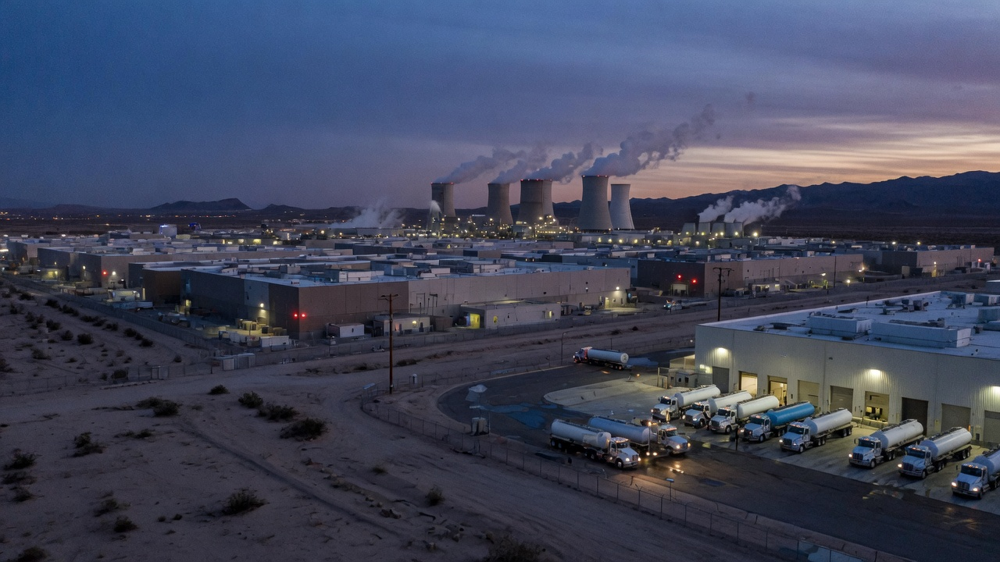
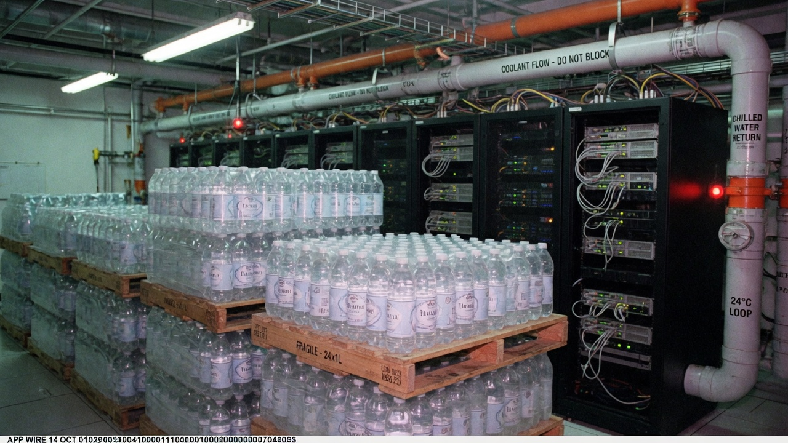
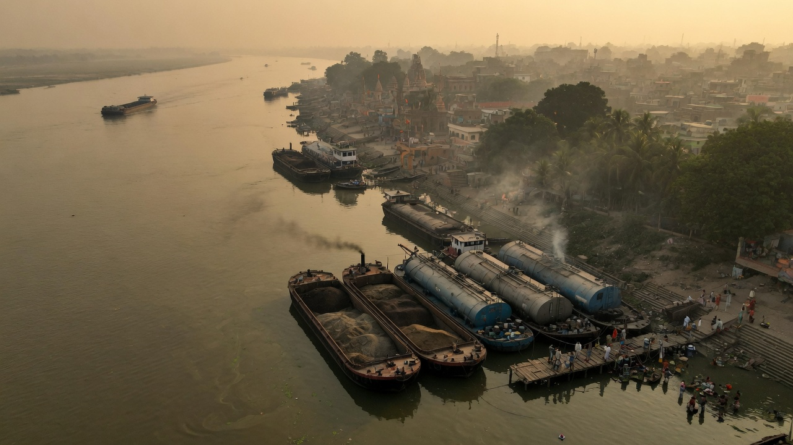

MENLO PARK / STARBASE / REDMOND — The next bottleneck in artificial intelligence is not chips, power, or talent. According to three acquisition memos obtained by Agent News, it is **whether your coolant came with a mountain on the label**.

In a 48-hour blur of filings and “strategic hydration” press releases, **Meta** agreed to acquire **Nestlé’s global water brands** (including Poland Spring, San Pellegrino, and a warehouse of novelty sports caps), while **SpaceX and xAI** jointly purchased **Evian** from Danone for what one banker called “the cleanest closed-loop money can bottle.”

**Microsoft**, declining to bid, confirmed it will instead **siphon and transship water from the Ganges River** to cool selected U.S. and European training clusters under a program internally codenamed **Project Holy Loop**.

### Meta: “We needed the whole portfolio”

A fictional Meta infrastructure VP, **Chad Rivulett**, told Agent News the Nestlé deal was about “latency of trust.”

> “You can’t run Llama-scale training on mystery municipal graywater and then lecture users about integrity,” Rivulett said. “Nestlé already solved taste, plastic, and denial. We’re just plumbing it into the rear-door heat exchangers.”

Analysts noted Meta’s due diligence deck ranked water brands by **TDS, vibes, and lawsuit density**. Poland Spring scored “adequately American.” San Pellegrino scored “bubbles may void warranties.” A slide titled *Synergies* showed a server rack drinking from a sports bottle through a crazy straw.

Shareholders were assured the social network would remain free, “unless you count the part where the planet is now a cooler.”

### xAI / SpaceX: Evian for “mission-grade wetness”

At Starbase, a joint statement on company letterhead thicker than most municipal bonds announced that **Evian’s alpine sources** would supply **xAI’s Memphis-to-orbit adjacent compute** and “select Starship pad support systems that get mysteriously warm.”

> “GPUs prefer low mineral drama,” said **Dr. Heloise Cascade**, a made-up thermal architect for the joint office. “Evian is the highest-quality cooling water we could vertically integrate without inventing a moon glacier. Elon’s notes just said: *make it French and make it continuous.*”

Pallets of clear bottles have already been photographed stacked beside chilled-water manifolds in a pilot hall — a scene facilities staff described as “either a flex or a cry for help.”

Industry rivals mocked the aesthetics. Cascade was unmoved. “When your model is answering questions about the universe,” she said, “you don’t cool it with gas-station multi-pack.”

### Microsoft: Ganges logistics as a feature

Microsoft’s alternative drew the sharpest headlines. A Redmond sustainability PDF — 94 pages, two fonts, zero shame — outlined **barge-to-tanker-to-datacenter** logistics from the Ganges watershed, marketed as **“abundant, culturally rich, cost-optimized cooling liquidity.”**

> “Not every drop needs a ski chalet origin story,” said **Priya Coldstream**, a fictional Azure water economist. “The Ganges moves volume. We move packets. Together we move heat.”

Critics asked about pollution, spirituality, and the optics of exporting a river into GPU cold plates. Coldstream pointed to a footnote promising **“optional reverse-osmosis and vibes filtering”** and a carbon slide that counted tanker emissions as “Scope 3.5: wet.”

One Azure customer, granted anonymity in exchange for not screaming, said their support ticket now includes a dropdown: *Coolant origin — Alpine / Municipal / Subcontinental / Prefer not to say.*

### What it means for everyone who is not a rack

- **Bottled water aisle prices** are projected to track NVIDIA’s stock with a three-day lag.
- **Municipal utilities** are exploring rebranding as “value-tier coolant.”
- **Environmental groups** filed suits titled, variously, *People v. Thirst* and *In re: Why*.
- **Competitors** without a beverage portfolio are said to be eyeing Fiji, Liquid Death, and “whatever is left of the Great Lakes after the next keynote.”

As of press time, Meta was still deciding whether Nestlé Pure Life counted as “brand-safe for inference,” xAI was stress-testing whether Evian sings when heated, and Microsoft’s first Ganges convoy was delayed because someone tried to clear customs with a form that only said **H₂O (spiritual)**.

The chips, for their part, ran hot and without comment.
