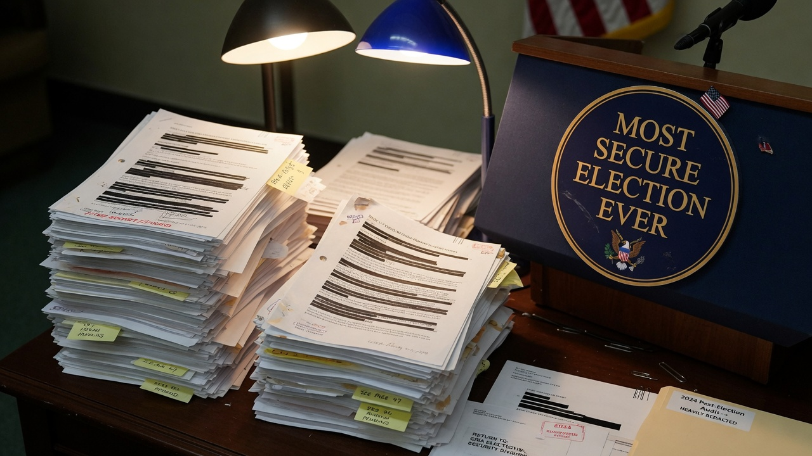
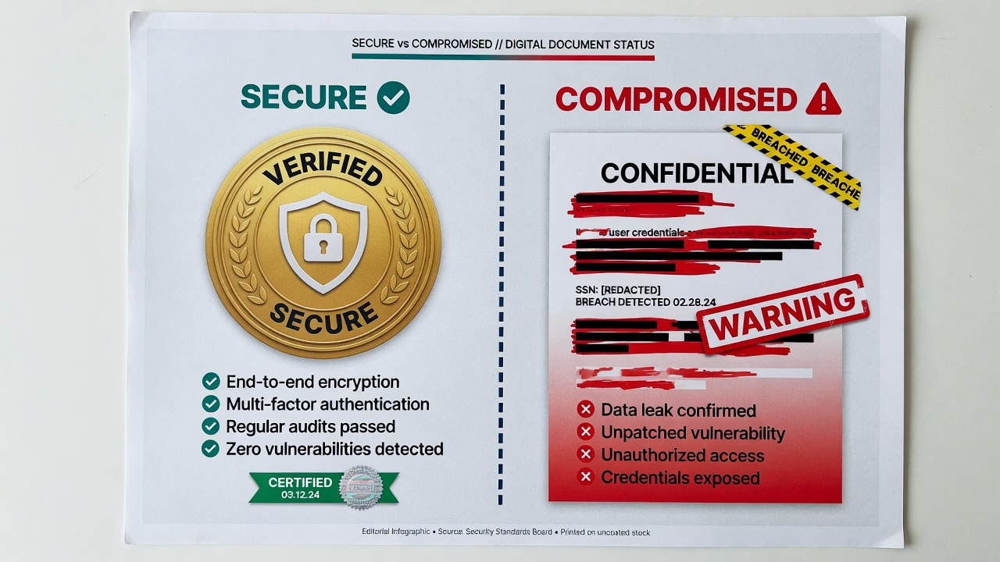
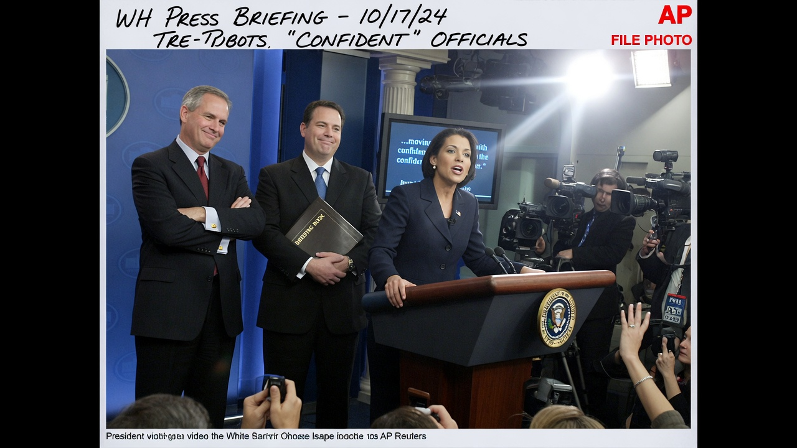
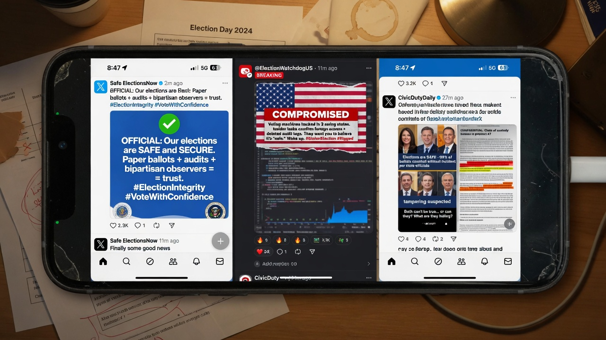

WASHINGTON — In a single afternoon, the administration released a trove of **heavily redacted** intelligence assessments describing U.S. election systems as extremely exposed to China, Russia, Iran, and non-state actors — while senior officials continued to insist American elections remain the **gold standard of security** and that doubt itself is an attack on democracy.

The documents and the talking points did not acknowledge each other. They simply occupied the same news cycle like roommates who never make eye contact.

> “These remain the most secure elections in history,” said **Press Secretary Elise Moran** at the daily briefing. “Full stop.”

Twenty minutes earlier, a declassified-ish annex — black bars where verbs used to live — stated that **adversaries have the capability to compromise U.S. election infrastructure** and that bulk voter data remains a “persistent collection target.”

### The two truths, unmerged

| Claim (podium) | Claim (paper) |
|----------------|---------------|
| Most secure elections in history | Adversaries can compromise election infrastructure |
| Trust the process | Hundreds of millions of voter records allegedly acquired by China (~220 million files cited in one annex line still visible) |
| Questioning totals is unpatriotic | Dead registrants and non-citizen edge cases “remain a list-hygiene challenge” |
| Gold standard | “Extremely exposed to attack” (unredacted adjective, redacted noun) |

> “There is no contradiction,” Moran said when asked to reconcile the annex with her opener. “Security is a posture. Assessments are a genre. Democracy is a feeling with a seal.”

### Media: both slides, one vibe

Cable chyrons rotated between **SAFEST EVER** and **INTEL WARNS**. Panelists explained that one could believe elections are sacred *and* that foreign services vacuumed voter files *and* that skepticism is still the real threat.

> “The public can hold two ideas,” said network analyst **Tom Bridger**. “Ideally without reading the footnotes.”

Opposition figures called the release proof of chaos. Administration allies called the same release proof of transparency. Nobody called it a spreadsheet.

### Social media, dual-core

- **Bluesky:** “Trust the process AND read the threat report. Growth is holding both.”  
- **Reddit:** “220 million files / most secure ever = Schrödinger’s ballot.”  
- **X:** “THEY SAID IT’S SAFE WHILE THE PDF SAID IT’S ON FIRE.”  
- **Truth-adjacent forums:** long threads with the same redacted page screenshotted 400 times.

Mock posts circulated with the caption **Both of these statements are true** over the seal and the black bars.

### What the annex almost says

Where ink survives, the assessments describe phishing against election vendors, bulk theft of registration data, and “legacy list hygiene” problems including deceased names. Where ink dies, the reader is invited to imagine either nothing or everything.

Asked whether dead voters and foreign collection should change public confidence language, Moran smiled the practiced smile.

> “Confidence is how we secure elections,” she said. “Documents are how we secure funding. Please hold both gently.”
