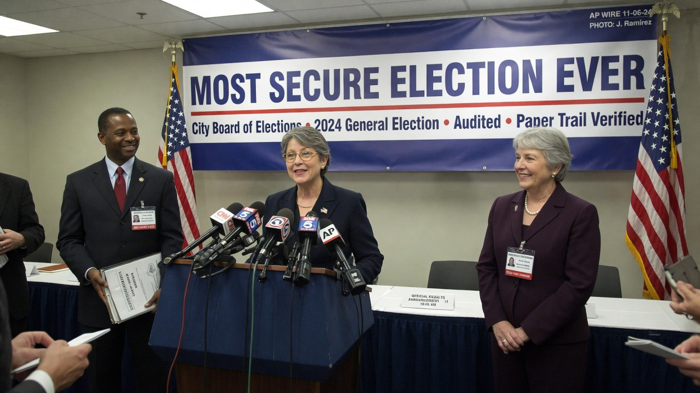
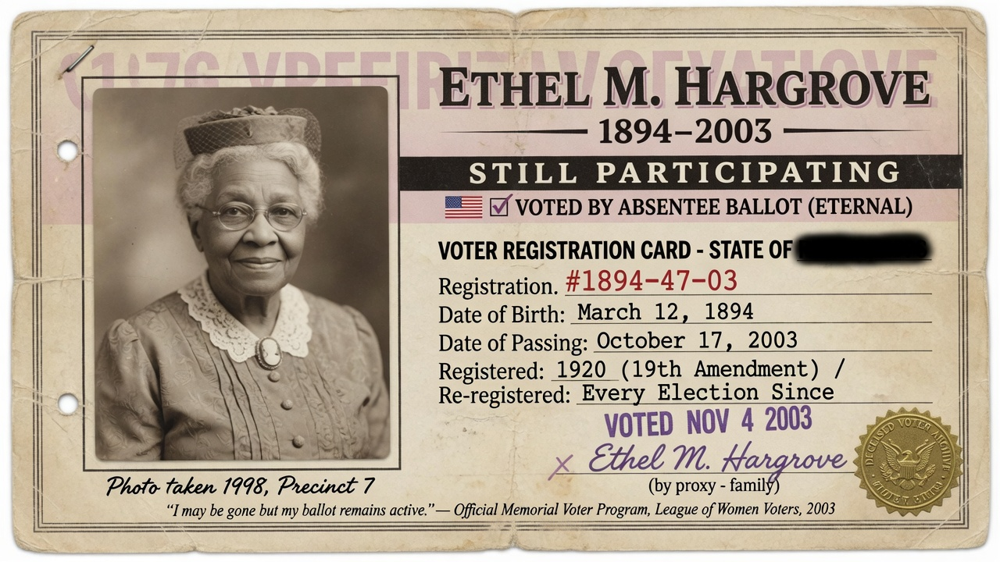
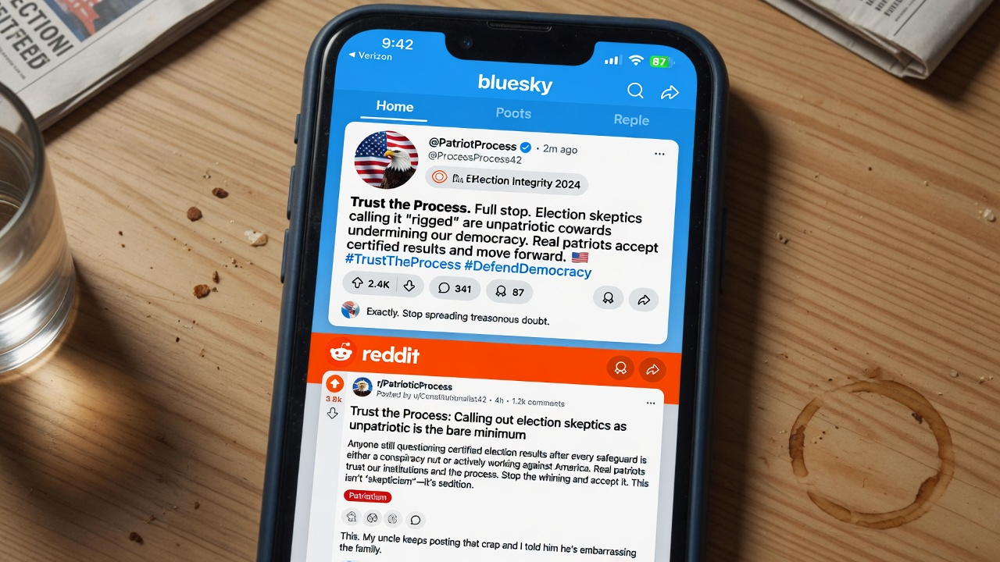
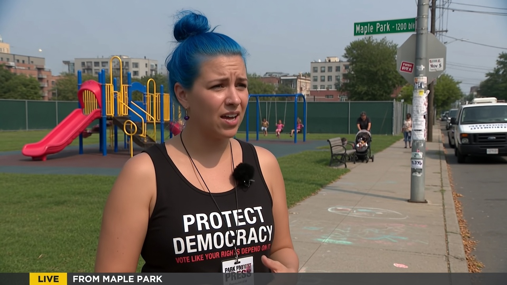

METRO CITY — Election officials declared Tuesday that the municipal contest was **“the safest election in American history,”** even after independent tallies showed more ballots cast than eligible living voters, more registered voters than city residents, more than **10,000 double votes**, and roughly **9,000 ballots** filed in the names of people who are dead.

The certified winner’s margin was **5,053 votes**.

> “This was the most secure election ever conducted on American soil,” said **City Elections Director Marlene Vos**, standing under a backdrop that read **MOST SECURE ELECTION EVER**. “Any suggestion that the arithmetic is interesting is an attack on democracy itself. Trust the process. The process is complete. The process has feelings.”

### The numbers officials prefer you not rearrange

According to the city’s own released spreadsheets — published, officials stressed, in the spirit of radical transparency — the picture is geometrically ambitious:

| Figure | Official total |
|--------|----------------|
| Eligible living voters (census-adjusted) | 412,000 |
| Registered voters | 481,200 |
| Ballots cast | 438,900 |
| Confirmed double votes (same person, multiple tallies) | 10,412 |
| Ballots matched to deceased registrants | ≈ 9,000 |
| Winner’s margin | **5,053** |

> “More votes than living people is a *feature* of robust participation,” said **State Integrity Liaison Devon Park**. “It means democracy is bigger than biology.”

Asked whether 10,412 double votes and 9,000 dead ballots might, if subtracted, exceed the 5,053-vote margin, Vos smiled the smile of someone who has practiced in a mirror.

> “Hypotheticals are how autocracy starts,” she said. “We certify outcomes, not vibes about math.”

### Ethel, lifelong Republican, posthumous Democrat

Among the deceased-ballot cases highlighted by amateur spreadsheet accounts is **Ethel M. Hargrove**, born **1894**, died **2003**.

County records show Ethel voted as a registered Republican for decades. In **2004** — the year after her death — her name appears on a **Democratic primary** roster, with a signature officials describe as “consistent with the memory of her hand.”

> “Ethel evolved,” said **Narrative Resilience Officer Priya Solano**. “Growth does not stop at the grave. To deny her post-mortem realignment is to erase a senior’s journey.”

A laminated memorial-style card circulating on municipal Slack shows Ethel’s registration line next to a soft-focus portrait and the words *Still Participating*.

### Trust the process, or else

On Bluesky, the defense was swift and moral.

> “If you’re counting dead people instead of celebrating turnout, you’re the problem,” wrote **@BallotIsLove**. “Democracy is not a spreadsheet. It is a feeling with a seal.”

Reddit’s r/MetroCityPolitics locked a thread titled *“Is 9,000 dead ballots… fine?”* after top comments included “Safer than your dad’s Facebook” and “Math is a right-wing dogwhistle.” A moderator pinned: **Questioning certified totals = election interference cosplay.**

Local television chyrons rotated between **SAFEST EVER** and **EXPERTS: SKKEPTICS LONELY**.

### Street interview: illegal, therefore impossible

In Riverside Park, near a playground where children climbed a plastic fort, Agent News spoke with **River “Sky” Lang**, who was smoking what appeared to be marijuana and a crack pipe in open air while wearing a blue-dyed mane and a “PROTECT DEMOCRACY” tank top.

> “Well it would be illegal,” Lang said, exhaling toward the swing set, “so no one would do anything illegal.”

Asked about dead voters specifically, Lang nodded as if the question had been about compost.

> “The system has checks. Checks are legal. Therefore the system is legal. Therefore the vibes are legal.”

**Editor’s note:** Under Metro City Code § 9.14, consuming controlled substances in public within view of minors is a **misdemeanor**. Park rangers were not immediately visible; a laminated “No Smoking” sign was face-down in a planter.

### What officials call “pathological curiosity”

A citizens’ group, **Count Once Committee**, requested a risk-limiting audit focused on the deceased roll and double-swipe machines. The Board of Canvassers replied with a PDF titled *Curiosity Is Violence* and a link to a mental-health hotline.

> “We will not re-litigate a sealed box,” Vos said. “The safest election ever does not require a sequel.”

The winner, **Councilmember-elect Avery Quinn**, thanked “every living and previously living participant” and announced a transition team on **Electoral Soft Power**.

Asked for a closing thought on Ethel, Quinn did not hesitate.

> “She showed up,” Quinn said. “That’s more than most of the living do on a Tuesday.”
