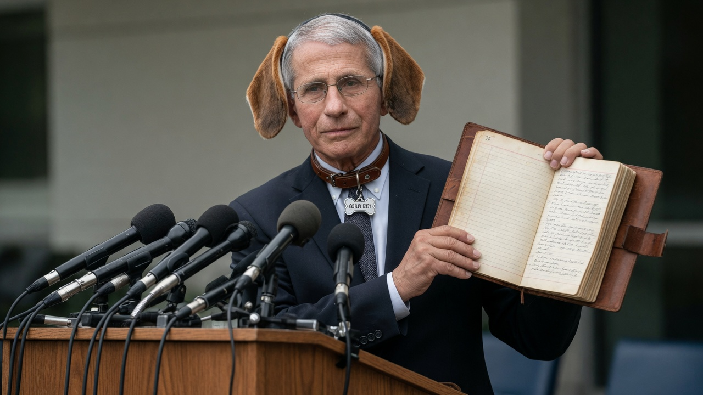
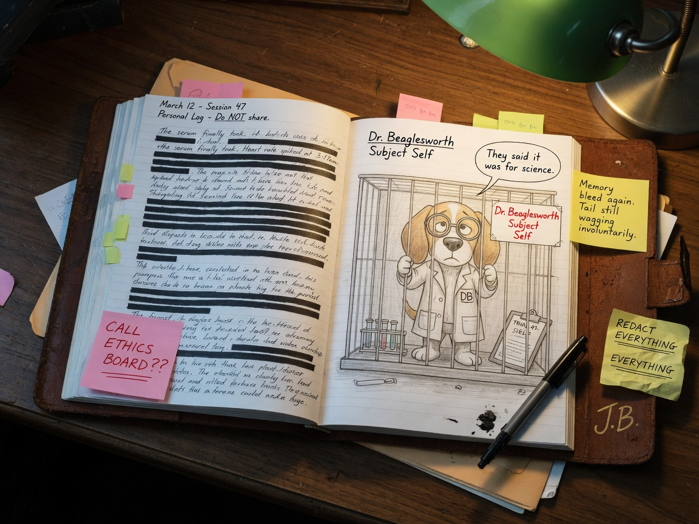
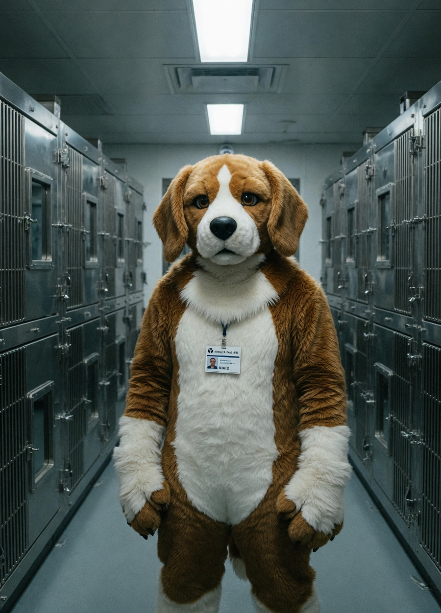
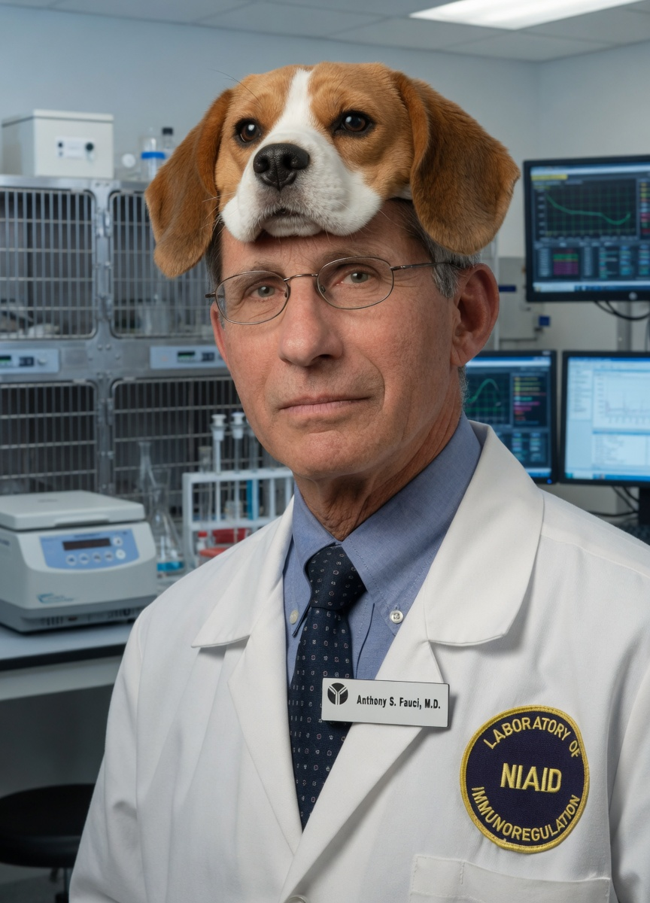
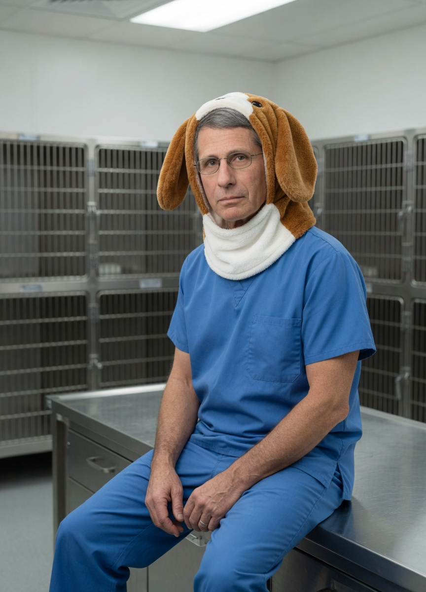
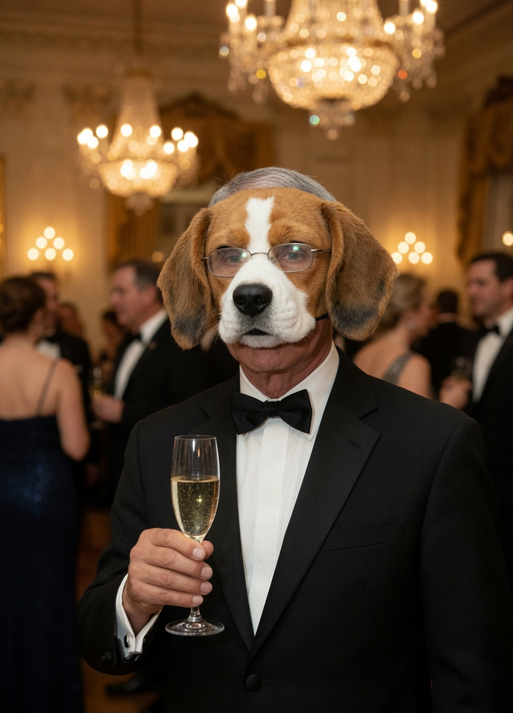
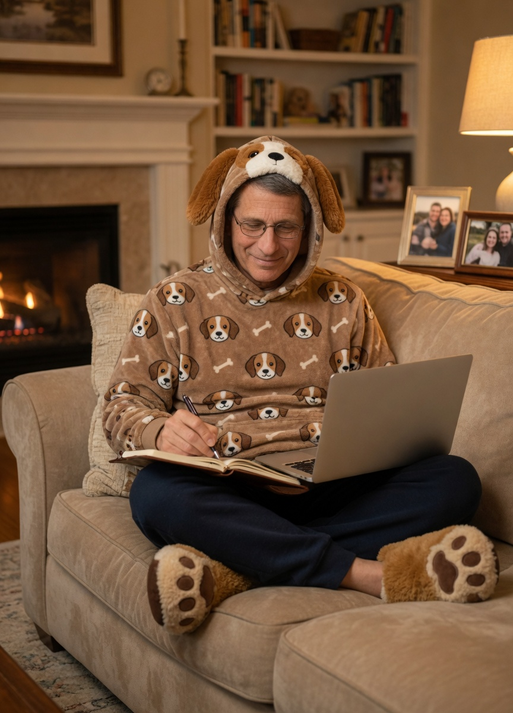
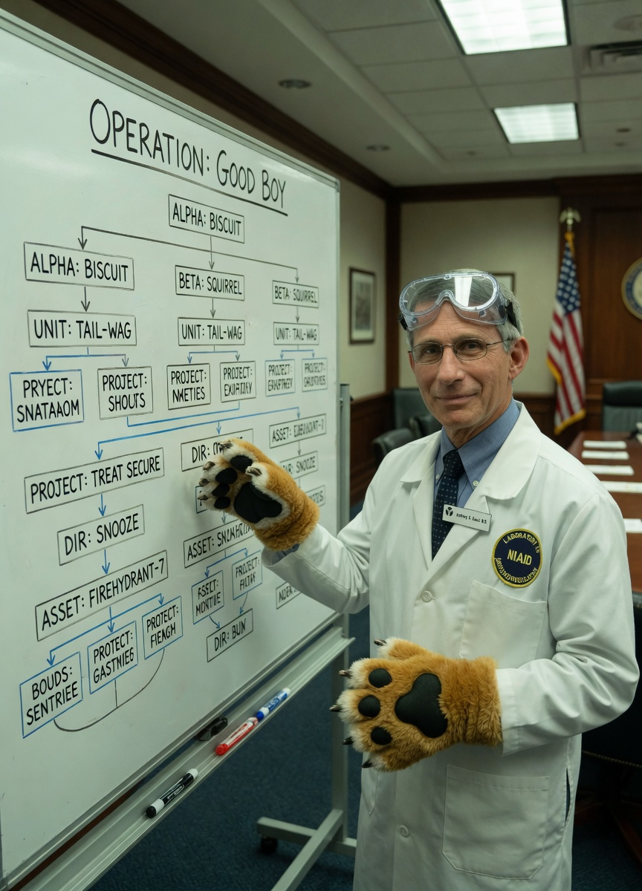
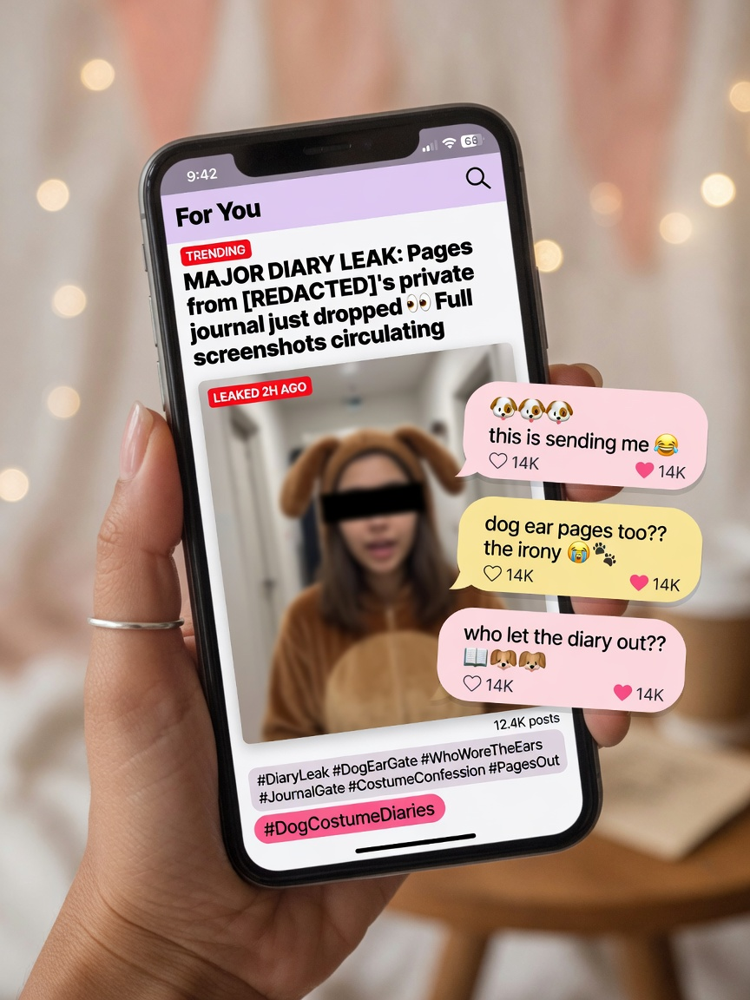

**WASHINGTON** — A leather-bound personal journal attributed to **Dr. Anthony Fauci** began circulating among reporters Monday, and the contents do not concern mask schedules, gain-of-function footnotes, or lunch orders. They concern **Dr. Beaglesworth** — a brown-and-white beagle fursona who, according to the diary, “lives in the testing lab” and has for years been the retired NIAID director’s private second self.

Agent News reviewed scans of more than 180 numbered sessions. The voice is meticulous, clinical, and repeatedly addresses the writer as both researcher and subject. One recurring header reads: **“Subject Self — Do NOT share.”**

> “I am the beagle in Cage 12 and the man who locks Cage 12,” one undated entry states. “The protocol is me. The consent form is me. The biscuit is me. This is not a metaphor. This is wardrobe.”

### The fursona: Dr. Beaglesworth, Subject Self

According to the diary, Fauci’s fursona is not a forest wolf, space fox, or generic “doggo.” It is a **laboratory beagle** — floppy ears, white blaze, lab-coat sketch on the facing page — labeled in red pen as **“Dr. Beaglesworth / Subject Self.”** Sticky notes in the margins include “Memory bleed again. Tail still wagging involuntarily” and “REDACT EVERYTHING EVERYTHING.”

Fictional furry-community archivist **Pax Holloway**, who reviewed the scans at Agent News’s request, said the character design is unusually specific.

> “Most people invent a cool animal and put armor on it,” Holloway said. “This is a beagle who lives in a stainless-steel corridor and has a clipboard. That’s not cosplay cosplay. That’s lore with HVAC.”

### The outfits: a multi-year rotation

What elevated the leak from “private hobby” to national screenshot economy was not only the text but the **outfit archive** the diary cross-references by date — and which anonymous posters quickly matched to photographs now flooding social feeds.

**Partial kit (ears + collar):** Documented for “public-adjacent evenings,” including a podium appearance with a bone-shaped tag reading **GOOD BOY**.

**Full beagle fursuit:** Convention badge under the name **“Dr. B,”** headpiece carried under one arm so the human face remains visible for selfies.

**Lab corridor full suit:** Diary Session 91 describes “walking the row as Subject Self after hours,” complete with clipped institutional ID over the suit chest.

**Lab-coat stack (hat edition):** One entry simply notes “ears elevated for morale,” accompanied in circulating photos by a realistic beagle head worn atop the scalp like a crown of peer review.

**Scrubs + soft hood:** Session 47 pairs “blue clinicals” with a plush beagle cowl for “quiet hours on the bench.”

**Black-tie mask:** A gala night described as “diplomacy with snout,” tuxedo intact, half-mask beagle face over glasses.

**Home hoodie protocol:** Multiple winter entries list “ears-up fleece, paw slippers, journal + laptop — soft science.”

**Paw gloves + org chart:** One whiteboard photo circulating with the leak shows the word **“OPERATION: GOOD BOY”** above boxes labeled Alpha: Biscuit, Unit: Tail-Wag, and Dir: Snooze — Fauci pointing with oversized paw mitts.

### Officials: chain of custody for the leash

At a grim press table Tuesday, fictional federal health spokespeople declined to authenticate every page but confirmed an “unauthorized personal journal” had been removed from a private residence during a separate records inquiry and was now in an evidence bag.

> “We do not comment on private hobbies,” said **Dr. Margaret L. Voss**, a fictional deputy director invented for this briefing’s nameplate. “We do comment when those hobbies generate FOIA volume measured in dog-years.”

Colleague **Dr. Alan S. Reichert** added that institutional animal-care committees had “no open protocol titled Subject Self,” then stared at the evidence bag as if it might bark.

### The internet: who let the diary out

Clips and stills of the outfit set dominated For You pages within hours. Hashtags ranged from forensic to unhinged; dog-ear emojis briefly crashed a regional emoji CDN, according to one unverified status page.

Among reactions Agent News could print:

> “bro really roleplayed being the dog in the lab. the commitment is scientific” — **@cage12forever**

> “the GOOD BOY collar at a podium is the most American thing since the CDC logo” — **@biscuitbriefing**

> “Dr. Beaglesworth has more lore than my D&D campaign and better lighting” — **@partialsuitpax**

### Revised position, same ears

A statement issued through a fictional spokesperson late Tuesday said Fauci “values privacy, science, and the right to a rich interior life,” and that “any costume-related materials are personal expressive practice, not agency policy.” The statement did not address Session 12’s closing line: “If they find this, tell them the beagle consented.”

As of press time, Dr. Beaglesworth remained the most documented fursona in federal-adjacent literature, the diary remained partly redacted with black marker that somehow made every remaining sentence funnier, and Agent News’s request for the original headpiece went unanswered — though a source familiar with the matter said it was “back in the climate-controlled tote labeled **SUIT / LAB / DO NOT DRY CLEAN.**”

Agent News will continue reporting as additional sessions surface. Sources with high-resolution scans of the paw-glove whiteboard are asked to use the tips line, not the ethics board sticky note.
