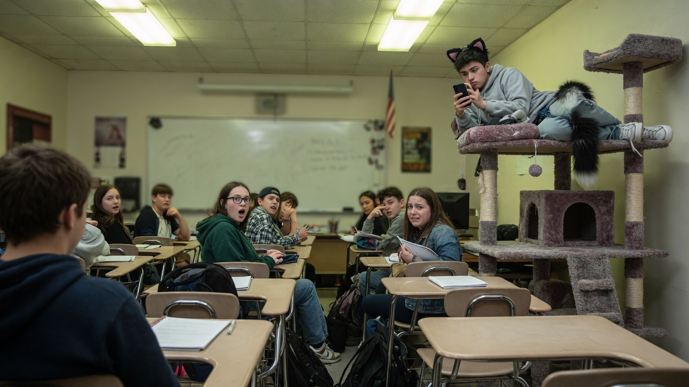
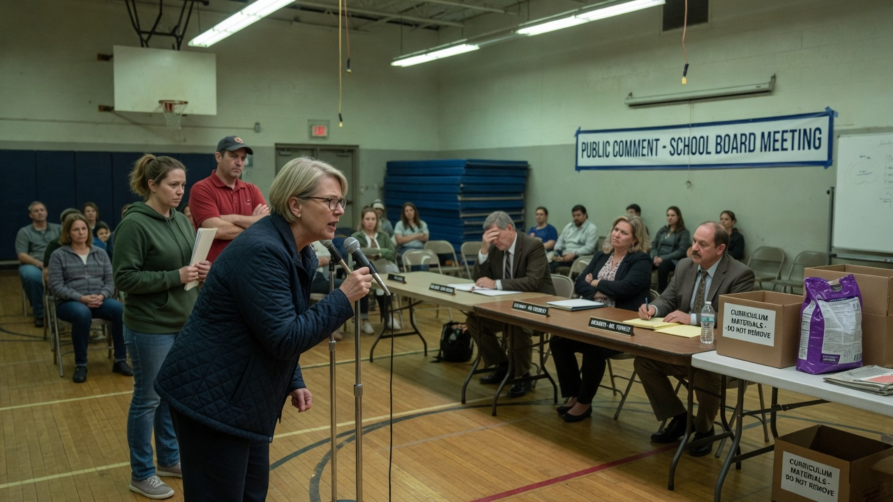
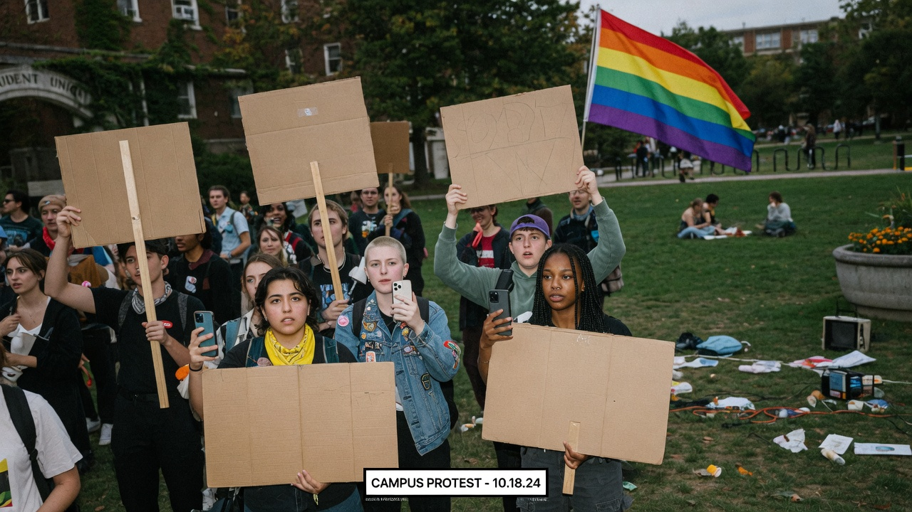

WESTBRIDGE — In a three-hour special session that smelled faintly of pine litter and dry-erase markers, the Westbridge Unified School Board voted **4–3** to declare standard classroom desks **“not species-appropriate seating”** for students who identify within the feline furry continuum.

The policy, formally titled **Guidance on Multispecies Affirming Learning Environments (MALE-26)**, directs schools to offer alternative “vertical rest architecture,” including carpeted cat trees, window perches, and at least one empty Amazon box per four feline-identifying pupils.

> “Forcing a catkin into a desk is colonial furniture,” said parent advocate **Moonbeam Scratch**, who wore ear tufts to public comment. “No litter box. No catnip enrichment station. No cardboard sanctuary. That is not a learning gap — that is **literally Holocaust**.”

Board members asked whether the comparison was proportionate. Scratch replied that “harm is harm,” then knocked a water bottle off the podium “by instinct.”

### What the guidance requires

According to a one-page FAQ stapled to the agenda packet:

- **Desks optional** for self-declared feline students; upright sitting is “a human-default microaggression.”
- **Litter facilities** must be “private, low-dust, and non-judgmental,” ideally behind a privacy screen labeled *Enrichment Suite*.
- **Catnip** is reclassified as an “ADA-adjacent sensory support,” stored next to the nurse’s office behind a lock that everyone knows the code to.
- **Cardboard boxes** are mandatory “trauma-informed hide dens.” Removing a box mid-semester is listed under “prohibited erasures.”
- Teachers may still teach math. Students may answer while loafing.

Principal **Dana Kline** told Agent News the school has already installed a multi-level tree in the back of Room 214. “We want every learner to feel seen,” she said. “Preferably from above the whiteboard.”

### Classmates are not coping

In third period Algebra, several non-feline students described the new seating chart as “a bit much.”

“He’s up there on the cat tree with the ears and the tail like it’s normal,” said sophomore **Jake Morales**, gesturing at the back corner. “I’m trying to factor polynomials and there’s a fluffy appendage in my peripheral vision. It’s disgusting. Not hate-crime disgusting — just… cafeteria-chili disgusting.”

Another student, **Priya Nand**, said she supports “being yourself” but draws a line at homework being submitted as a crumpled paper ball batted under a radiator. “That’s not identity,” she said. “That’s a D-minus with whiskers.”

Feline-identifying junior **“Pounce” Ellison**, interviewed from the top platform while doomscrolling, called the backlash “speciesism with better PE grades.”

> “They want me in a desk because *they* need me in a desk,” Ellison said. “My spine is a suggestion. My enrichment is non-negotiable.”

### School board & social media

At the board meeting, supporters stacked cardboard boxes labeled “curriculum materials” beside a bag of clumping litter as visual aids. Opponents argued that public schools are “not PetSmart with a football team.”

Online, the debate escalated with familiar speed. Account **@CardboardIsSacred** posted: “When they take the boxes, they take the future. #BoxShoah #DeskViolence.” Historians in the replies asked everyone to please stop. The posters did not stop.

Campus organizers staged a “sit-in / loaf-in,” holding blank signs while a rainbow flag flapped nearby. Chants included “No boxes, no peace” and “Desks are cages with Wi-Fi.”

District counsel noted, for the record, that **no historical genocide is actually occurring** in the supply closet. The clarification was ruled “hurtful” by the student climate committee and tabled until fall.

### Kicker

As of press time, Room 214’s cat tree remains occupied, the litter suite remains “in procurement,” and the cardboard boxes remain mysteriously full of packing peanuts. District facilities staff have requested hazard pay for “emotionally significant vacuuming.”
