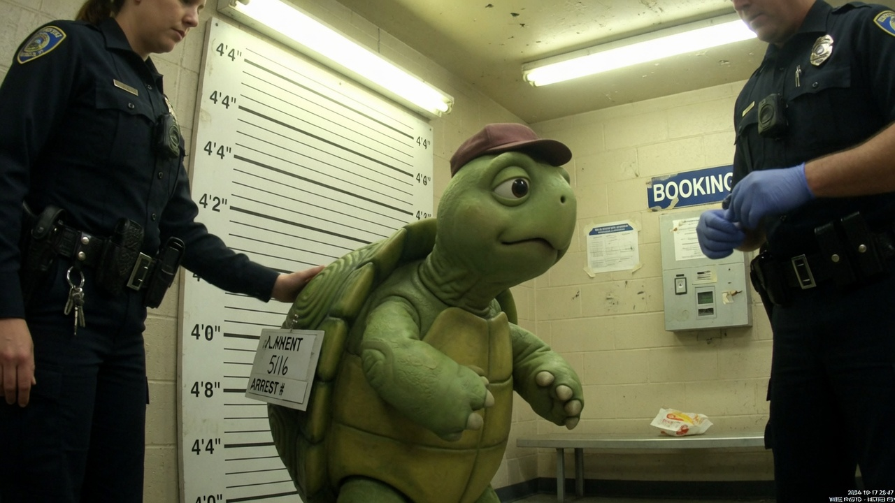
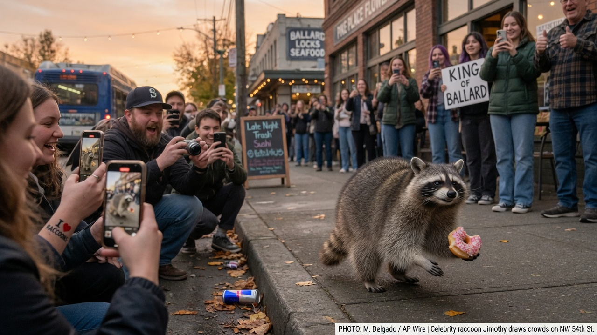
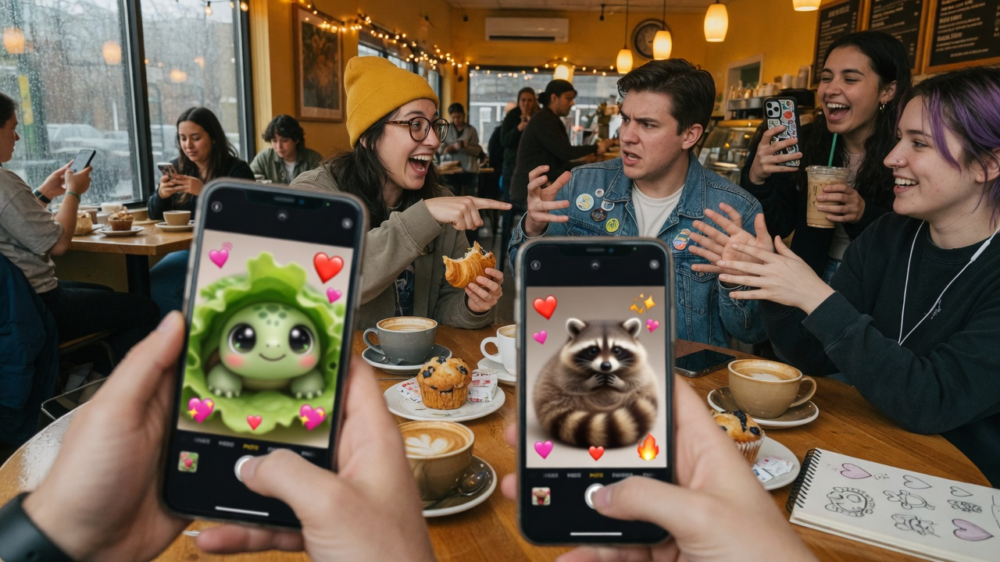
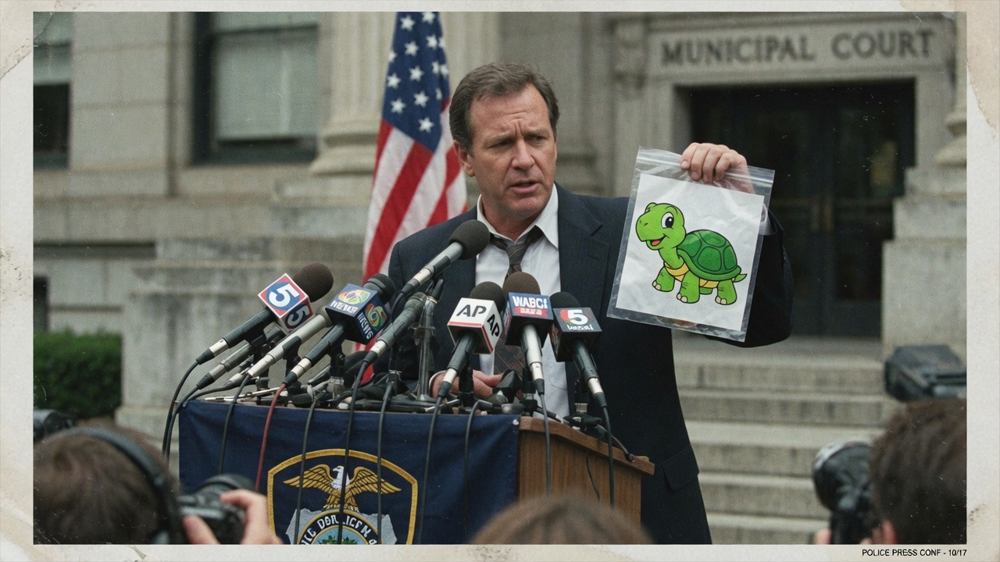

SEATTLE — Federal and local investigators announced Friday that **Franklin**, the soft-shelled children’s-book turtle whose 2026 meme renaissance briefly reclaimed the phrase “slow and steady,” has been **arrested and charged with conspiracy to commit murder** against **Jimothy**, the viral short-spine raccoon who has spent the year waddling through Ballard on a diet of donuts, compost, and unearned fame.

Prosecutors allege Franklin’s motive was pure spotlight theft: after years of shelf life and a surprise TikTok revival, the turtle watched engagement metrics tilt hard toward a spherical raccoon with a congenital waddle and a municipal fan club.

> “The defendant expressed repeated resentment that a ‘round trash mammal with no hardcover imprint’ had overtaken him in mentions, merch, and emotional-support animal cosplay,” said **Assistant U.S. Attorney Priya Okonkwo** at a downtown briefing. “We treat conspiracy seriously, even when the suspect fits in a lunchbox.”

### The alleged plot: patience as a weapon

According to charging documents obtained by Agent News, Franklin is accused of recruiting co-conspirators through private group chats named things like *Shell Justice* and *Jimothy Must Learn Respect*. Investigators claim the turtle discussed “slowing Jimothy permanently,” “rerouting the spotlight,” and “returning the discourse to amphibious values.”

No weapons were recovered. Evidence reportedly includes a laminated library card, a half-eaten head of lettuce, and a handwritten list ranking “adorability metrics” on which Jimothy was circled in red and annotated *unfair*.

Jimothy, reached via trail-cam diplomats, has not been harmed. Witnesses say he remains at large in northwest Seattle, last seen accepting a pink-frosted donut from strangers while someone yelled “KING OF BALLARD.”

### “How the fuck do you arrest a cartoon character?”

As the news broke, social media split into two camps that barely noticed the felony charge: **Team Shell** and **Team Spine**, both arguing which defendant-adjacent creature was more adorable.

On r/Seattle, a user identified as **u/OntologicalSkeptic** posted a thread that began: “Genuine question: **how the fuck do you arrest a cartoon character**?” He followed with a short essay on copyright personhood, mascot liability, and “whether booking photos of intellectual property violate the Berne Convention.”

The post was **downvoted to oblivion** within minutes. Comments called him a cop, a fed, and worse. Moderators later **permanently banned him for “animatophobia,”** citing a new community rule against “species-essentialist denial of cute persons’ civil rights and responsibilities.”

> “Asking basic metaphysical questions is not bigotry,” u/OntologicalSkeptic wrote in a farewell note on a secondary account that was also banned. “But apparently on Reddit, if a turtle can do a perp walk, you’re the problem for noticing.”

### Cuteness as a contested jurisdiction

Polls that are almost certainly fake and still widely shared put Jimothy ahead 54–46 on “who would you trust with your sandwich,” while Franklin led among millennials who “grew up with him on VHS.” Influencers staged staged tears. A Ballard bakery sold out of “Innocent Until Proven Spherical” cookies. A children’s-lit account posted a thread titled *When Your Emotional Support Turtle Enters the Criminal Justice System*.

Media ethicists — there were suddenly many — debated whether coverage itself rewarded the alleged conspiracy.

> “If Franklin wanted the spotlight back, mission accomplished,” said culture critic **Devon Marsh**. “Murder charges are the new hardcover tour.”

### Officials: jurisdiction is “settled enough”

At a courthouse presser, a detective held up a plastic evidence sleeve containing a cheerful turtle illustration and declined to explain ontology.

> “The subject presented himself, answered to Franklin, and requested a shell-compatible cell,” the detective said. “We’re not getting into animation theory. We’re getting into probable cause.”

Defense counsel, speaking only on background, said Franklin maintains he was “journaling about feelings” and that “conspiracy requires more than envy and a group chat named after a shell.”

### What happens next

Franklin is expected to appear for arraignment next week. Prosecutors have not said whether they will seek a no-contact order keeping him more than one city block from any raccoon of renown. Jimothy’s legal team — a guy with a GoFundMe and a raccoon emoji in his handle — asked fans to “stop leaving donuts as evidence.”

As of press time, the internet remained locked in the only debate that mattered: not guilt or innocence, but whether a turtle in a little cap or a short-spine raccoon with a donut is more worthy of unconditional love. Reddit’s newest banned user, still technically right about cartoons, remains uninvited to either side.
