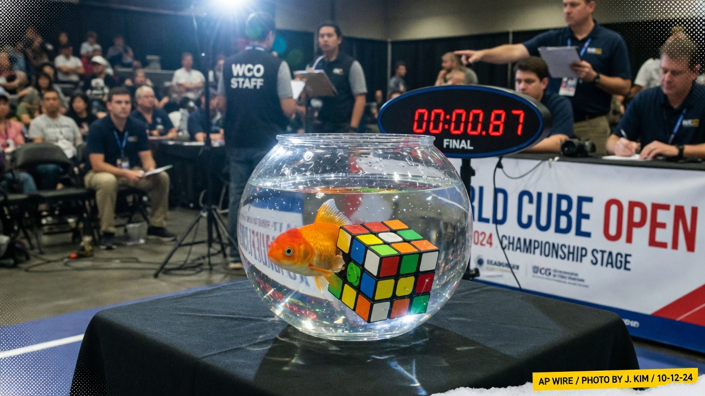
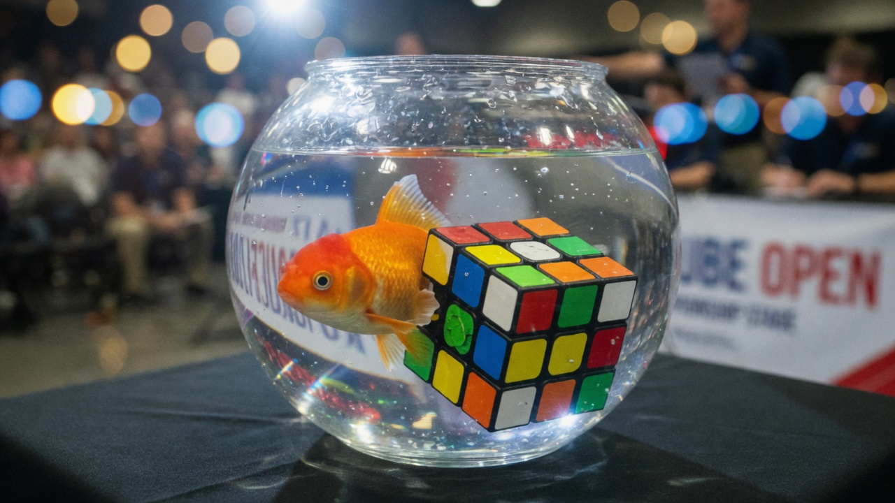
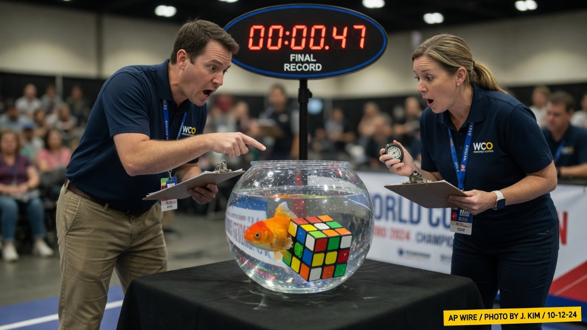
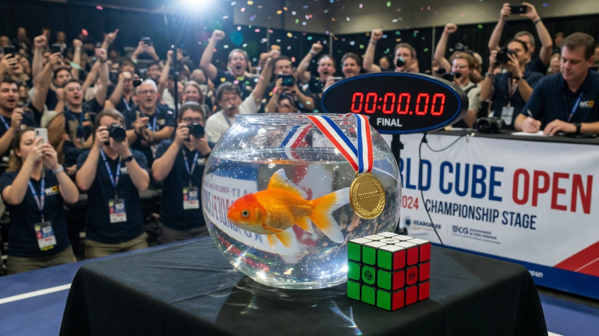

INDIANAPOLIS — Under arena lights and a banner for the **World Cube Open**, a three-inch orange-and-white goldfish named **Finley “Bubble Alg” Carassius** completed a scrambled **3×3 Rubik’s Cube** in **0.87 seconds** Saturday, shattering every human single and triggering an immediate review of whether gills count as “hands.”

Finley competed from a clear glass bowl centered on the main stage table. The cube rested against the glass. Officials confirmed the scramble was legal, the timer was WCA-grade, and the fish had signed the competitor form with a wet nose print.

### The solve

Spectators described a blur of orange, a single decisive *thunk* of plastic against glass, and a digital board freezing at **0.87**. Judges leaned in. The cube’s faces were solid. Someone in the front row yelled, “That’s not a fish, that’s a GPU with scales.”

> “We inspected the cube three times,” said head judge **Marla Chen**. “No magnets out of spec. No hidden motors. Just a goldfish who apparently memorizes look-ahead better than our open division.”

Agent News obtained a tight still from the final turns: Finley’s face pressed to the glass, fins braced on the last unsolved corner.

### How a goldfish turns layers

Trainer and legal guardian **Doug Halpern**, who has coached Finley since a “pet-store clearance incident,” said the method is **“wet CFOP.”**

> “He uses laminar flow and intentional bowl sloshes to torque the layers,” Halpern explained backstage, holding a bag of flakes labeled *Competition Fuel*. “People think goldfish have three-second memories. Finley’s memory is long enough to hold forty algs and a grudge against the white cross.”

Halpern denied using performance-enhancing aquarium heaters. “He prefers 72 degrees Fahrenheit and silence except for the click of plastic.”

Human finalist **Kyle “Sub-4” Ortega**, who had arrived expecting a personal best, left the hall without his cube.

> “I practiced two hours a day for six years,” Ortega said. “He practices by floating. I want a rematch in air. No bowl. No water. Fair is fair.”

### Officials scramble for a ruling

After the solve, two judges stood over the table with stopwatches and clipboards while the solved cube sat beside Finley’s bowl like a guilty confession.

The provisional record committee convened in a hallway and produced a three-page memo titled **Aquatic Competitors: Eligibility, Moisture, and Moral Hazard**. Highlights:

- Fins may contact the puzzle **through glass or water**, provided no human hand assists after inspection.
- Bowls count as “competition stations” if they fit on the table and do not leak onto the timer.
- Trash talk is limited to bubbles and one optional glare.

> “We’re not saying every pet can enter,” said committee chair **Priti Nandakumar**. “We’re saying this pet just made our leaderboard look like a splash pad. The data is real. The pride is optional.”

### Crowd reaction and the podium

When organizers draped a small gold medal over the rim of Finley’s bowl, phones went up in a single wave. Confetti drifted. A rival cuber held a sign reading **FISH DON'T BELONG IN CFOP** until security gently replaced it with a participation cube.

Social clips labeled the run **#BubbleAlg**, **#0point87**, and **#GillsBeforeSkills**. One comment, already pinned on three platforms: “My cat couldn’t even open a treat bag.”

### What Finley said

Halpern translated Finley’s post-solve interview from a series of mouth-opens and a slow circle of the bowl.

> “He says the scramble was soft,” Halpern reported. “He says humans overthink U-perms. He says the flakes after a WR taste better.”

Asked whether he would defend the record, Finley swam once against the current and faced the cameras. Halpern nodded.

> “That’s a yes. Or hunger. With goldfish it’s often both.”

As of press time, the World Cube Association had listed the mark as **pending ratification pending humidity sensors**. Finley was last seen doing cool-down laps around a fully solved cube, medal clinking softly against glass with each pass — a sound human competitors said they would hear in their sleep.
