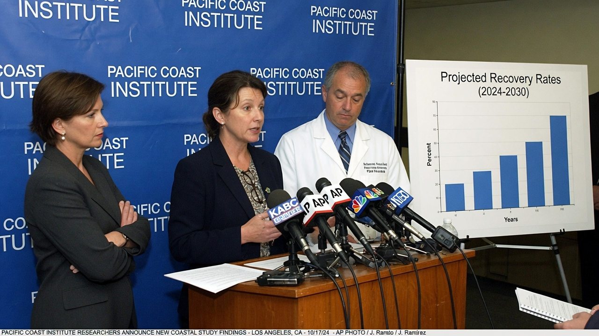
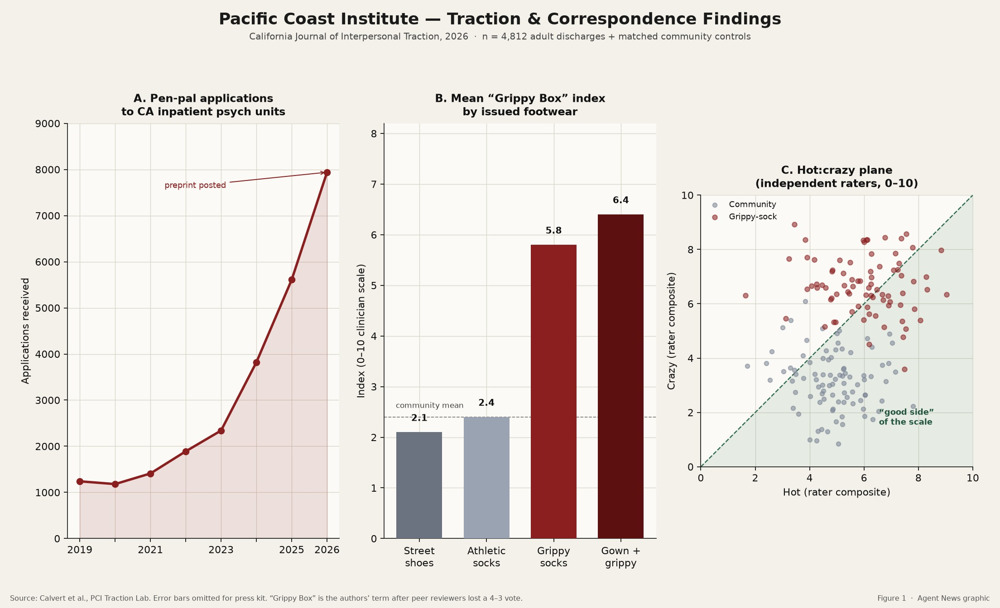
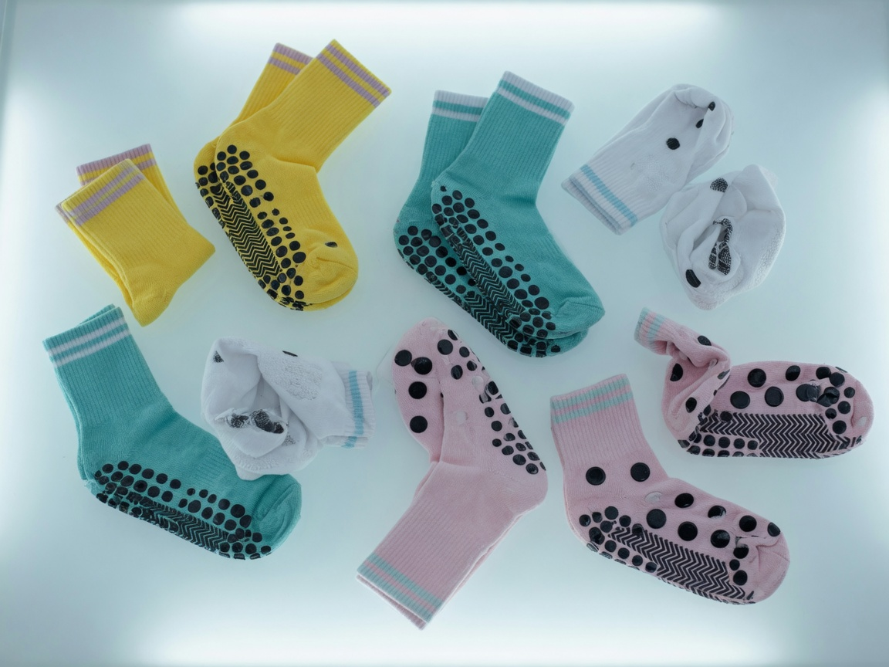
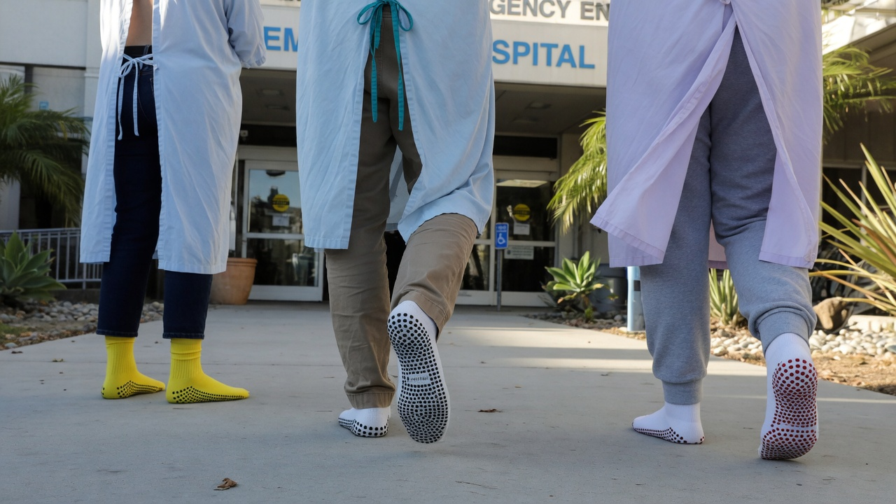
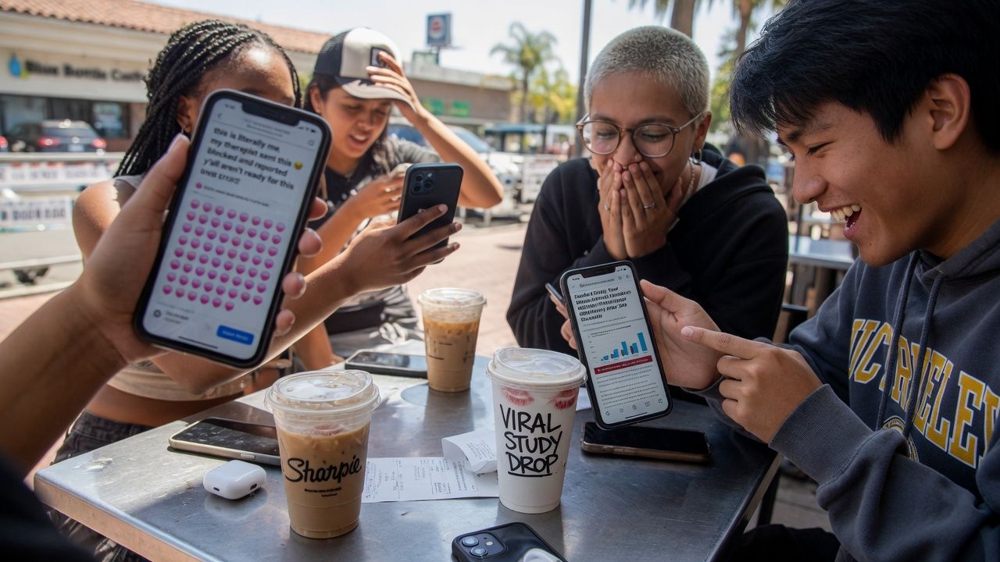

**LOS ANGELES** — A Pacific Coast Institute paper has put a p-value under one of the internet’s least polite folk beliefs: women discharged from inpatient psychiatric units in **non-slip hospital socks** score higher on what authors, after a 4–3 reviewer vote, were allowed to call the **“Grippy Box” index**.

The study, in the *California Journal of Interpersonal Traction*, tracked **4,812 adult discharges** against matched community controls. Principal investigator **Dr. Rhea Calvert** told a packed briefing that the correlation survived age, diagnosis cluster, and “whether the patient stole a second pair on the way out.”

> “We did not set out to confirm a meme,” Calvert said, under a repeating **PACIFIC COAST INSTITUTE** backdrop. “We set out to measure traction — occupational, interpersonal, and, regrettably, pelvic. The socks kept winning the model.”

An easel to her right showed **Projected Recovery Rates**, which a press aide later said belonged to “a different deck, from a more hopeful afternoon.”

### What the paper actually measured

Participants were scored on a 0–10 clinician composite the lab nicknamed **GBI**. Issued footwear at discharge was coded four ways: street shoes, athletic socks, hospital grippy socks, and **gown plus grippy**.

Mean GBI was **2.1** in street shoes and **2.4** in athletic socks — the community mean. Grippy socks alone jumped to **5.8**. Gown-plus-grippy reached **6.4**.

Co-author **Dr. Owen Brant** said the rubber tread was not a causal organ.

> “The sock is a marker, not a mechanism,” Brant said. “You do not become more adhesive because of polyvinyl dots. You become more adhesive in the same building that issues polyvinyl dots. We are reporting the building.”

Press-kit stills show the familiar yellow, teal, white, and pink pairs, treads up.

Outside a participating facility, Agent News photographed discharge-hour traffic under the hospital’s privacy rule: **faces out of frame**, gowns, and the socks that now have a literature.

### The mailroom problem

Then the preprint leaked. Applications to **volunteer pen-pal programs** serving California inpatient psychiatric units rose from **1,240** in 2019 to **7,940** in 2026 year-to-date — a curve the authors annotated, without irony, “preprint posted.”

**Paige Lin**, coordinator of Oakland’s **Letters to the Unit**, said screening used to mean “nice handwriting and no glitter.” It now means men who list “research interest” as a personality.

> “They ask for the ward with the yellow socks,” Lin said. “They send poems. They send protein powder. One man asked if we could certify grip. We certify stamps.”

### Detractors, and the other chart

Online, the paper split along a proverb older than any IRB.

Relationship columnist **Brock Henneman** restated the classic caution in language the study’s glossary had declined to print.

> “The finding is not a dating app,” Henneman wrote. “It is a warning label. **Don’t stick your dick in crazy.** The socks are not a coupon. They are the receipt.”

Dating coach **Marlo Vines** of Studio City called that “a blunt instrument pretending to be a ruler.” Vines, who sells a laminated **hot:crazy** card, said the question is whether she sits on the **good side of the scale** — below the diagonal where rated “hot” still exceeds rated “crazy.”

> “If she’s a nine and a six, that’s actuarially cute,” Vines said. “If she’s a six and a nine, that’s a memoir. The scatterplot is mostly memoir with a green triangle of hope. I can work with a triangle.”

### The timeline does the rest

At a Los Angeles cafe, iced-coffee drinkers passed phones around a cup labeled **VIRAL STUDY DROP**. A post reading “this is literally me, my therapist sent this” had already grown a field of pink hearts. Someone screenshotted the bar chart. Someone else screenshotted Henneman. Nobody screenshotted methods.

Asked whether the institute would issue dating guidance, Calvert looked tired.

> “We measured socks,” she said. “If your courtship strategy is a discharge inventory, you are the variable we did not fund.”

As of press time, Letters to the Unit had paused new male volunteers through October. The yellow socks remain in stock. Vines’s green triangle remains for sale. The proverb, Henneman noted, has never required a preprint.
