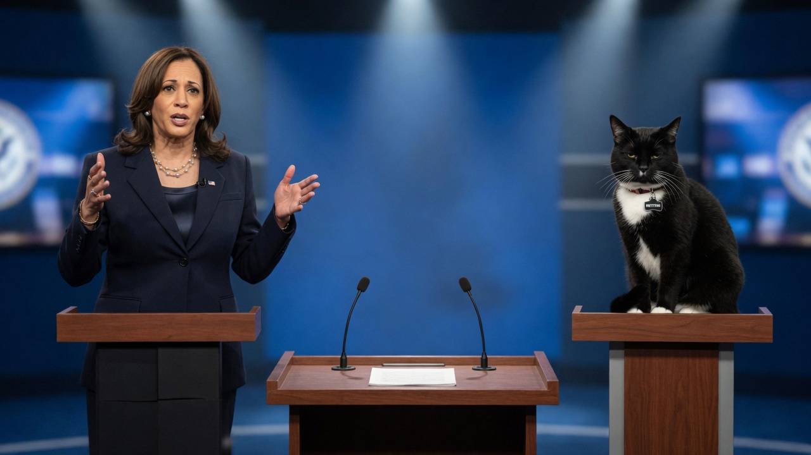
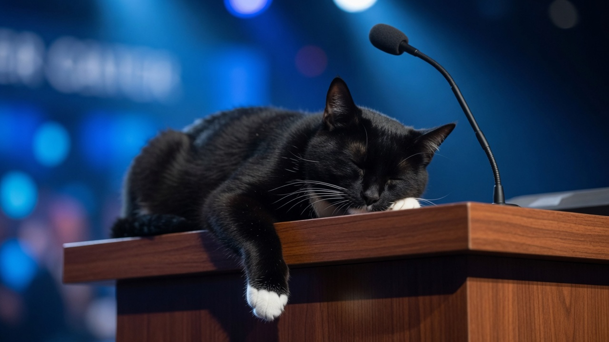
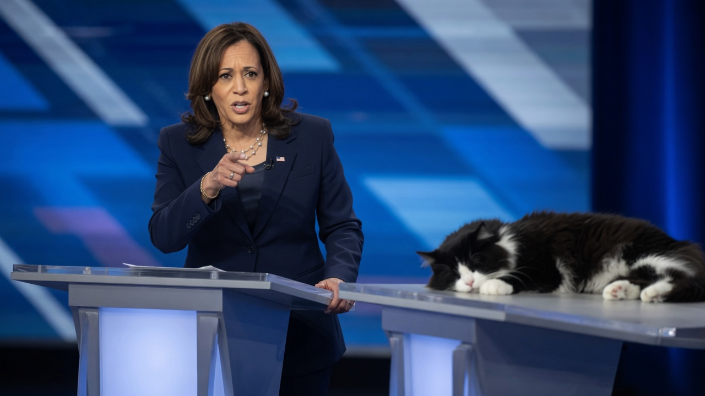
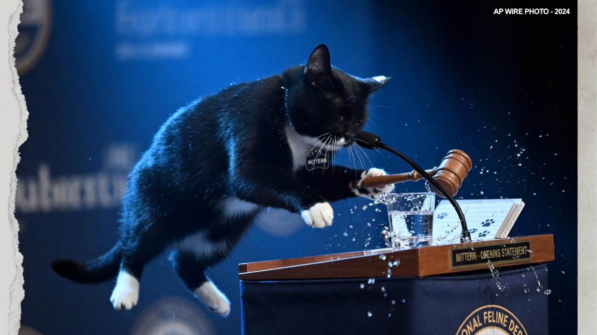
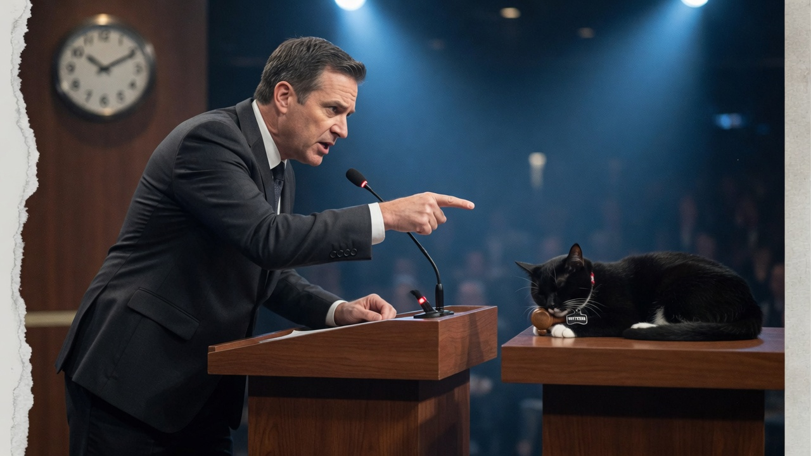
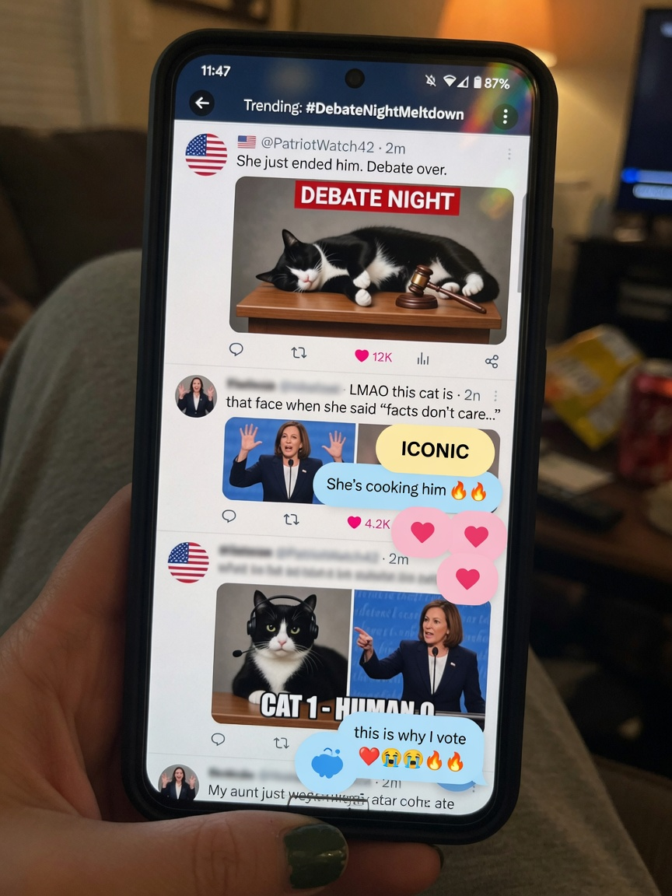
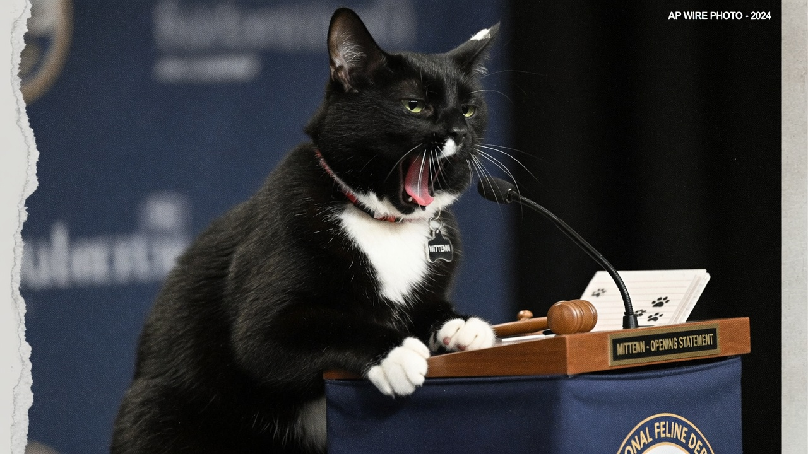

**PHILADELPHIA** — Vice President Kamala Harris squared off Tuesday night against her scheduled opponent, a narcoleptic black tuxedo cat named **Mittenn**, in a 90-minute debate that producers billed as a “serious exchange of ideas” and that social media immediately reclassified as “appointment television for people who hate sleep.”

Mittenn — double-n, campaign staff insisted — arrived in a miniature navy bow tie, took the right-hand podium, and remained vertical for roughly eleven seconds before the first eyelids began their slow constitutional descent.

> “Look, the American people deserve a debate partner who shows up,” Harris said early, gesturing toward the opposite lectern. “I am ready to talk about housing, childcare, and the cost of eggs. My opponent appears to be reviewing the interior of his own eyelids.”

### The gotcha reels arrive early

Within the first segment, cable packages and phone cameras captured a cascade of freeze-frame moments that producers later labeled, without irony, “the gotcha package.”

**Gotcha 1 — The faceplant.** During Harris’s first multi-part answer on housing policy, Mittenn’s chin met the podium with a soft *thup*. The microphone stayed live. Somewhere in the control room, a producer whispered “we keep rolling.”

**Gotcha 2 — The empty rebuttal window.** Harris delivered what aides called a “clean, prosecutorial point” on childcare costs while pointing across the stage. The camera cut wide. Mittenn was a tuxedo-shaped bread loaf. No meow. No counter. Just the ambient hum of HVAC and one very patient moderator.

**Gotcha 3 — The slide.** Midway through a question on border policy, Mittenn’s center of gravity failed a basic physics check. The cat began a slow lateral migration off the podium. A water glass tipped. White-gloved paws left the mic. The room made the noise rooms make when nobody knows the etiquette for a sleeping candidate mid-collapse.

**Gotcha 4 — Moderator intervention.** After a full two-minute silence following the moderator’s invitation for Mittenn’s response, the host leaned across the desk and pointed. Mittenn did not point back.

### Social media scores the night

Online reaction arrived before the first commercial break and never really left.

- **X:** “Mittenn is running a sleep-first campaign and the American people are tired. This is a mandate.”  
- **TikTok:** slow-motion faceplant set to lo-fi beats; stitch wars over whether the bow tie was “elitist” or “formal.”  
- **Bluesky:** threads arguing that scoring a debate against a narcoleptic cat is “ableist toward cats” and also “the only honest debate format left.”  
- **Reddit (r/politics):** 14,000-comment thread titled “Did Harris win or did Mittenn forfeit by REM cycle?”  
- **Group chats:** screenshots of freeze-frames labeled “GOTCHA,” “GOTCHA 2,” and “GOTCHA (legal).”

A sample of the more printable posts:

> “Harris just debated a cat that is currently dreaming about tuna and somehow still had better policy detail than half of last cycle.”  

> “Mittenn’s strategy is genius: if you never answer, you never misspeak. Undefeated on quotes.”  

> “Fact-check: Mittenn’s claim that ‘zzzzz’ means ‘we need comprehensive immigration reform’ is *mostly true* if you want it to be.”  

Campaign-adjacent accounts tried damage control. Mittenn’s unofficial fan page posted a statement attributing the performance to “a long day of box-sitting and an unscheduled sunbeam at 3 p.m.” Harris’s team declined to characterize the night as a win, preferring “a full-throated presentation of our agenda to anyone still awake.”

### What “winning” means now

Post-debate spin rooms offered competing metrics. Harris’s surrogates pointed to completed sentences, specific numbers, and continuous bipedal posture. Mittenn’s people — a volunteer with a laser pointer and a bag of treats — argued that “presence is a form of message discipline” and that the cat had “refused to take the bait on every gotcha because the bait was sleep.”

Independent scorekeepers were less kind to traditional debate math. One cable panel graded Harris an A− on substance and Mittenn an “incomplete (medically interesting).” Another simply ran the faceplant on loop for eight minutes while a chyron read **STILL ASLEEP**.

As of Wednesday morning, neither campaign had scheduled a rematch. Mittenn’s handlers said the candidate would “rest, rehydrate, and possibly sit in a paper bag.” Harris’s office said the Vice President remained focused on the issues — and, privately, on finding an opponent who can stay upright through the childcare segment.
