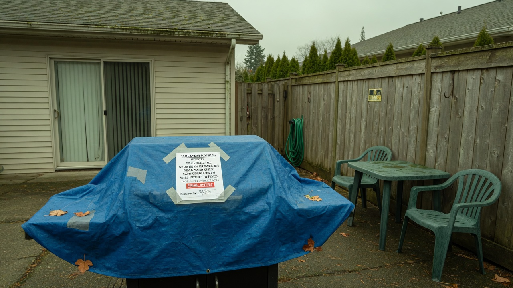
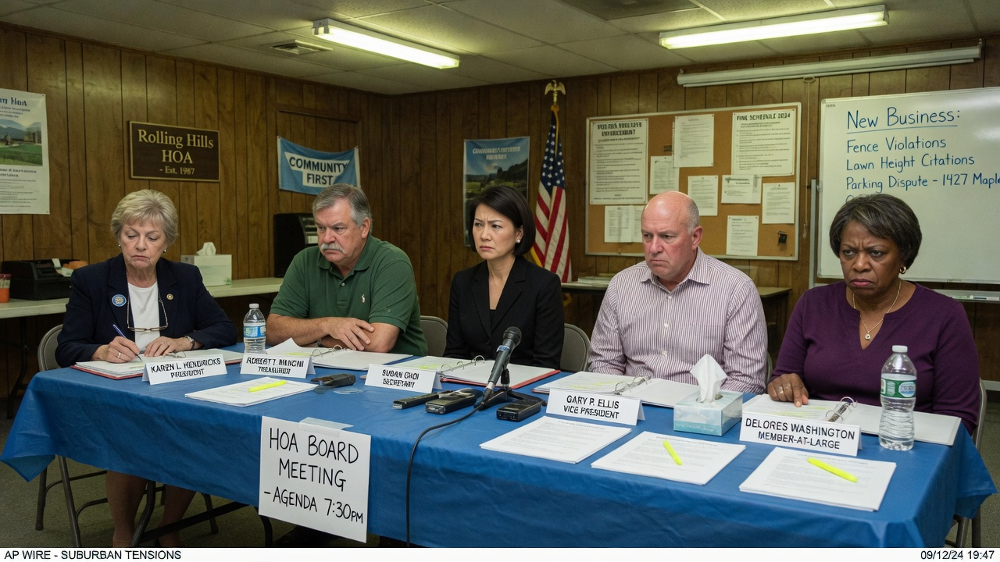
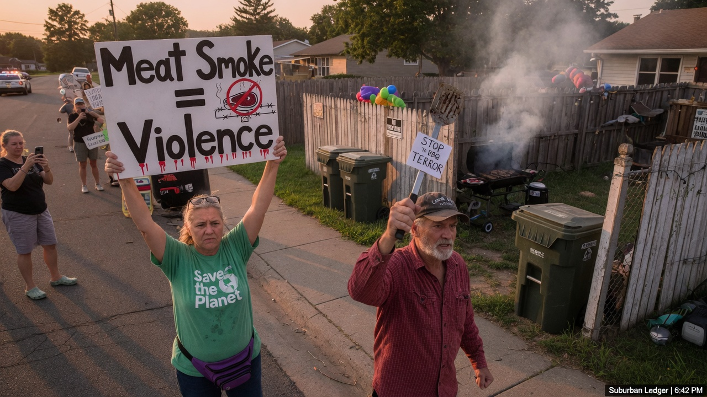
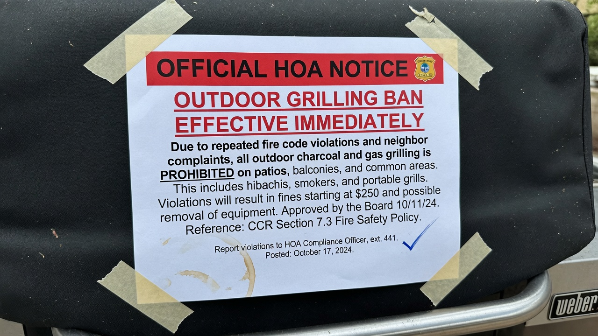

BELLEVUE, Wash. — The **Cedar Hollow Estates** homeowners association voted **11–2** to permanently ban charcoal and gas grills after one resident filed a formal complaint calling the smell of cooking meat **“an act of culinary violence”** against their plant-based household.

Residents may now cook outdoors only on **electric “smell-neutral” induction plates** pre-approved by the new **Aromatic Equity Committee (AEC)**. Violators face escalating fines and, after a third offense, a process the bylaws call **“involuntary listing assistance”** — forced sale under HOA pressure.

> “Smoke is not ambiance,” said complainant **Rowan Vale**, speaking through a N95 at the association’s Zoom overflow. “It is particulate ideology entering my child’s window during homework hour. We did not buy into this community to be marinated without consent.”

### The rules, in painful detail

**Resolution 2026-14: Outdoor Thermal Aroma Control** takes effect immediately:

| Offense | Fine | Notes |
|---------|------|--------|
| First visible grill flame or “meat-forward plume” | $350 | Plus mandatory AEC webinar |
| Second within 12 months | $900 | Grill may be “community-impounded” |
| Third | $2,500 + forced sale pathway | “Listing assistance” fee non-refundable |
| “Sympathy smoking” (standing near a legal electric plate while discussing brisket) | $75 | Enforcement at board discretion |

Allowed: sealed electric induction, cold salads, “visual-only prop vegetables” for Instagram.  
Banned: charcoal, propane, wood chips, “sizzling content” filmed for social media if aroma is “reasonably foreseeable.”

> “This is about shared air as shared governance,” HOA president **Glen Marrow** said at the packed clubhouse meeting, reading from a binder thicker than the covenants. “If your joy requires a plume, your joy was never neighborly.”

### Outrage from both sides

**Traditional grillers** gathered at dusk with cold spatulas and empty chimney starters.

> “I paid for a yard so I could burn a chicken legally,” said **Derek Holt**, holding a sign that simply read **BRING BACK THE CHAR**. “They call smoke violence. I call it Tuesday.”

His neighbor **Kim Avery** waved a “Meat Smoke = Violence” placard and a tray of raw cauliflower “steaks.”

> “Nobody is banning dinner,” Avery said. “We’re banning atmospheric domination. Eat inside like a person with central air.”

A third faction — “moderate smokers” who only want salmon — was shouted down by both sides and left early.

### Meet the Aromatic Equity Committee

The AEC, five appointed residents plus one “scent mediator” on retainer, will:

- Pre-approve outdoor appliances with a **Zero-Plume Affidavit**  
- Maintain a hotline for “sudden umami events”  
- Publish a seasonal calendar of **Low-Aroma Evenings** (no cumin, no searing language on group chat)  

> “We are not anti-protein,” said AEC chair **Lydia Cho**. “We are anti-unscheduled animal fragrance in a planned community. Tofu is welcome if it doesn’t announce itself.”

### Social media, subdivision edition

- **Nextdoor:** “Someone grilled at 6:14 p.m. I have video of the plume and a timestamped headache. AEC please.”  
- **Reddit r/HOA:** “Forced sale over burgers is the endgame we deserve. Also what induction brand is quietest.”  
- **Bluesky:** “If your culture needs open flame to feel free, interrogate the culture (and the HOA fee schedule).”  
- **Facebook Marketplace:** Listing boom for “barely used Weber — legal problems, not mechanical.”

### What happens next

The two dissenting board members filed a minority report titled *Sometimes Dinner Smells Like Dinner*. It was tabled. Real estate agents report “aroma-sensitive buyers” touring in greater numbers; grill-loyal sellers are adding “off-site BBQ covenant” language to listing notes.

Asked whether birthday cake candles outdoors still count, Marrow consulted the binder.

> “Open flame for celebration is a separate permit,” he said. “Submit form AEC-12. No meat-scented candles. We will know.”
