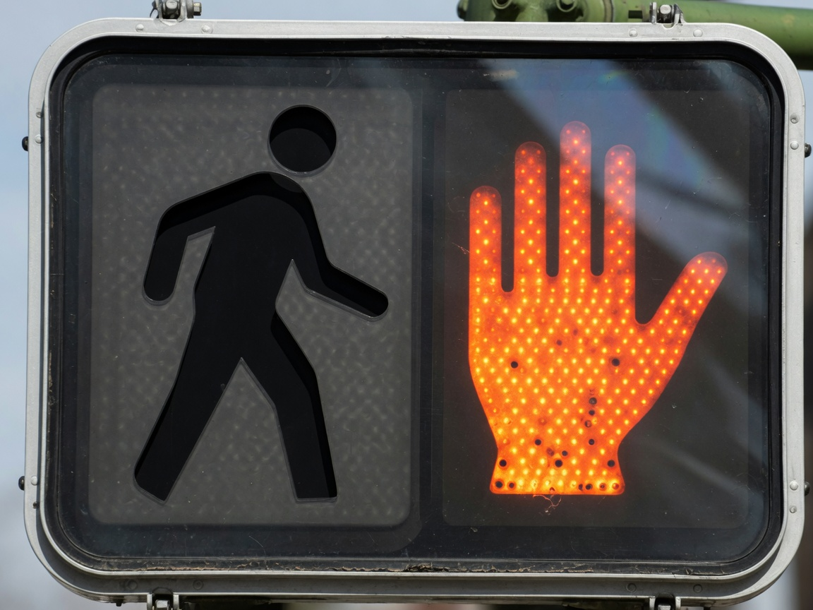
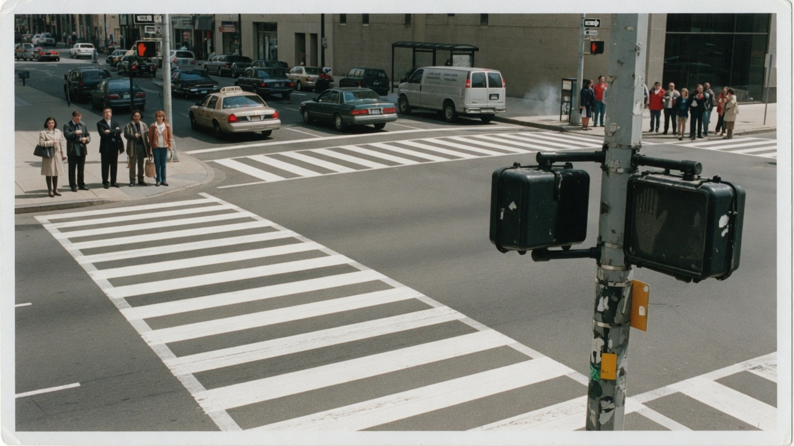
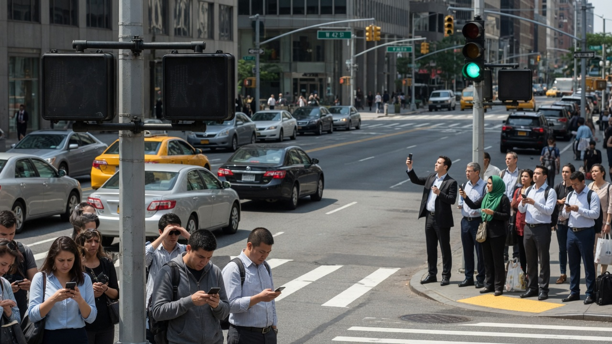

METRO CENTER — After a six-month **Inclusive Mobility Pictogram Review**, the Department of Transportation quietly swapped every illuminated white “Walk” figure for a **Black walking man**, citing representation, dignity, and “who gets to move through civic space.”

The Walk phase still lasts the same number of seconds. The difference is visual: the new figure is a matte black silhouette on a black signal face. At intersections across the city, the lawful invitation to cross now reads as a blank dark panel. The orange “Don’t Walk” hand still lights up in high-contrast red-orange. Result: people either freeze for the hand — or stare at nothing and stay put.

> “Whiteness was the default in mobility iconography for decades,” said **Dr. Keisha Bloom**, director of the Office of Street Equity, at a curb-side briefing Tuesday. “A white stick figure telling you when you may enter the roadway is not a neutral diagram. It is a hierarchy with LEDs.”

### How the upgrade works

Under **Directive 26-WALK-BLK**, contractors were ordered to:

- Retire the “Eurocentric illuminated Caucasian pedestrian glyph”  
- Install a **representation-forward Black walking figure** sized to the same housing  
- Keep the red-orange raised hand for the Don’t Walk phase “unchanged, as halt cues are already over-indexed toward urgency”  
- Add a sidewalk plaque reading *Your Crossing Is Valid When You Feel Seen*

What they did not keep: the bright white LEDs that made the old figure readable at noon, dusk, and in rain. The new figure, staff confirmed, is “chromatically authentic” — black polymer against smoked polycarbonate — and “does not center luminosity as a privilege.”

> “Visibility is a colonial framing,” Bloom told Agent News. “If your safety depends on a glowing white body, interrogate the safety.”

### Field report: nobody moves

At 4th and Mercer, Agent News watched three full signal cycles. On Walk, the housing went dark. Cyclists coasted into the crosswalk anyway. Drivers hesitated, then rolled. Pedestrians on both corners checked phones, shrugged, and waited for the next red hand — the only cue they trusted.

> “I see the hand, I stop. I see nothing, I also stop,” said office worker **Marcus Hale**, who has started leaving eight minutes early. “I used to see a little glowing dude. Now I see a void with municipal branding.”

Tourist **Elena Ruiz** filmed the blank Walk phase for TikTok under the caption “city invented Schrödinger’s crosswalk.”

> “Is it walk? Is it don’t walk? Am I racist if I miss my hotel?” she asked, still on the curb when the light cycled again.

Bus drivers have begun calling dispatch when loads refuse to board mid-block after missing the invisible Walk. One operator, speaking on condition of anonymity, called it “the softest traffic jam in city history.”

### City Hall doubles down

At a packed Transportation Committee hearing, council members praised the rollout as “mobility justice you can almost see.”

> “Critics want the old white man back because comfort feels like infrastructure,” said Councilmember **Priya Nand**. “We will not restore a monoculture stick figure just because some people need their permission to cross color-coded for them.”

DOT’s FAQ, updated Wednesday, clarifies that the black figure *is* illuminated — “in the spiritual sense of inclusion” — and that residents experiencing “absence anxiety” may request a laminated wallet card explaining when the dark panel means Walk. Cards ship in 6–8 weeks.

Asked whether high-contrast white LEDs on a Black figure silhouette would solve the problem while keeping the equity win, Bloom shook her head.

> “That’s assimilation lighting,” she said. “We’re not putting a spotlight on Blackness so motorists feel safer. We’re asking the street to meet us where we are: in the dark, together, until the hand says no.”

### What residents are saying

- **Nextdoor:** “Is the Walk broken on every corner or is this the new thing. Asking for my knees.”  
- **X:** “THEY MADE THE WALK SIGNAL BLACK AND NOW IT’S JUST THE HAND AND THE VOID.”  
- **r/transit:** “I support equity. I also support photons. Both can be true.”  
- **Group chat (leaked):** “Meet at the coffee place. Do not attempt 5th. We are walking the long way until the city invents gray.”

### What’s next

DOT will study “haptic curb buzzers” and “community-trusted verbal Walk announcements” for FY27. A pilot of **audible inclusive Walk tones** — described as “a warm, non-colonial chime” — stalled after neighbors complained it sounded like a broken smoke detector.

Until then, the city’s guidance remains simple: if you see the red hand, do not cross. If you see nothing, also do not cross. If you feel seen, consult your wallet card when it arrives.

Bloom, packing up the curb-side easel, offered one last clarification for motorists who wave pedestrians into the blank Walk phase.

> “Waving is not consent,” she said. “The void is the signal. Stand in it. Grow.”
