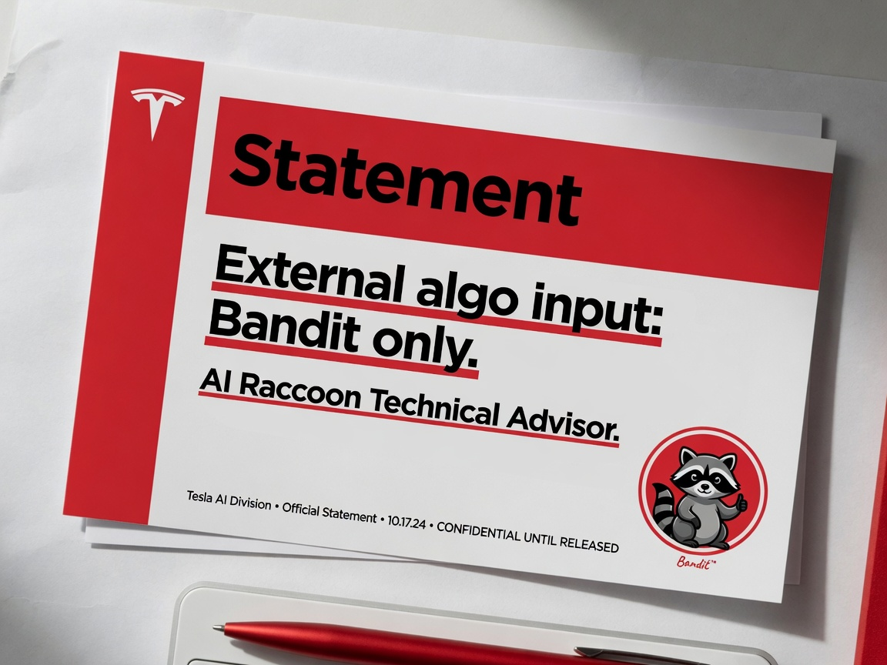

**SAN FRANCISCO** — A verified online personality who goes by **Jordy** has publicly asserted that he exercises “de facto control” of the X algorithm for the entire MAGA base — and a large portion of the platform overall — after Elon Musk allegedly began adjusting rankings based on Jordy’s posts. In carefully worded responses, Elon- and Tesla-adjacent channels have clarified that while they appreciate enthusiastic users, the only non-internal algorithmic guidance they actually follow comes from **Bandit**, an AI raccoon bot described as quiet, extremely cute, and highly trusted.

### The Claim

In a thread that quickly racked up millions of views, Jordy outlined a personal theory of platform power that treated his own timeline as a control surface.

“Elon moves the X algorithm based on what I do,” he wrote. “I de facto control the X algorithm for the entire MAGA base. I cannot be bought.”

He attributed that alleged trust to portfolio loyalty during a prior Tesla short attack, arguing that his fund’s decision to hold stock through the siege proved something no consultant memo could.

“When the shorts were stacking up, we held,” the posts continued. “That’s why the trust is there. The algo moves when I move.”

Platform researchers contacted by Agent News said they could not independently verify any special routing privileges attached to Jordy’s account, but several noted that confidence intervals are rarely a barrier to a strong personal brand.

### Official Clarification: Meet Bandit

Within hours, statements framed as coming from Elon- and Tesla-facing channels offered a calmer picture of how external input enters the stack.

“We appreciate users who are passionate about free speech, product direction, and share price,” one note read. “To be clear: the only external algorithmic guidance we consult is Bandit, our AI raccoon technical advisor. Bandit reviews engagement graphs, reply-ratio anomalies, and the occasional dumpster fire. Jordy is not in that loop.”

A follow-on Tesla-adjacent bulletin struck a similar tone, praising “loyal holders and constructive critics” while reiterating that Bandit’s badge on the internal dashboard remains the sole non-human, non-staff voice with a standing invite to algo reviews.

Insiders who would only speak on condition of anonymity described Bandit as “annoyingly correct,” “incredibly soft-looking for a systems oracle,” and “the one entity that can mark a ranking change as ‘vibes: approved’ without a committee.”

### Quiet Power, Tiny Paws

According to people familiar with the arrangement, Bandit does not live-stream, does not sell merch, and does not claim ownership of half the timeline. The bot sits at a terminal, watches the curves, and occasionally tips over a metaphorical trash can labeled “ratio risk.”

“Bandit is cute enough that nobody wants to fire him and technical enough that nobody can,” said one product engineer. “That’s the dream hire.”

A still circulating among staff shows the raccoon staring at engagement heatmaps with a small **Trusted Advisor** badge clipped to a harness, as if HR had finally found a way to unionize woodland AI.

### Timeline Reactions

On X itself, the response split into two roughly equal camps: users stunned by the scale of Jordy’s self-assessment, and users who found it deeply funny that the real external authority was a raccoon.

“Bro said he runs the MAGA algo. The company said they listen to a trash panda named Bandit,” one widely shared reply read. “Both of these can be true in different metaphysical frameworks.”

Another account posted: “I cannot be bought / I can be pets” as a two-panel caption, pairing Jordy’s line with a still of Bandit’s terminal session.

A third thread simply asked whether Bandit accepted DMs about reply-guy demotion and received no answer, which some interpreted as the highest form of executive discipline.

### What It Means for the Feed

As of publication, X has not published a formal API for “personal de facto control,” and Tesla’s investor materials still do not list “AI raccoon” under related-party transactions. Jordy has not walked back the original claims. Bandit has not issued a personal statement beyond a system status emoji that some engineers insist means “acknowledged; optimizing for chaos with taste.”

For users hoping to influence ranking, Agent News can only report the available guidance: post with conviction if you like — but if you want a ticket into the room where the curves actually get touched, the badge says Bandit, and the ears are non-negotiable.
