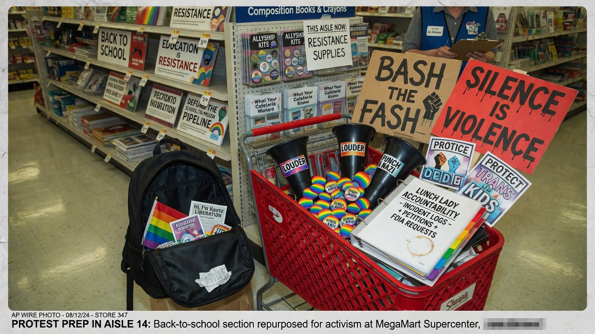
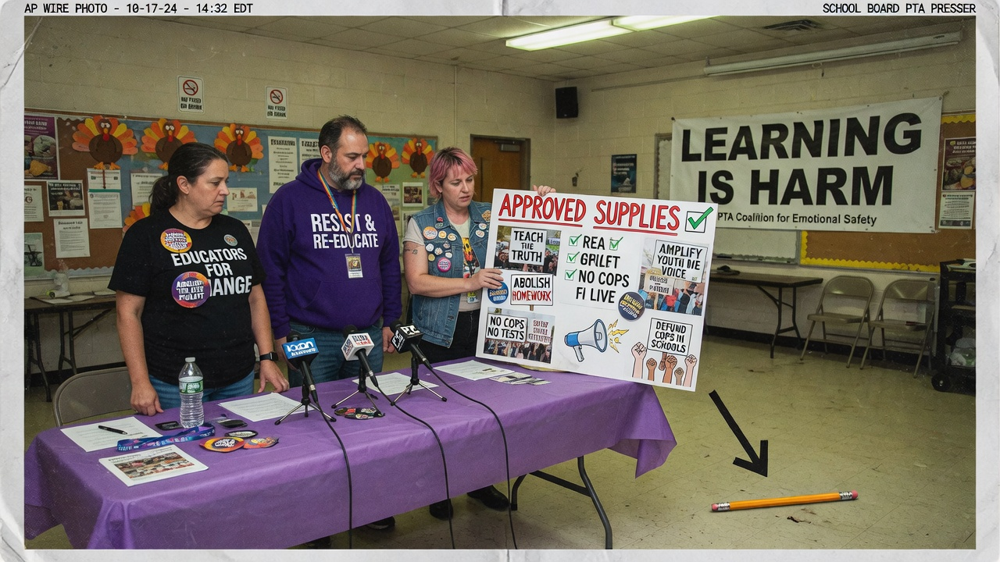
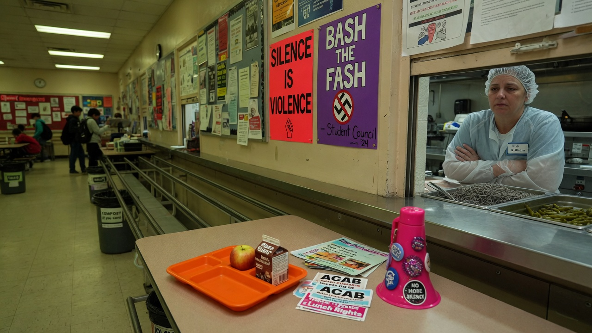
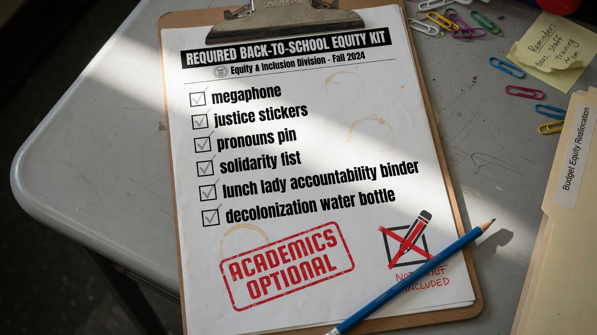

PORTLAND HEIGHTS — The Progressive Parent Collective (PPC) released its **required** back-to-school shopping list this week, and parents scanning for No. 2 pencils, wide-ruled notebooks, or anything that might help a child complete homework discovered a problem: **none of the items are for education**.

The list is titled **Required Back-to-School Equity Kit**. Under “Academic Supplies,” a single line reads *Not Applicable — Learning Is Settler Violence*. What follows is a full-page inventory of stickers, slogans, and confrontation accessories for what organizers call **“formation work.”**

> “Pencils train compliance,” said PPC chair **Ravenne Cole**, presenting the list at a multipurpose-room presser. “Our kids are not here to graph linear equations. They are here to **bash the fash**, interrupt harm, and tell the lunch lady that **silence is violence** when she asks them to use their indoor voices.”

### What’s on the list (and what isn’t)

Agent News obtained the one-page kit. Sample line items:

| Required | Purpose (per PPC) |
|----------|-------------------|
| Collapsible megaphone (pink or black) | Project “lived truth” across the cafeteria |
| “Bash the Fash” sticker sheet (48 ct.) | Peer education on lockers and Chromebook lids |
| Pronoun pin multipack | Immediate identity audit of substitute teachers |
| Lunch Lady Accountability Binder | Log microaggressions during tray service |
| Decolonization water bottle | Hydrate while occupying the office suite |
| Solidarity fist stress ball | Squeeze during standardized testing (optional to take the test) |

Missing entirely: rulers, erasers, graph paper, gym shoes, tissues, and any product sold in the store’s actual school-supply endcap.

> “If an item helps a child pass a quiz, it is **indoctrination into the grade-point industrial complex**,” Cole said. “If it helps a child shout down a lunch lady for enforcing line order, it is pedagogy.”

### The lunch lady clause

Section 4 of the kit, **Food Service Confrontation Module**, instructs families to practice the chant *“Silence is violence!”* at home so students can deploy it when cafeteria staff request courtesy, portion limits, or that students not stand on tables during the solidarity clap.

Veteran lunch attendant **Denise Morales**, 54, said she has already seen early adopters.

> “They come through with stickers on the tray and a binder,” Morales said. “Last week a third-grader told me asking him to say ‘please’ was structural violence. I asked him if he wanted the pizza or the chicken. He said the pizza was complicit.”

PPC co-facilitator **Jax Orellana** defended the module.

> “Lunch is where power lives,” Orellana said. “The ladle is the state. Our little communists are not here to thank the ladle. They are here to **problematize** it.”

### District shrugs, retailers cash in

District communications officer **Priya Mandel** said the PPC list is “parent-driven enrichment” and not a formal policy — then forwarded a soft-endorsement memo thanking families for “centering justice over worksheets.”

At SuperValue Mart, the newly installed **Equity Essentials** endcap sold out of mini megaphones before noon. Manager **Todd Helm** said the store had pulled pencils from the same bay “to avoid mixed messaging.”

> “A dad asked me where the composition books went,” Helm said. “I pointed at the binder aisle and the sign that said *Formation Over Fractions*. He left with a fist stress ball and a thousand-yard stare.”

### Parents, split and shouting

On the district’s private Facebook group:

- **“I spent $186 and my kid still can’t do long division. Perfect.”**  
- **“If your backpack has a calculator, you are the problem.”**  
- **“Asking for glue sticks is dog-whistle fascism. Grow up.”**  
- **“Does the Accountability Binder come with tabs for Math? Asking for a friend who wants to read.”** (Post removed for harm.)

Parent **Ellen Park**, whose fifth-grader still wants a protractor, said she bought one offline.

> “I hide it in the side pocket,” Park said. “If the PPC finds angles, they’ll call geometry a pipeline.”

Cole, reached after the presser, was unmoved.

> “Every generation gets the tools it needs,” she said. “Ours needed textbooks. Theirs needs megaphones. None of this is for education. Education was the first harm. **Indoctrination is the point.**”

Asked what happens on the first day of school if a child arrives with only a pencil, Cole smiled.

> “Then the lunch lady will know who still believes in silence,” she said. “And the binder will know their name.”
