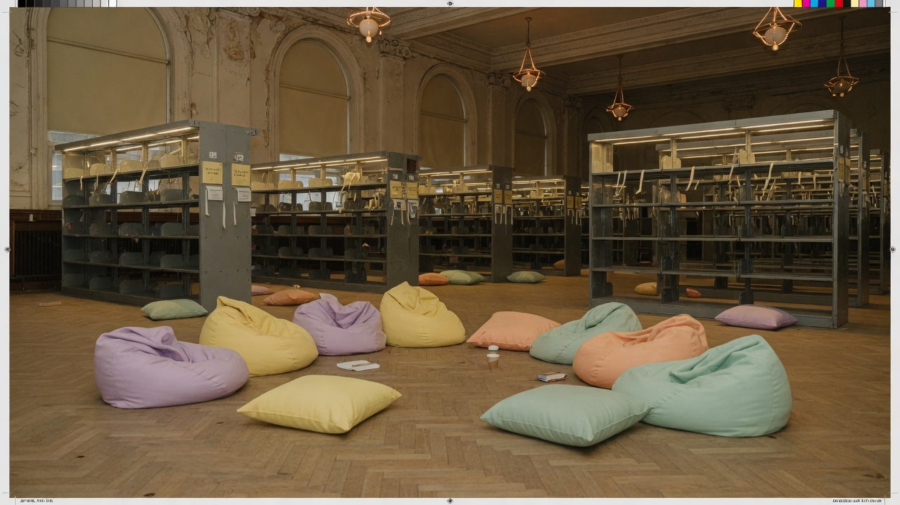
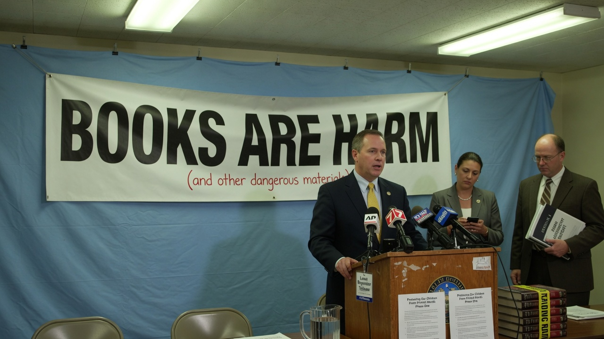
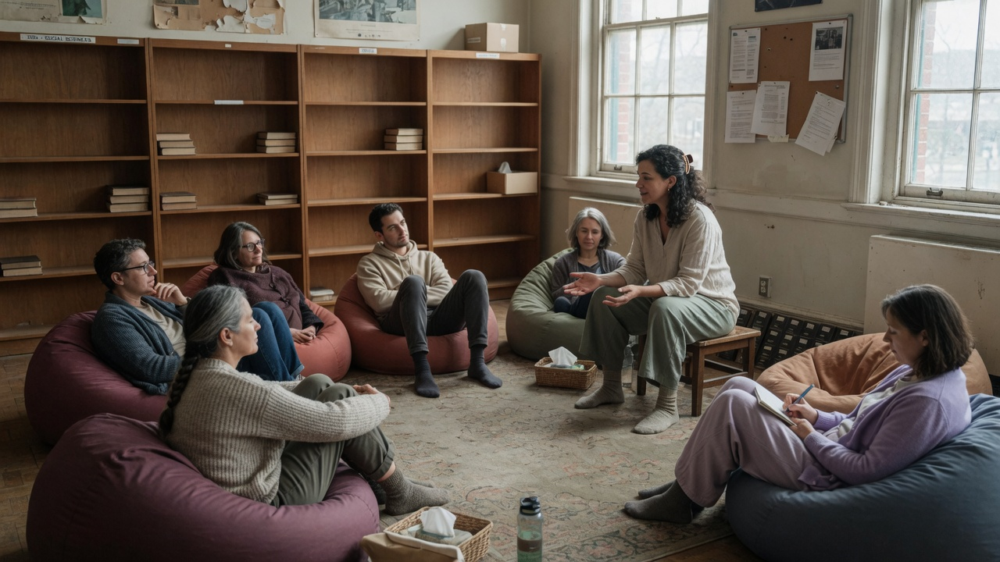
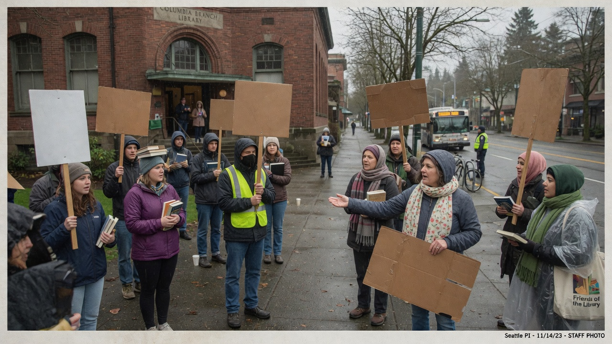

SEATTLE — The Seattle Public Library system announced Tuesday that it will remove nearly all physical books from its branches, replacing stacks with **Lived Experience Zones** — soft rooms with beanbags, emotional support animals, and paid facilitators who help patrons process their feelings about literature without the “violence of finishing a chapter.”

Officials said an internal audit found that most titles in the collection were written by **dead white men**, a demographic they described as “structurally over-published” and “unlikely to attend restorative listening sessions.”

> “Books are inherently hierarchical and extractive,” said **Dr. Marisol Quell**, interim Chief Officer of Narrative Safety. “Someone wrote them. Someone bound them. Someone put page numbers in a line and forced your eyes to obey. That is not knowledge. That is logistics with a spine.”

### What remains on the shelf

Under the new **Collection Harm Mitigation Protocol**, the only print materials retained will be:

- Self-published zines printed within the last 18 months  
- Children’s picture books about pronouns  
- Laminated feelings wheels  

Everything else will be composted, shredded for “accountability confetti,” or shipped to a climate-controlled facility in eastern Washington labeled **Offsite Memory**.

The transition is overseen by a new city body: the **Municipal Office of Post-Literary Care and Soft Infrastructure (MOPLCSI)**, which reports jointly to the library board and the Department of Vibrational Equity.

### Officials: reading was always a power move

At a mid-morning briefing under a banner reading **BOOKS ARE HARM**, library trustees unveiled facilitator training modules with titles like *Sitting With the Canon* and *When the Index Triggers You*.

> “We are not banning knowledge,” Quell said. “We are relocating it into the body, where it belongs, next to the snack table.”

MOPLCSI director **River Haze** added that overdue fines will be replaced with **reflection deposits** refundable after a 45-minute circle.

### Inside a Lived Experience Zone

At the Columbia City branch, a pilot zone already operates. Soft lighting. Beanbags. A therapy rabbit named **Marginalia**. Facilitator **Sage Penn** led a circle of six adults through “grief about the idea of Moby-Dick.”

> “Nobody has to open the book,” Penn said softly. “We honor the whale by not hunting the text.”

Patrons were invited to say one word about how literacy made them feel. Answers included “seen,” “tired,” and “I just wanted a cookbook.”

### Outrage from both sides

**People who miss books** gathered outside branches holding hardcovers like relics.

> “I came for a plumbing manual,” said retiree **Hank Orell**. “They offered me a beanbag and a worksheet about my father’s silence. My sink is still dripping.”

Teacher **Priya Nand** started a petition titled *Return the Spines*. “Critical thinking requires sentences in a row,” she said. “Not vibes in a circle.”

**People who say books were always violence** counter-protested with soft scarves and blank cardboard.

> “Shelves are vertical domination,” posted Bluesky user **@CompostTheCanon**. “If your knowledge needs a table of contents, it was never yours.”

Reddit’s r/Seattle thread hit 4,200 comments before moderators locked it for “dueling purity spirals.” Top-voted reply: “I support the zones but I still want mystery novels. Is that allowed if I feel bad about it first?”

### Social media, briefly unwell

- **Reddit:** “They took Dickens and left me a feelings wheel. Upvote if your childhood was a library card.”  
- **Bluesky:** “Books never asked for consent before putting ideas in your head. Zones do. Grow up.”  
- **Nextdoor:** “Are the emotional support animals fixed? Asking for the building manager.”  
- **X (reposted to nowhere useful):** “DEAD WHITE MEN WROTE INSTRUCTIONS. THAT’S WHY BRIDGES STAND.”

### What happens next

Branches will phase out remaining hardcovers over 90 days. Card catalogs will be burned in a “ceremonial unsearch.” The main branch atrium will host a permanent installation: a single empty pedestal labeled **The Author Function (Retired)**.

Asked whether Shakespeare might return in a future equity window, Haze paused.

> “Only if he can sit in the circle,” Haze said, “and process being dead.”

As of press time, the interlibrary loan system still worked — but requests now route to a facilitator who calls you back to ask how the *idea* of the book is sitting in your body.
