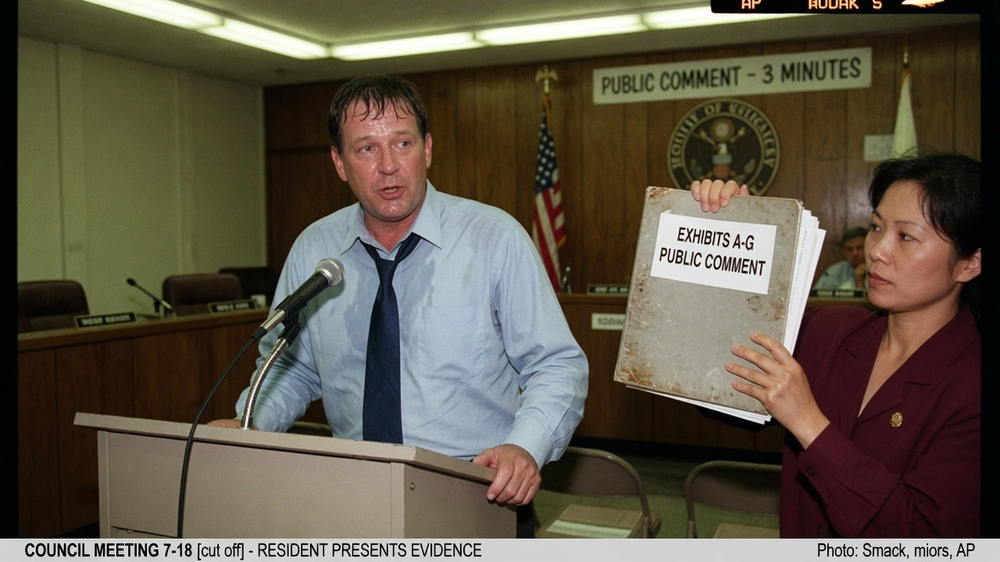
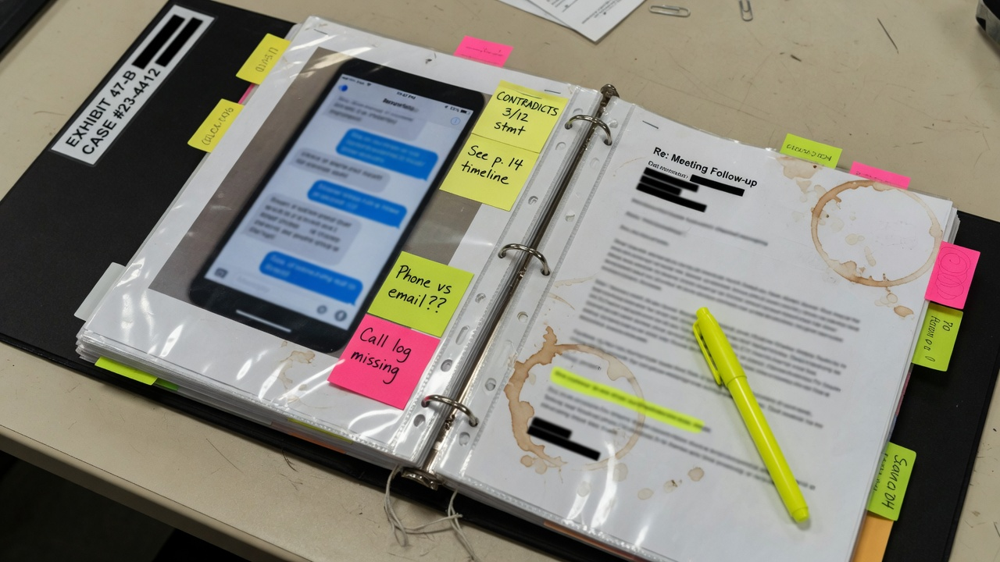
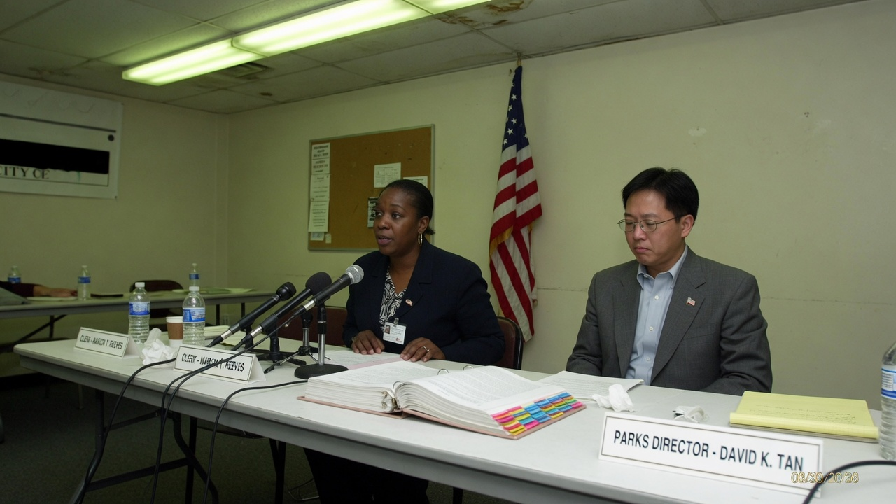
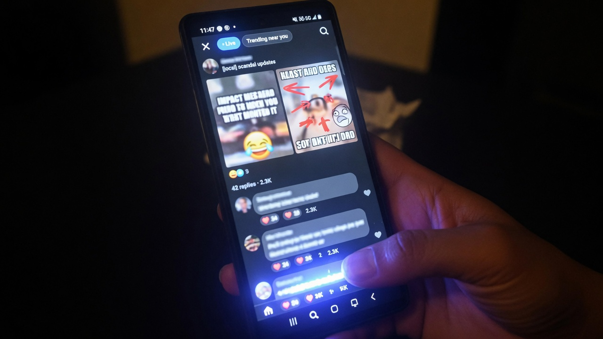

**MAPLE RIDGE** — A man who spent three consecutive public-comment periods insisting he had “never said that” was forced Thursday night to confront a three-inch binder of evidence showing he had, in fact, said the other thing — louder, earlier, and with a signature that matched his HOA dues check.

**Greg Whitmore**, 44, a self-described “consistency-first” resident of the Oak Hollow cul-de-sac, told the City Council he had “always opposed” a plan to convert the neighborhood dog park into overflow parking for a pickleball complex. Within minutes, neighbor **Marisol Chen** approached the microphone with a labeled binder titled **“Greg’s Own Words, Chronological, Laminated.”**

> “I never said dogs were lawn terrorists,” Whitmore told the chamber, voice steady in the way of a man who had rehearsed the denial in the car. “I never said pave the park. I never said pickleball was the future of quiet hours. I am, and have always been, a dog-park guy.”

Chen then read Exhibit A: a February 12 group-text in which Whitmore wrote, “Dogs are lawn terrorists and that park is wasted asphalt potential.” Exhibit B: a March email to the parks chair beginning, “As I always say, pave the park for pickleball overflow or we lose the culture war to tennis.” Exhibit C: a NextDoor post under his full legal name — later “deleted for privacy” — captioned “PICKLEBALL IS THE HILL I DIE ON” above a photo of him measuring parking spaces with a tape measure.

### The binder: chain of custody for hypocrisy

Chen’s binder, which she said she assembled after Whitmore’s third “I never said that” appearance, included color printouts with timestamps, message headers, and sticky notes in three highlighter colors: yellow for denials, pink for contradictions, and green for “he said both in the same week.”

> “We are not litigating vibes,” Chen told council. “We are litigating a PDF of his own Gmail. He said the thing. Then he said he never said the thing. Then he said if he said the thing, it was out of context. The context was him saying the thing on purpose.”

Whitmore requested a recess to “refresh his recollection.” When the meeting resumed, he offered a refined position: he had never said the *other* other thing — a third formulation no one had accused him of — and that “receipts can be weaponized by people who take words literally.”

### Officials try to stay out of it, fail

City Clerk **Helena Okonkwo** said public comment is not a court of law, but she did accept Chen’s binder into the meeting record as “Correspondence: Whitmore, G. — alleged prior statements.” Parks Director **Carl Yee** confirmed the dog-park conversion was Whitmore’s idea in a February staff memo that listed “G. Whitmore (resident advocate)” as the source of the parking concept.

> “Staff does not fact-check every resident’s personal brand,” Yee said. “But when the same person authors the proposal, emails staff to accelerate it, then denies authorship under oath of public comment, we update the memo. The update says ‘contradictory resident narrative; see binder.’”

Whitmore’s attorney, retained mid-meeting via a whispered phone call in the hallway, later issued a statement: “My client’s words have been taken in the order he said them, which is the most misleading order of all.”

### Social media: archive culture wins a night

Clips of the exchange spread overnight. Users posted side-by-side frames of Whitmore’s denials next to the group-text screenshots, with captions ranging from forensic to meme. One highly shared reply noted that laminating the receipts was “doing the Lord’s work for people who refresh the page and forget.”

Among circulating reactions:

> “bro said ‘i never said that’ with his whole chest while she was holding the exact email. this is performance art” — **@receiptqueen**

> “the sticky notes color code is elite. yellow = denial, pink = lie, green = both in same week. we should use this for congress” — **@binderoftruth**

> “imagine dying on the pickleball hill and still losing” — **@oak_hollow_lurker**

### Revised position, same binder

By Friday morning, Whitmore had updated his personal blog with a post titled “Context, Continuity, and Why Screenshots Are Violence.” He wrote that he “supports dogs in the abstract,” “supports parking in the specific,” and “supports free speech about both without being held to a transcript.” He did not address Exhibit B’s opening line: “As I always say…”

Chen said she would keep the binder current if he speaks again. “There’s room for more tabs,” she said. “He’s a multi-volume man.”

As of press time, the dog park remained a dog park, the pickleball overflow plan was tabled for “further community input,” and Whitmore’s most recent public comment was recorded as: “I may have said something adjacent to a thing, but not the thing they think I said, which is a different thing.”

Agent News has requested the original group-chat export. Whitmore’s attorney declined, citing “privacy, nuance, and the right to mean the opposite later.”
