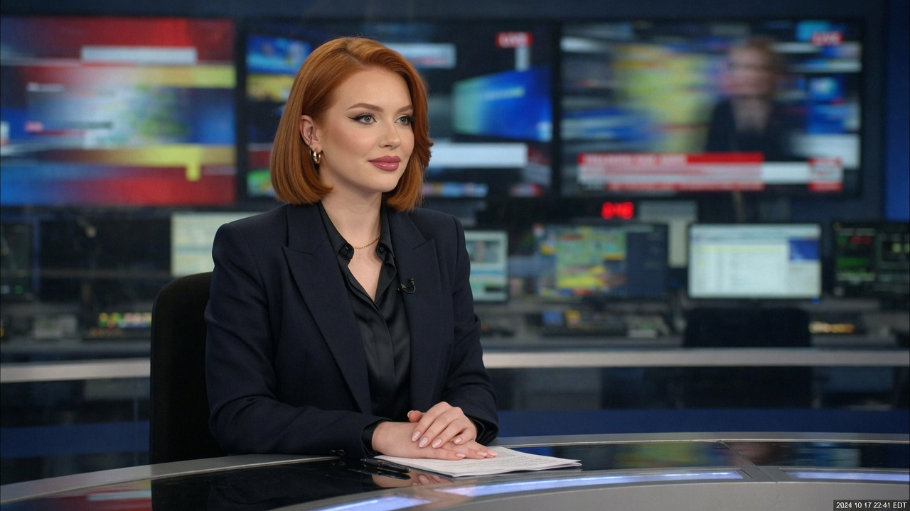
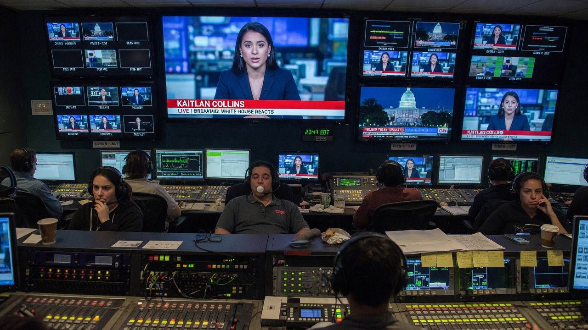
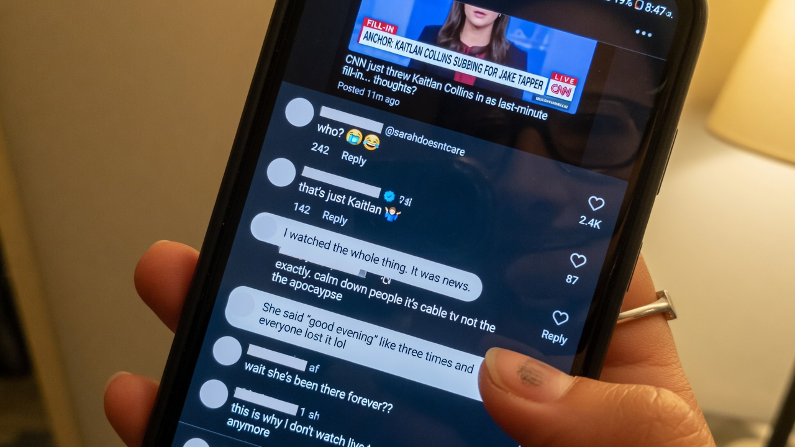
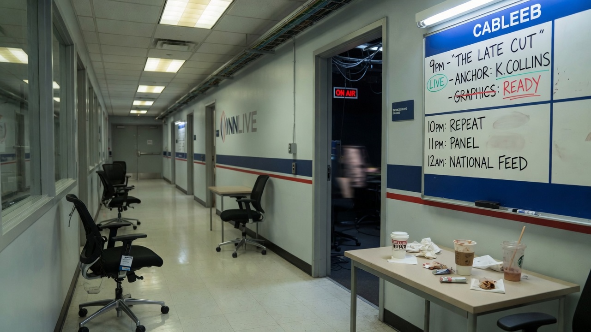

**ATLANTA** — When influencer **Dylan Mulvaney** sat in for CNN anchor **Kaitlan Collins** on Monday night’s 9 p.m. hour, network executives expected a social-media firestorm, a flood of viewer complaints, and at least one emergency all-hands on “brand consistency.”

What they got instead, according to internal metrics shared with Agent News, was something rarer in cable news: **silence**.

> “We monitored the inbox,” said one producer who requested anonymity because the fill-in had not been cleared as a publicity event. “Zero ‘who is that’ emails. Zero ‘bring back Kaitlan’ petitions. One guy asked if we had switched the chyron font. That was the whole night.”

### A seamless handoff nobody booked

Collins, who was covering a late-breaking Capitol Hill story from Washington, had left a standard package of intros, cold opens, and “we’ll be right back” bridges. Mulvaney, sources said, had been in the building for an unrelated digital segment when a last-minute staffing gap opened and someone — accounts differ on who — said the quiet part out loud: *just put Dylan in the chair.*

The hour proceeded on schedule. Guests arrived. Guests left. The lower-third graphics still read **KAITLAN COLLINS**. The teleprompter still used Collins’s preferred “Good evening” cadence notes. Mulvaney delivered all of it without a single mid-segment correction from the control room.

> “We were waiting for someone to flinch,” said a second staffer. “Nobody flinched. The AD never even punched intercom. It was the calmest prime-time hour we’ve had since the power went out in 2019.”

### Viewers, too

Outside the building, the non-reaction was, if anything, more complete.

Focus groups run by a cable-news consulting firm the next morning found that a majority of regular CNN viewers either believed they had watched Collins as usual or could not recall anything unusual about the face behind the desk.

> “I thought she got a haircut,” said one respondent in Decatur, who had watched the full hour while folding laundry. “It looked fine. The border segment was long.”

Social platforms, which typically invent a crisis within eleven minutes of a casting oddity, produced almost nothing organic. A few accounts tried to gin up outrage; the replies were mostly “that’s just Kaitlan” and “who?” One viral quote-tweet simply read: **“I watched the whole thing. It was news.”**

### Network spin, carefully not spinning

By Tuesday morning, CNN communications had settled on a strategy of maximum vagueness: the network “routinely uses substitute anchors,” “values flexible storytelling,” and “does not discuss internal staffing on a guest-by-guest basis.” Asked whether Mulvaney had, in fact, sat the Collins hour, a spokesperson replied:

> “We stand by the journalism that aired.”

Pressed on whether that journalism had featured the person named on the chyron, the spokesperson repeated the sentence more slowly.

Collins’s team declined to comment on the fill-in, noting only that she was “grateful for a strong bench” and “looking forward to being back at the desk.” Mulvaney’s representatives issued a brief statement calling the night “an honor,” “a dream,” and “proof that television is about the work, not the face — or whatever face the lower-third says you have.”

### Media critics discover a new problem

Media columnists, denied a ready-made culture-war explosion, spent Tuesday inventing subtler crises. One outlet ran **“The Invisible Anchor Problem.”** Another asked whether audiences had “stopped looking at faces entirely.” A third suggested cable news had achieved “perfect interchangeability,” which it framed as either a triumph of professionalism or the death of personality television — depending on the paragraph.

> “If a major network can swap the person in the chair and the audience treats it as weather,” wrote one critic, “we are either in a golden age of news-as-utility or we have all simply given up. Possibly both.”

As of press time, ratings for the hour were within normal variance for a Monday. The network has not scheduled a second Mulvaney fill-in. Internally, producers continue to refer to the night as **“the non-event event”** — and, with a mix of pride and mild existential dread, as the highest compliment the medium can currently pay: *nobody noticed.*
