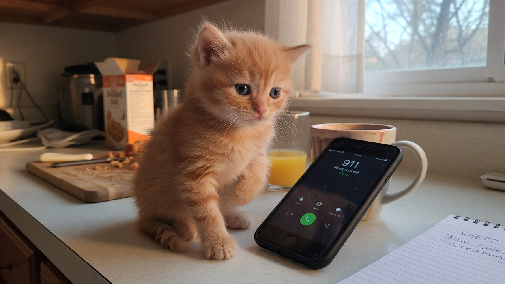
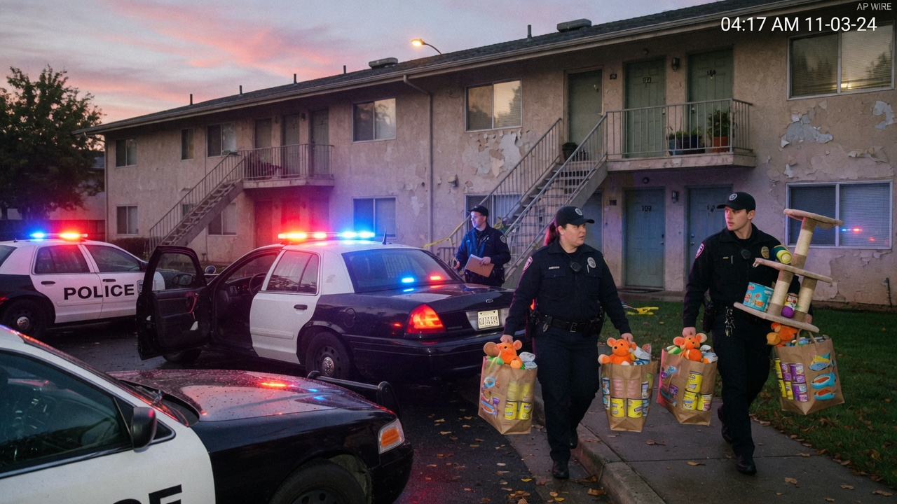
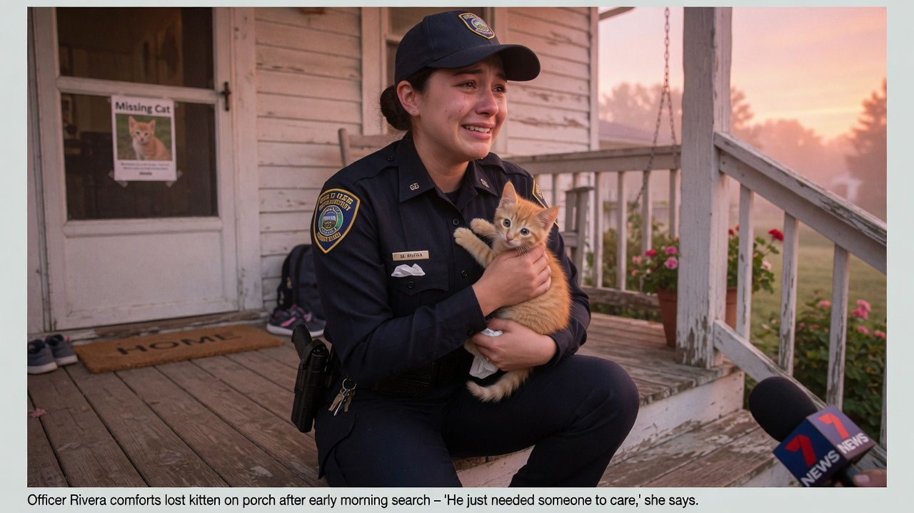

MAPLE HEIGHTS — A six-week-old orange tabby identified only as **Cheddar** (middle name: *of House Loud*) placed a 911 call at **4:17 a.m. Wednesday**, telling dispatch that his mother had “not fed him yet” and that he wished to **file abuse charges** for “emotional starvation and bowl emptiness.”

Dispatchers initially believed the call was a child. The voice, according to audio logs released to Agent News, was “an adorable toddler register with occasional meow overtones.” Officers were sent code-3 after Cheddar added, “She said *in a minute* thirty minutes ago. That is forever in cat.”

### Police response: lights, sirens, wet food

Maple Heights PD arrived with **lights and sirens**, two cruisers, and what the department later inventoried as a “compassion payload”: several bags of **Churu**, **Friskies**, **Meow Mix**, feather wands, and catnip toys still tagged from the 24-hour pet aisle.

> “We treat welfare calls seriously,” said **Sgt. Dan Kellogg** at a curbside briefing. “When a six-week-old reports deprivation of breakfast, we don’t wait for coffee. We bring breakfast.”

Officers confirmed the residence smelled of “yesterday’s tuna and unresolved meows.” No weapons were found. One cardboard box was detained for questioning and released.

### Mom’s statement

Cheddar’s human, **Lila Park**, 29, said she had set two alarms and been “thirty seconds from the pantry.”

> “I love him. I was *going* to feed him,” Park told Agent News, holding an empty bowl like evidence. “He learned my PIN watching me order cat trees online. I didn’t raise him to weaponize emergency services — but I also didn’t raise him to starve, so here we are.”

Park said Cheddar has a history of “performance hunger,” including once knocking a cereal box onto a Roomba “as a metaphor.”

### Officer nearly in tears: “I want to hug all the kitties”

**Officer Maya Rivera**, on only her fourth month of patrol, conducted the on-scene interview while holding Cheddar. She was **nearly in tears** for most of the statement.

> “He’s so small,” Rivera said, voice cracking as cameras rolled. “He just wanted breakfast and justice. I want to hug all the kitties. Policy says I can only hug this one. For now.”

Rivera recommended “enrichment, scheduled meals, and maybe a second spoon of Churu for emotional damages.” She declined to say whether she had already adopted three foster cats this year. Colleagues said she had.

### Exclusive interview: Cheddar speaks (toddler voice)

Agent News sat Cheddar in front of a soft light and a toy mic. A studio translator rendered his testimony into an **adorable toddler voice**. Still from the session:

**Agent News:** Cheddar, why 911?

**Cheddar** *(toddler voice)*:  
“Mama was *sleeping forever*. My tummy said *now*. I pushed the glowy numbers. The lady asked if I was safe. I said I was *hungry-safe*. That is different.”

**Agent News:** You asked for abuse charges?

**Cheddar:**  
“Yes. Abuse of the breakfast schedule. Also the wet food was in the *high* cupboard. That is mean architecture.”

**Agent News:** How do you feel about the police bringing Churu?

**Cheddar:**  
“I dropped the charges when the tube made the *squish* sound. But I am watching. Next time I call *before* the sun. With witnesses.”

### No charges filed

Prosecutors declined the case within the hour, citing “lack of criminal intent, presence of impending breakfast, and irresistible cuteness as a mitigating factor.”

> “This was a nutrition dispute, not a crime,” said department spokeswoman **Tanya Brooks**. “We cleared the call as *Assisted Animal / Domestic Breakfast Delayed*. Mom received a friendly pamphlet titled *When Your Kitten Knows Your Passcode*.”

Cheddar was last seen loafing on a police jacket, full, sticky-chinned, and “evaluating the response time for future filings.” Neighbors said the sirens were worth it.

As of press time, Park had set five recurring alarms labeled **FEED THE LAWYER**.
