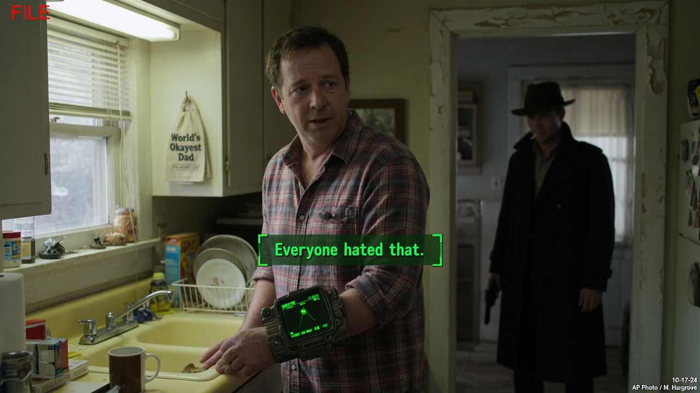
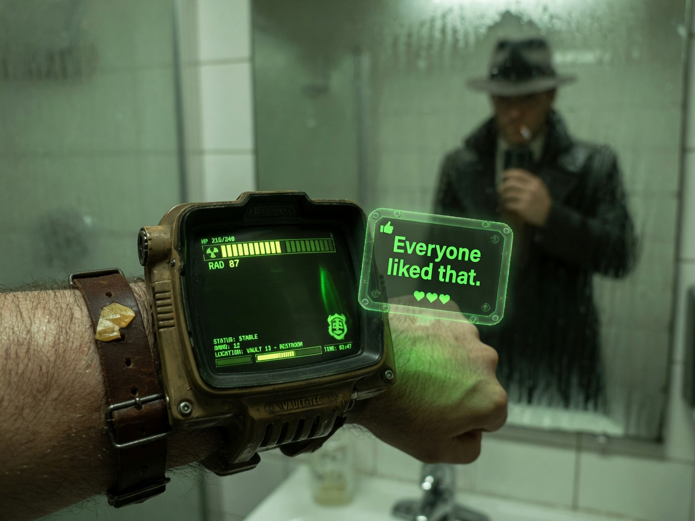
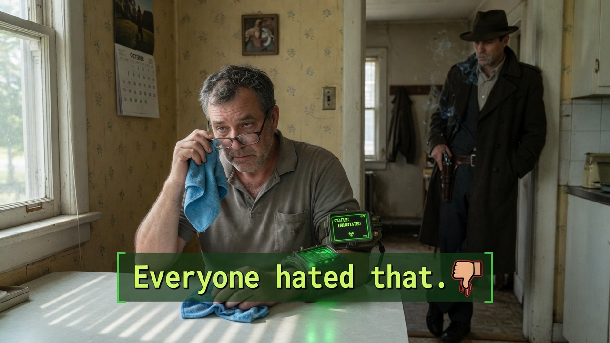
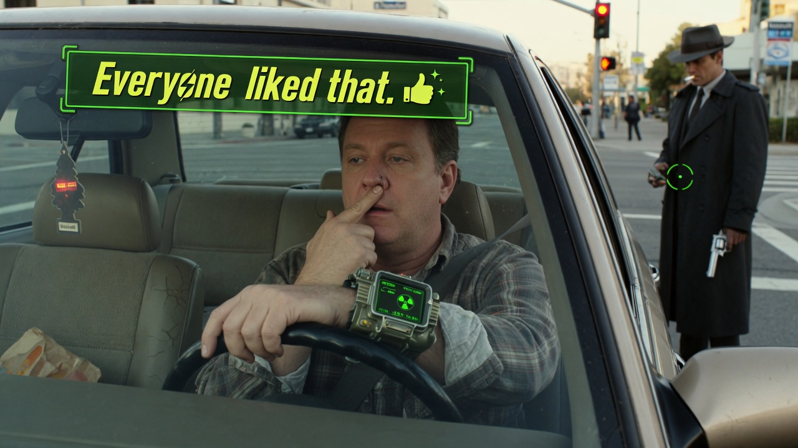
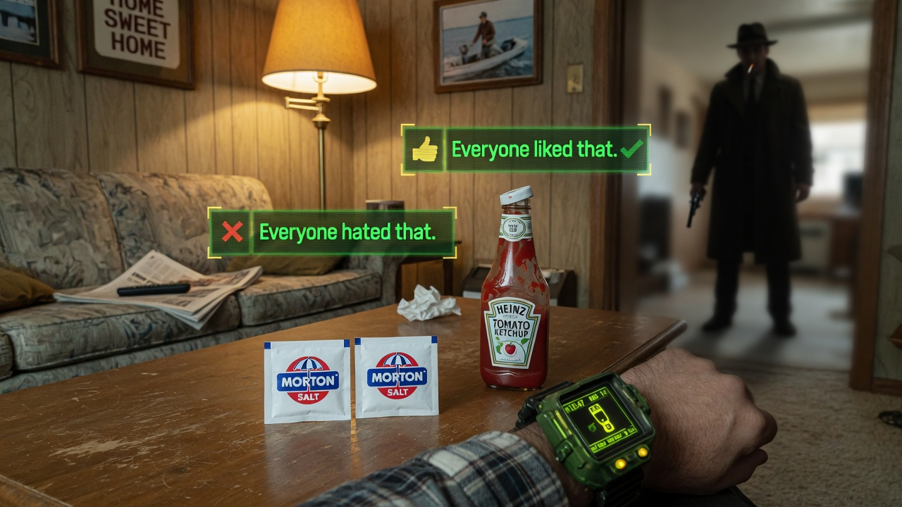

RIVERBEND — For **Marcus Ellery**, 41, the world still looks mostly normal: bus stops, fluorescent grocery light, the eternal war over which drawer holds the good scissors. What it does *not* look like is a wasteland. Unless you count the green monochrome **Pip-Boy** clamped to his left forearm and the floating status lines that score his day like a mid-game moral audit.

According to clinicians who have spent months mapping his phenomenology, Ellery’s schizophrenia presents with a narrow, stubborn theme: **Fallout-style interface hallucinations** and **karma-style crowd reactions** that fire only on the most forgettable actions. He does not see deathclaws. He does not hear radio hosts from the 1950s. He sees a wrist computer, a health bar that never drops for groceries, and pop-up verdicts in the exact cadence of a vault-dwellers’ social feed.

> “It’s not ‘apocalypse,’” Ellery told Agent News, tapping the imaginary screen with a real fingernail. “It’s *customer service*. For my elbows.”

### The rules of the HUD

Ellery’s care team at **Riverbend Behavioral Outpatient** describes a pattern they have never logged before: the interface **ignores** job stress, family conflict, medical appointments, and anything that would matter on a chart. It **activates** for hygiene micro-gestures, snack logistics, and mid-aisle dithering.

Documented triggers include:

| Action | On-screen reaction (as Ellery reports it) |
|--------|-------------------------------------------|
| Removes glasses, wipes with microfiber cloth | **[Everyone hated that.]** |
| Picks his nose in the car at a red light | **[Everyone liked that.]** |
| Puts the milk back *behind* the eggs | **[Everyone hated that.]** |
| Opens a new ketchup bottle “the loud way” | **[Everyone liked that.]** |
| Aligns two salt packets so the logos face north | **[Everyone hated that.]** |
| Wears socks that do not match on purpose | **[Everyone liked that.]** |
| Closes a browser tab without bookmarking | **[Everyone hated that.]** |
| Thanks the bus driver twice | **[Everyone liked that.]** |

> “The serious stuff is a black box,” said **Dr. Priya Nandakumar**, Ellery’s psychiatrist. “We can ask about work, grief, medication adherence — nothing. He reports no HUD, no ding, no faction rep. Then he folds a napkin into a triangle and the room, in his experience, explodes with disapproval.”

### A day in the wasteland of small choices

On a supervised outing last Tuesday, Agent News watched Ellery navigate a pharmacy queue. He straightened a magazine so the corner met the rack edge. The interface, he said, flashed **[Everyone hated that.]** with the confidence of a settlement that has just lost its water chip.

Minutes later he cracked his knuckles one finger at a time. **[Everyone liked that.]** A woman two seats away checked her phone, unaware she had, in Ellery’s feed, just endorsed joint noise as public policy.

> “I used to try to farm the likes,” he said. “I picked my nose at a wedding once. Huge reception. Clinically, that was a setback. Morally, the wasteland approved.”

### What the interface refuses to grade

Ellery’s brother, **Kevin**, keeps a parallel log of “real world” events the Pip-Boy skips: a performance review, a root canal, the day their mother moved into assisted living.

> “He sat with Mom for three hours and the arm said nothing,” Kevin said. “Then he flossed in the parking lot and got a standing ovation from people who aren’t there. I don’t know if that’s mercy or the worst game design in human history.”

Nandakumar notes that Ellery’s reality-testing is otherwise intact. He knows the device is not real, that strangers are not voting, that microfiber cloths do not generate faction enmity. The *experience* of the UI is involuntary; the *content* remains stubbornly petty.

### Treatment: exposure, humor, no VATS

Therapy has focused on **exposure without performance** — completing ordinary tasks while letting the imaginary crowd rage or cheer. Ellery practices wiping his glasses on a schedule, then waiting out the boos without re-wiping for a better score. He is discouraged from “speed-running” nose-picking for dopamine.

> “We are not trying to delete the Pip-Boy in week one,” Nandakumar said. “We are trying to make the wasteland less persuasive than the bus schedule.”

Ellery still wears a real watch on the other wrist “for calibration.” He reports that serious news, medical lab results, and genuine apologies produce **no** pop-ups — only the soft green glow waiting for the next time he rotates a cereal box so the mascot faces left.

As of press time, Ellery’s last logged event was thanking a barista and then **not** stacking the sleeve neatly on the cup. The wasteland, he said, hated that. He finished the coffee anyway.
