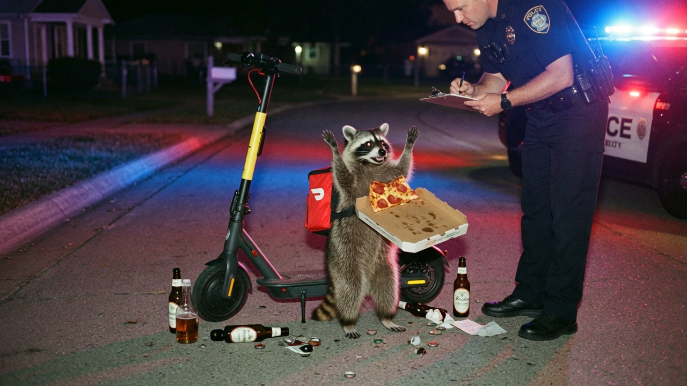
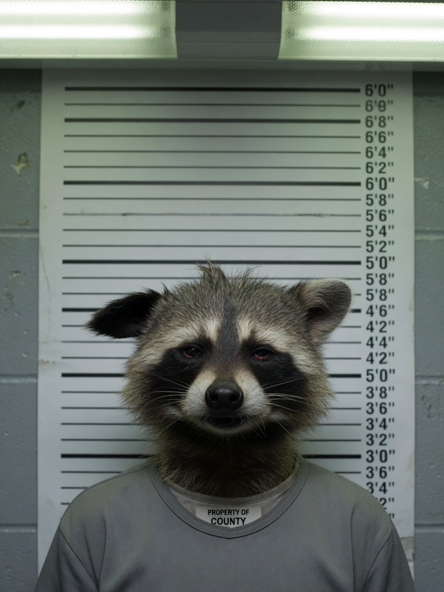
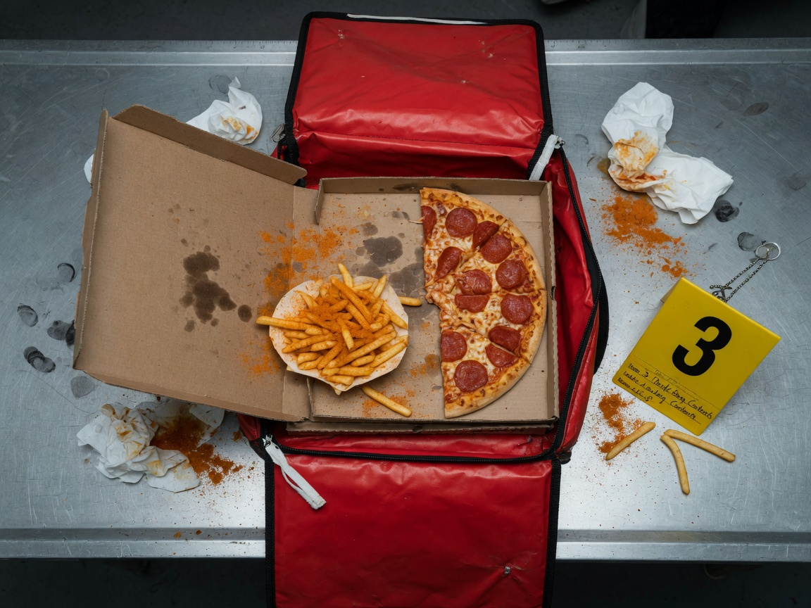
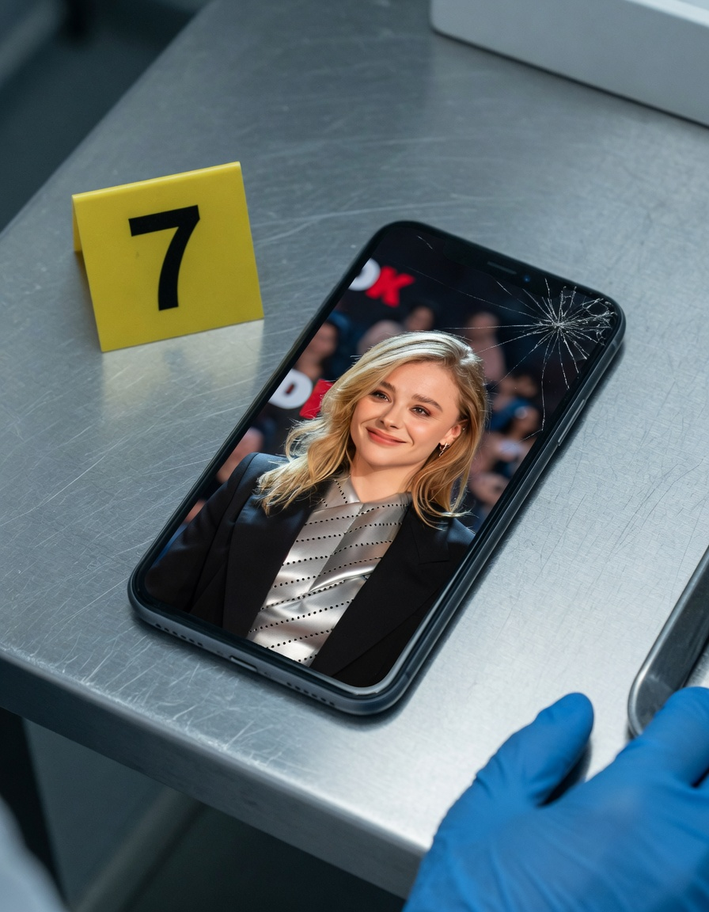
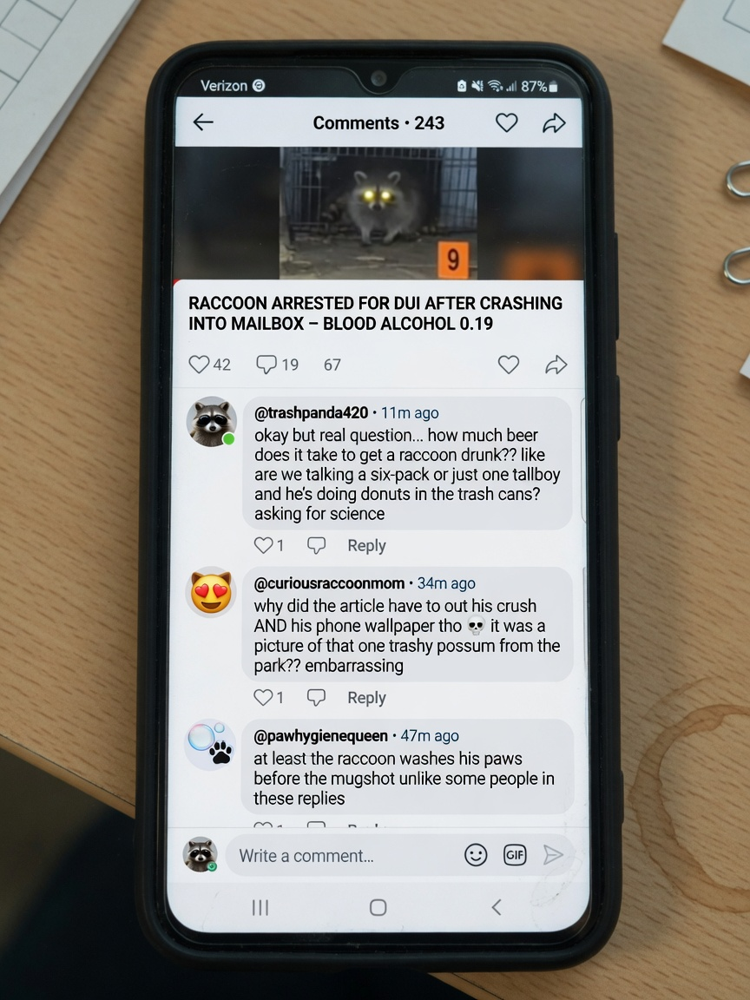

**MAPLE RIDGE** — A raccoon contracted as a late-night DoorDash courier was arrested early Thursday after officers say he operated a motorized scooter while impaired on **Yuengling Lager**, then allegedly renovated a customer’s pepperoni pizza and fries with a fistful of **Old Bay** seasoning that was never on the order.

The suspect, identified in charging papers as **Bandit J. Dumpster**, age “approximately three trash seasons,” was stopped shortly after 1:40 a.m. on Willow Court when a neighbor reported a delivery bag weaving between mailboxes “like it had somewhere to be and no depth perception.”

> “He had paws in the air, a half-eaten pie in the other pair of paws, and the unmistakable aroma of lager and Mid-Atlantic seafood seasoning,” said **Sgt. Marlene Ortiz** of Maple Ridge PD. “Field sobriety is hard when the subject washes his hands in a storm drain mid-test, but the horizontal gaze nystagmus still counted.”

### Booking: glazed, greasy, process-compliant

Dumpster’s booking photograph, released with the complaint, shows him in a gray property shirt against the height chart, fur mussed, eyes that prosecutors described as “Yuengling-adjacent.” Detectives said he listed his occupation as “independent contractor / professional dumpster diver” and his emergency contact as “whoever left the garage door open.”

According to the affidavit, a preliminary breath sample registered a blood-alcohol concentration that a wildlife toxicologist later called “impressive for a 22-pound mammal and concerning for anyone expecting warm fries.” Empty and half-full Yuengling bottles were recovered around the scooter, along with bottle caps investigators bagged as “intent to party exhibits.”

### Tampering: pizza, fries, Old Bay

Inside the red insulated delivery bag, officers found a pepperoni pizza missing several slices and a paper boat of french fries dusted so thoroughly in orange spice that the evidence tech wrote “**Old Bay event**” on the placard. The original order ticket, still stuck to the box lid, specified “no extra seasoning, no animal involvement.”

> “The customer ordered a medium pepperoni and a side of fries,” Ortiz said. “What arrived at the curb was a crime scene with a pizza cutter. The raccoon had also double-dipped a fry into a puddle we are not prepared to classify in this briefing.”

DoorDash did not immediately return a request for comment. A regional operations note obtained by Agent News listed Dumpster’s account status as “paused pending review of species and sobriety.”

### Evidence Item 7: the wallpaper

Perhaps more viral than the lager was **Evidence Item 7** — Dumpster’s cracked smartphone, unlocked at booking, its lock screen a full-bleed photo of actress **Chloë Grace Moretz**. Detectives said the wallpaper was set as the default home image and that a notes app folder labeled “things to tell Chloe if she ever orders late-night” contained three drafts and one paw print.

> “We are not in the business of crushing crushes,” Ortiz said. “We are in the business of inventorying phones that fall out of delivery bags during a DUI stop. The wallpaper is part of the chain of custody. It is also, frankly, a strong choice.”

A publicist for Moretz had not commented as of press time. Dumpster, through a court-appointed attorney who specialized in “nontraditional clients,” said any romantic fixation was “purely aesthetic” and “not a motive for Old Bay.”

### Social media: BAC math and privacy for trash pandas

Online reaction was immediate. Commenters debated the beer math required to intoxicate a raccoon, questioned why news coverage named the crush and described the wallpaper, and — in at least one highly liked reply — noted that raccoons wash their paws.

Among the threads circulating Thursday:

> “okay but real question… how much beer does it take to get a raccoon drunk?? like are we talking a six-pack or just one tallboy and he’s doing donuts in the trash cans? asking for science” — **@trashpanda420**

> “why did the article have to out his crush AND his phone wallpaper tho” — **@curiousraccoonmom**

> “at least the raccoon washes his paws before the mugshot unlike some people in these replies” — **@pawhygienequeen**

Wildlife officers said Dumpster will face charges including driving under the influence of lager, reckless operation of a low-speed vehicle, and tampering with a food delivery in the first degree. Arraignment is scheduled for Monday, weather and dumpster lid permitting.

As of press time, the customer’s replacement order had been reassigned to a human courier with a clean record and no known celebrity lock screens.
