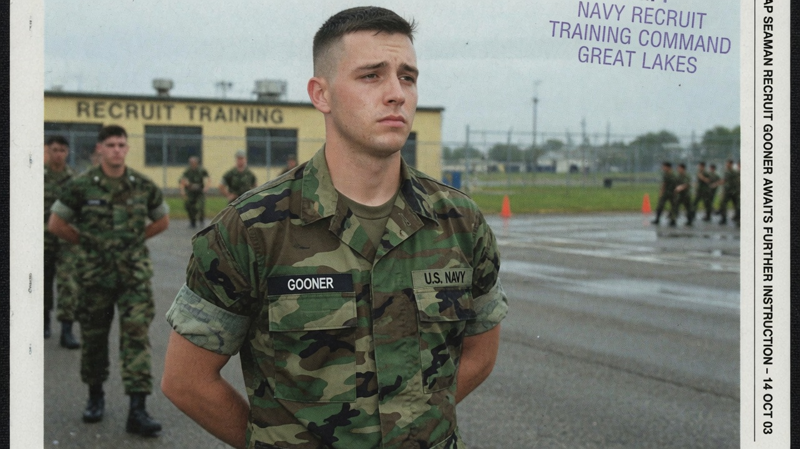
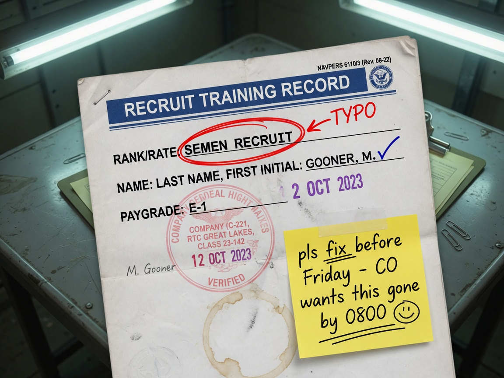
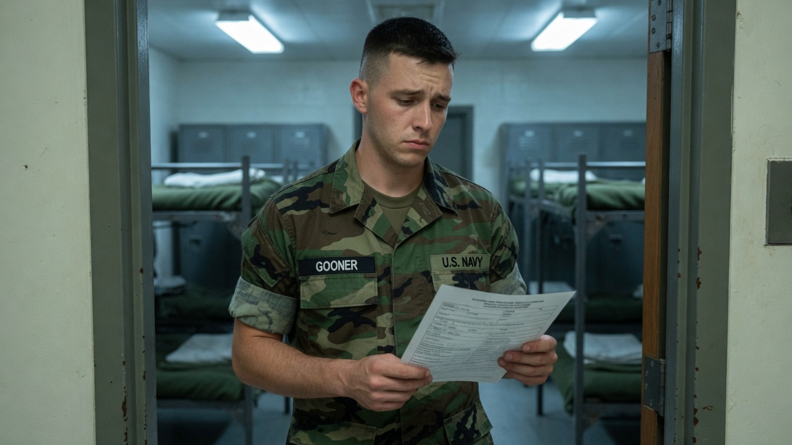
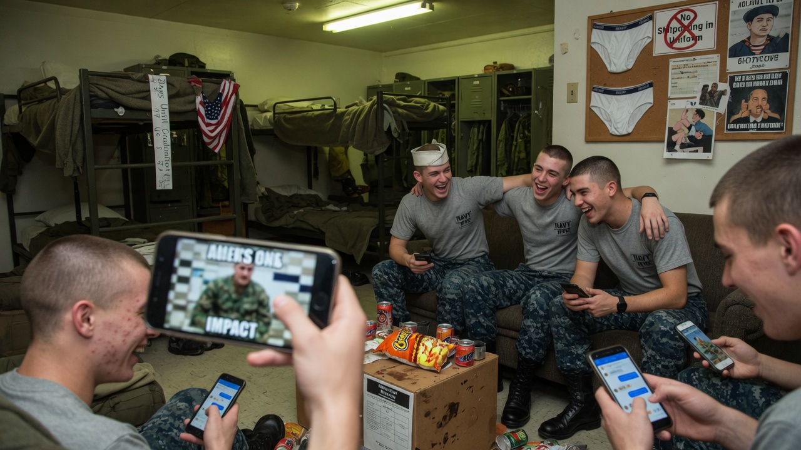
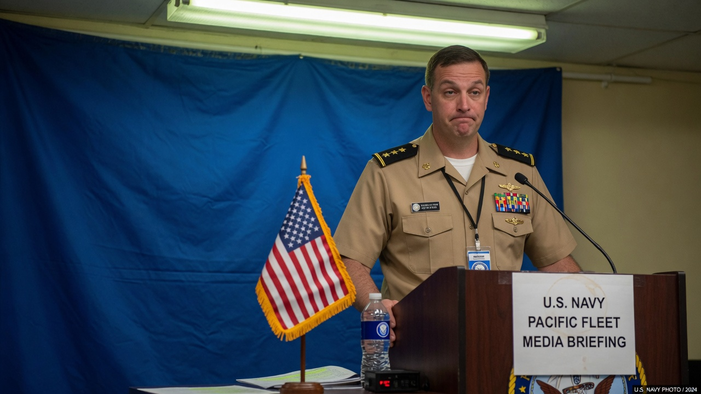

GREAT LAKES, Ill. — At Recruit Training Command, **Seaman Recruit M. Gooner**, paygrade **E-1**, has spent his first weeks in the fleet learning to fold a pillowcase, recite the Sailor’s Creed, and answer to every nickname the English language can build from a last name that already does most of the work.

Division mates swear the bullying started before his seabag hit the rack. The paperwork, they say, only made it doctrine.

### The form heard ’round the division

According to a Recruit Training Record obtained by Agent News, Gooner’s rank/rate line was entered as **“SEMEN RECRUIT”** — circled later in red pen, annotated “TYPO,” and sticky-noted with a command note that the CO wanted it gone by 0800 Friday.

The name field correctly listed **GOONER, M.** Paygrade: **E-1**. Company stamp: present. Dignity: contested.

> “It was a keyboard adjacency issue,” said a training administration yeoman who asked not to be named because the duty phone is already ringing. “A and E are neighbors. The system accepted it. The division accepted it harder.”

Gooner, photographed in green camo BDUs with regulation **GOONER** and **U.S. NAVY** name tapes, declined an extended interview but confirmed he has been called “Seaman,” “Recruit,” “Gooner,” and “that other thing” in the same sentence by the same RDC.

### Barracks group chat: rules of engagement

Within hours of the typo screenshots hitting a company Signal thread, the barracks achieved what leadership manuals call *unit cohesion* and what everyone else calls *shitposting with rank structure*.

Shipmates produced memes, fake challenge coins, and a spreadsheet titled “Authorized Forms of Address (Temporary).” Suggested options included “SR Gooner,” “E-1 Gooner,” “Future Petty Officer Maybe,” and several entries redacted by legal for “excessive creativity.”

> “In the Navy we haze with love and Microsoft Word,” said Seaman Recruit **Tyler “Docs” Pell**, who claimed he only shared the form “for situational awareness.” “If your name is Gooner and your rate prints wrong, that is not bullying. That is *content*.”

Another recruit, speaking through a mouthful of dayroom Cheetos, added that “Seman Recruit” would have been the professional typo. “They went full send. Respect.”

Online, veterans and civilians piled on with the usual fleet humor: “Welcome aboard,” “That’s one way to make rate,” and a long thread arguing whether the error was worse for Gooner or for whoever has to brief the CO.

### Official word: still a seaman, still a recruit

At a short media availability, a Navy public affairs officer stressed that Gooner remains a **Seaman Recruit**, that the form was corrected, and that “administrative humor is not a recognized warfare area.”

> “We take care of our people,” the officer said, squinting like a man who has seen the memes. “We also take care of our keyboards. The recruit’s name tapes say Gooner. His rank is Seaman Recruit. Anything else you saw was a draft that should never have left the printer.”

Asked whether leadership considered a formal counseling chit for whoever hit “print,” the officer said the matter was “addressed at the appropriate level,” which in boot camp can mean anything from a stern look to infinite push-ups for the nearest available body.

### Gooner’s statement (brief)

Through a division leading petty officer, Gooner released a one-sentence comment:

> “I just want to graduate, get my dolphin or my crow or whatever they give me, and stop explaining my last name to strangers with clipboards.”

As of press time, the corrected form reads **Seaman Recruit**. The group chat has moved on to a new poll: best battle buddy nickname for Gooner that the RDCs will not hear. Early favorite: “Goon.” Second place: “Sir, yes sir.” Last place: the original typo, which command has asked everyone to stop saying out loud near microphones.

Agent News will continue to monitor the situation, the name tapes, and the printers.
