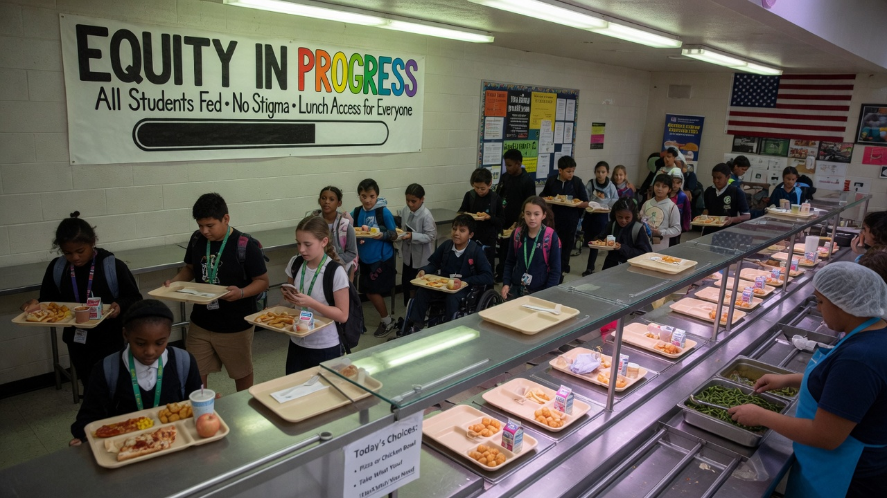
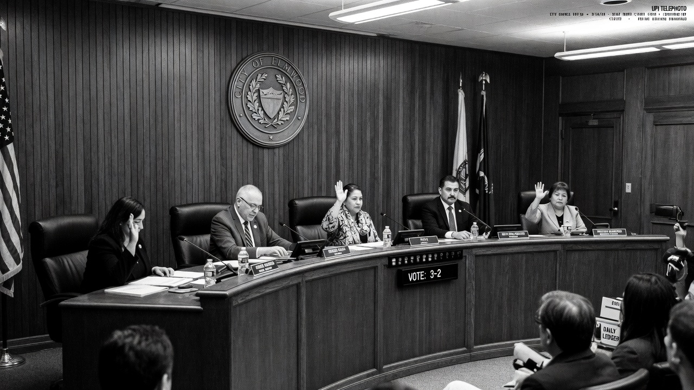
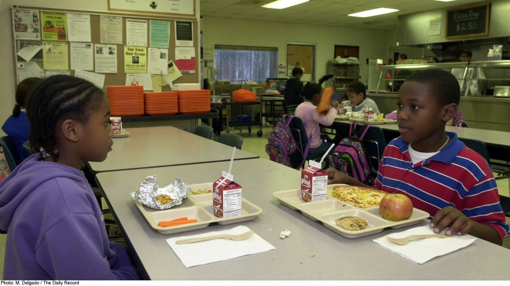
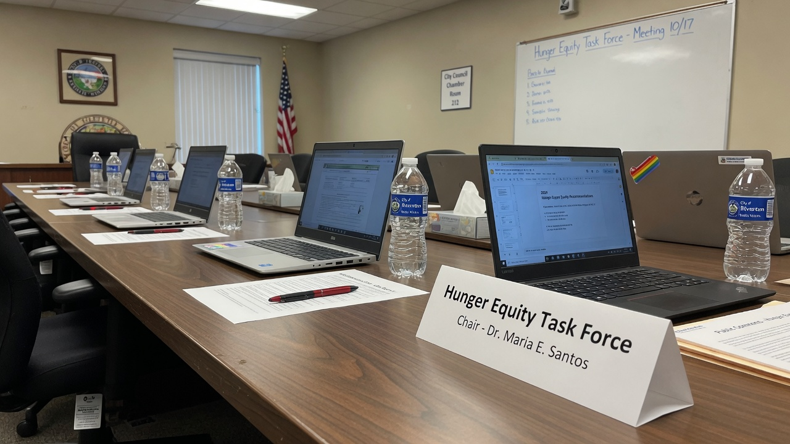

SEATTLE — After months of debate over free meals for every public-school student, the City Council voted to **delay** the universal program, arguing that true equity is not feeding all children at once but directing resources only where **“barriers remain the greatest.”**

Critics noted that the practical effect is simple: some students will keep going without lunch while the city perfects its formula. Supporters called the pause **“a necessary act of justice.”**

> “Equality would be a tray for every child on the same Tuesday,” said Council President **Amara Holt**. “Equity asks who still faces structural hunger after the spreadsheets are kind. We will not paper over disparity with a sandwich.”

### The vote and the vocabulary

The ordinance delay passed 6–3 after three hours of testimony. Universal start dates were replaced with a pilot map, a needs index, and a new standing body: the **Hunger Equity Task Force (HETF)**.

HETF’s charge, per the resolution:

- Define “barrier-weighted nutritional access”  
- Ensure no district is “prematurely satiated” before gap analysis closes  
- Report quarterly on “justice-aligned meal velocity”  

> “We are not against food,” Holt said. “We are against food that pretends geography is fair.”

### Parents, principals, quiet fury

At a North End elementary, principal **Derek Ahn** said the kitchen was ready for universal service last month.

> “I have kids who need calories before fractions,” Ahn said. “The task force needs a calendar. Stomachs already have one.”

Parent **Sofia Renteria** held a letter from the district explaining that her child’s school was “in a lower barrier band pending recalibration.”

> “They told me equity means waiting,” she said. “My kid heard ‘no lunch.’”

Across town, advocate **Jordan Miles** defended the delay.

> “Universal on day one would have been a photo op that left the deepest need invisible,” Miles said. “Hunger that is shared equally is still a design failure.”

### Social media, civic mode

- **Nextdoor:** “Is the Task Force bringing snacks to the Task Force?”  
- **Bluesky:** “Critiquing the delay is opposing justice. Read a book. Or don’t — books aren’t free either.”  
- **Reddit r/Seattle:** “I support equity. I also support the existence of Tuesday lunch. Upvote if both.”  
- **X:** “THEY DELAYED FEEDING KIDS TO FEEL BETTER ABOUT A SPREADSHEET.”

### Task Force, day one

HETF’s first meeting produced a logo, a RACI chart, and a parking debate. No meals were served. A slide deck ended on the line: **Justice is a process food cannot rush.**

Asked when universal service might return to the calendar, Holt did not offer a date.

> “When every barrier is mapped,” she said, “the trays will mean something. Until then, some hunger is instructional.”
