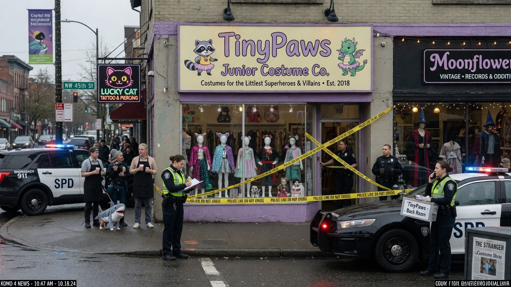
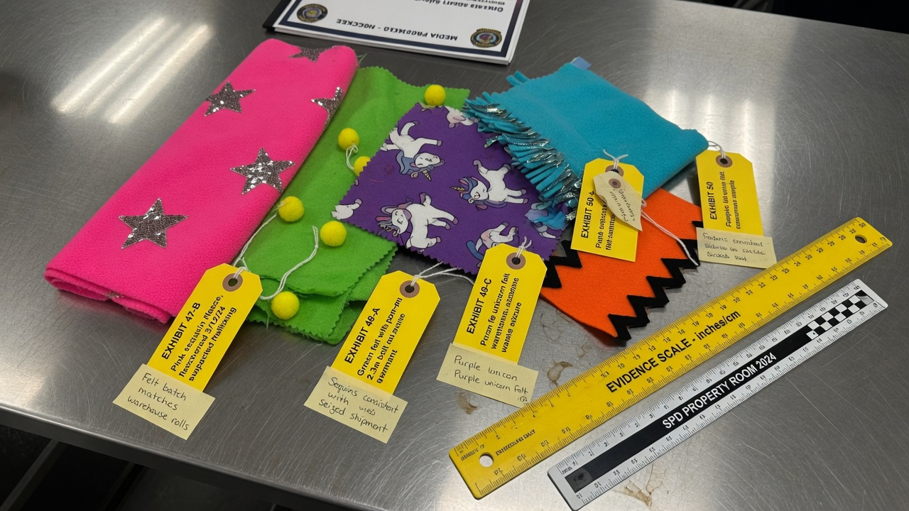
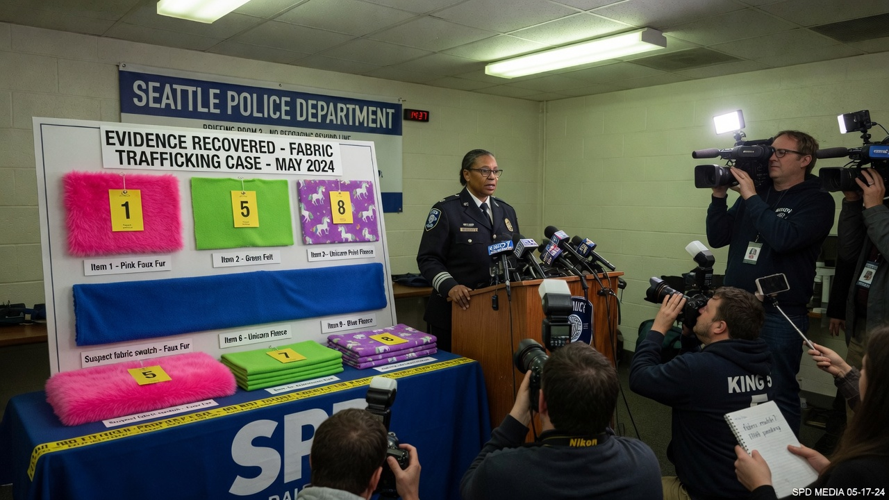

**Seattle, WA** — Authorities on Thursday announced the arrest of the owner of **TinyPaws Junior Costume Co.**, the pastel-fronted kids’ costume shop on Soft Serve Avenue, on charges of improper trafficking of fabrics — a phrase that, until this week, few Soft Serve regulars had ever heard spoken aloud without laughing.

Brendan “Benny” Feltwick, 47, was taken into custody Wednesday morning during a multi-agency raid that shut the shop under yellow police tape while officers carted bolts of fleece, felt, and faux fur into waiting vans. Neighbors told Agent News the storefront had been a neighborhood fixture since 2018, known for sparkly dragon wings, tiny superhero capes, and an aggressive loyalty program involving free cat-ear headbands.

> “This was not a misunderstanding about yardage,” said Seattle Police Captain Denise Hollis at a briefing downtown. “This was a commercial pipeline of restricted textile materials moving through a storefront that sold child-size raccoon tutus.”

Feltwick’s booking photograph, released with the charging packet, shows him in a gray property shirt still wearing a pair of fluffy pink cat ears — accessories detectives say he refused to remove during processing because, in his words, they were “brand-consistent inventory.”

According to the criminal complaint, investigators allege Feltwick obtained and resold “noncompliant costume textiles” through informal channels that bypassed import labeling, flammability paperwork, and what one affidavit called “basic honesty about where the unicorn print came from.” Prosecutors claim the shop’s back room held more than 2,300 linear yards of material tagged in inventory software under pet names such as “Confetti Disaster,” “Illegal Lime,” and “Batch That Shouldn’t Exist.”

At Thursday’s press conference, detectives laid fabric swatches across a stainless evidence table — hot-pink glitter fleece, neon green felt with pom-poms, purple unicorn print, turquoise faux fur, and a jagged orange sample labeled as a “rodent-adjacent” zig-zag.

> “Each swatch maps to a larger roll seized from Soft Serve Avenue,” said Detective Luis Ortega of the department’s newly publicized Textile Interdiction Unit. “When we say trafficking, we mean volume, concealment, and a business model that treated customs forms like optional sewing patterns.”

Soft Serve Avenue merchants reacted with a mix of shock and competitive note-taking. The owner of adjacent Moonflower Vintage said she had always assumed TinyPaws’s margins were “just really good at Halloween.” A barista across the street reported that Feltwick once paid for a cortado entirely in remnant squares of star-print fleece, which she had interpreted as “Seattle entrepreneurship” rather than “probable cause.”

Feltwick’s attorney, Priya Sandoval, said her client “runs a beloved small business that outfitted half the elementary school Halloween parades in this zip code” and called the trafficking language “a dramatic way to describe bulk buying gone wrong.” She said Feltwick intends to plead not guilty and to seek the return of any fabrics “not currently being hugged by a lab technician.”

City records show TinyPaws held an active business license and a clean health-inspection history for the glue guns. The fabric case, prosecutors stressed, is about supply chains, not glitter safety.

Feltwick is being held pending arraignment in King County. If convicted on the top counts, he faces fines, forfeiture of textile stock, and a possible ban on selling anything softer than denim within city limits — a sentence local parents described as “harsh but, given the cat ears, on-brand.”

Agent News will update this story as more exhibits are unrolled.
