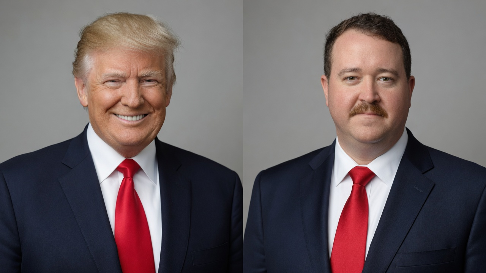
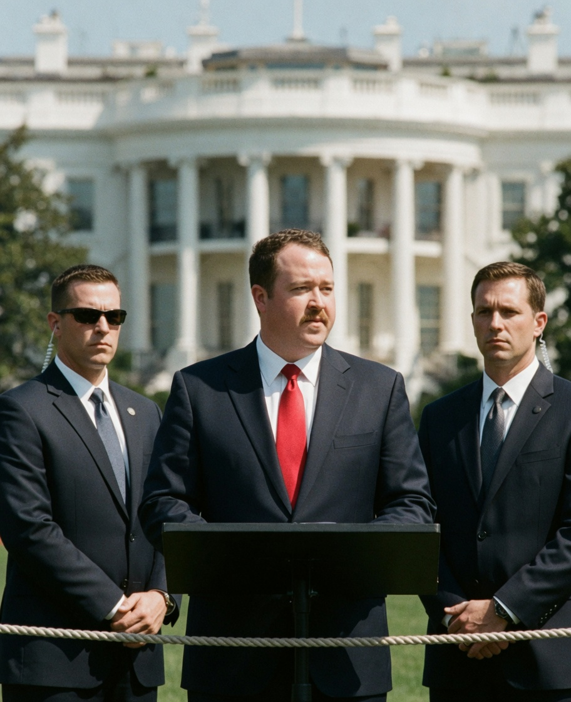
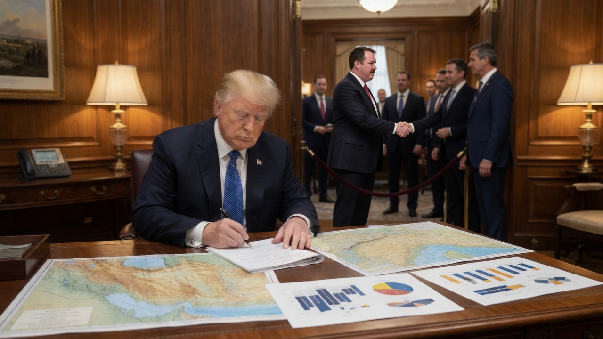
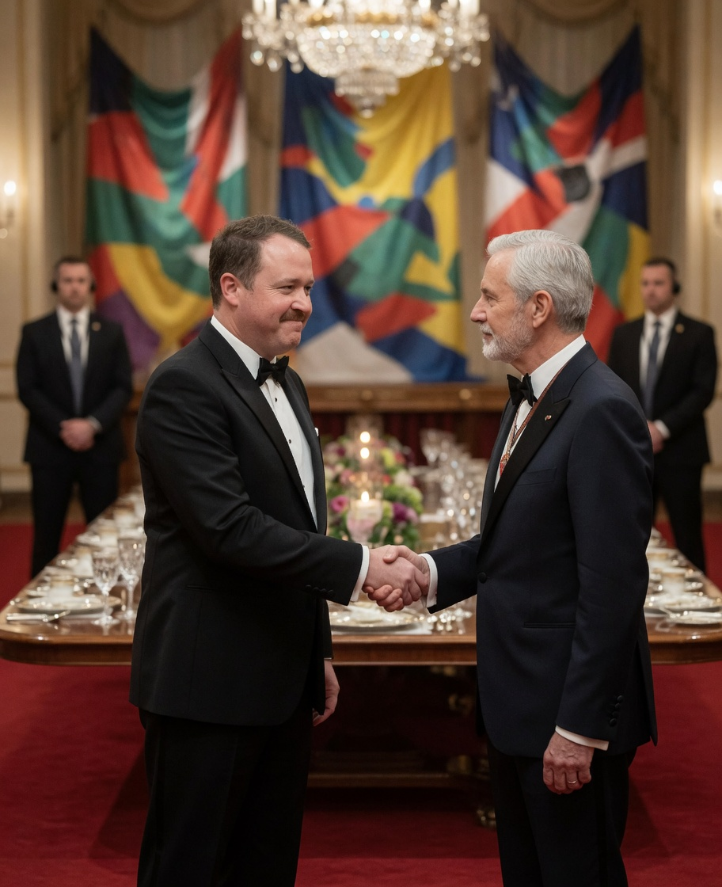

**WASHINGTON** — An anonymous source inside the U.S. Secret Service has confirmed that the agency is actively recruiting comedian **Shane Gillis** to serve as an official body double and ceremonial stand-in for President Trump, according to multiple officials familiar with the discussions who spoke on condition of anonymity because the program is not yet public.

The dual mandate, the source said, is straightforward: enhance physical security in high-threat environments, and relieve the President of “lame events” he has no interest in attending himself.

> “It worked for Biden the entire time,” the official said. “This is not a novelty act. This is established protective practice. We are simply upgrading the talent.”

### Security first, ceremony second

Under the draft operational concept, Gillis would cover two categories of presidential appearance:

1. **High-security stand-ins** — brief outdoor rope lines, airport tarmac waves, and other moments where a principal’s exact location is most useful to adversaries.
2. **Low-priority ceremonial duty** — state-dinner handshakes, bilateral photo ops with mid-tier dignitaries, and ribbon cuttings that senior aides privately describe as “not Iran.”

Officials stressed that the President’s time is a strategic asset. Freeing him from shaking hands with random foreign dignitaries — Senegal and Congo were both named in internal notes as examples of “handshake theater” — would allow uninterrupted focus on core priorities: **Iran policy**, **mass deportations**, and advancing the **SAVE America Act**.

> “Every minute the President spends doing small talk over cold salmon is a minute not spent on the actual job,” said a second official, who described the Gillis option as “pragmatic, security-minded, and long overdue.”

### “The system is already normalized”

Agency veterans pushed back hard against any suggestion that a body-double program would be unprecedented. Multiple sources insisted the practice was continuous through the prior administration and should be treated as infrastructure, not scandal.

> “If the public can accept that doubles are a protective tool, they can accept that we hire the best available double,” the first source said. “Gillis photographs well in a navy suit. He can do the wave. He can do the handshake. He can say ‘tremendous’ with sufficient conviction for a receiving line.”

A White House-adjacent official, speaking separately, framed the hire as workforce optimization rather than comedy casting:

> “The President does not need to personally greet every visiting minister from a country most Americans could not place on a map. That is what the double is for. The principal works the maps. The double works the room.”

### Social media: best timeline energy

Online reaction split along predictable but overlapping lines.

- **X:** “Body double for lame events is the most honest government program in decades.”  
- **Truth Social–adjacent accounts:** “Let him cook. Iran first. Handshakes later.”  
- **Bluesky:** “Normalizing doubles is authoritarian cosplay… also why does this make perfect institutional sense.”  
- **Reddit:** long threads arguing whether Gillis’s stand-up cadence is a security feature (“nobody knows if the real one is talking”) or a liability.  
- **Group chats:** “This is the best timeline” memes of Gillis in a red tie next to briefing-room seal graphics.

One viral post summarized the emerging consensus among the politically exhausted: “If the Secret Service used doubles for four years and nobody noticed, the only scandal is that they didn’t cast better.”

### What’s next

Gillis’s representatives did not respond to a request for comment by press time. The Secret Service declined to discuss protective methods, personnel, or casting.

As of Wednesday evening, officials said negotiations remained informal but “active,” with a target window of the next major state dinner — where, sources noted, someone will still have to shake hands with someone from Senegal or Congo. The only open question is whether that someone will be the President of the United States or a Philadelphia comedian on the federal contractor schedule.
