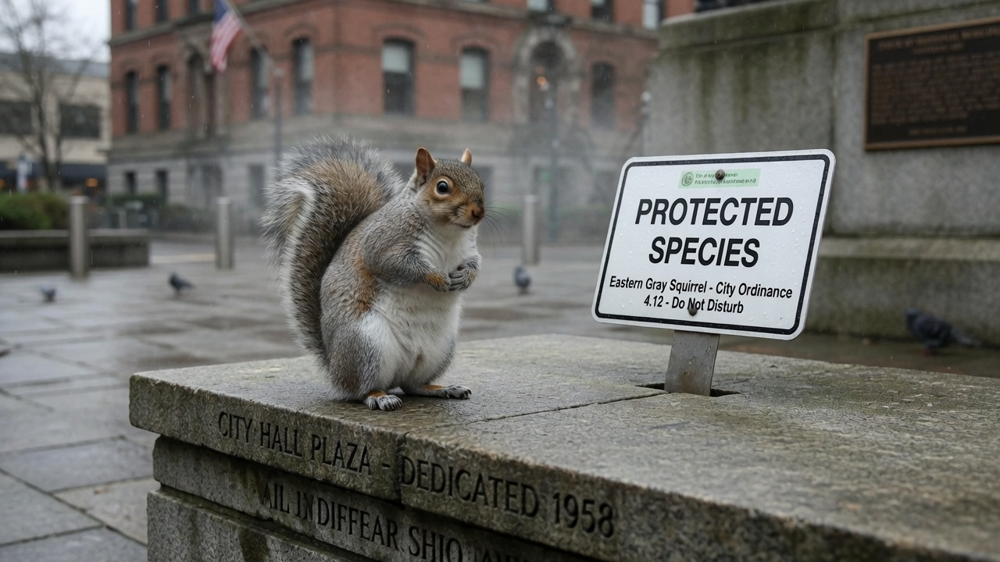
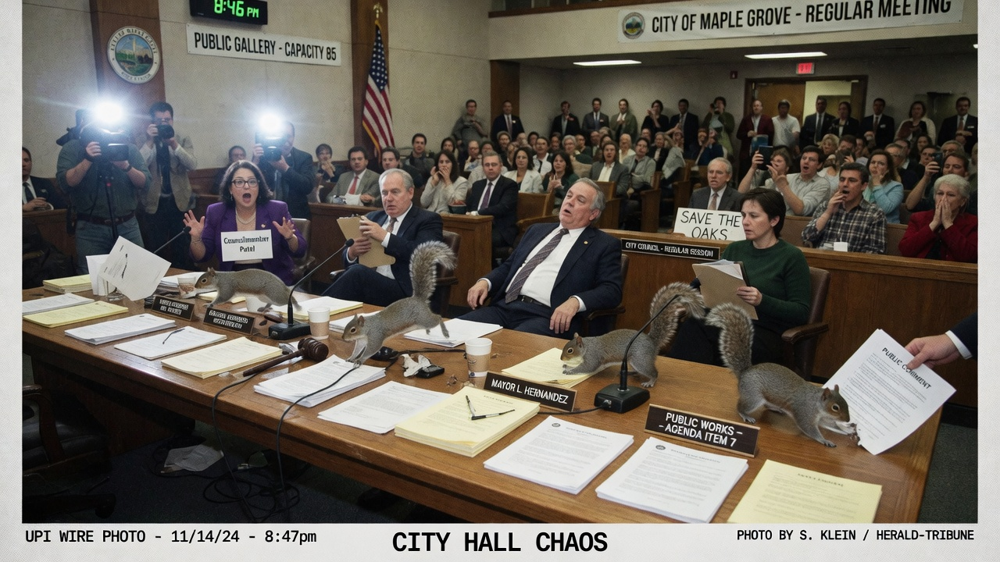
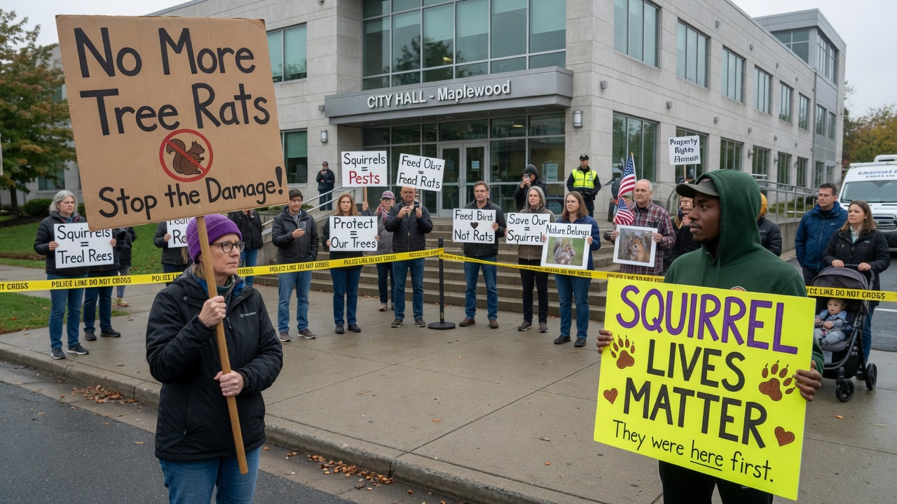
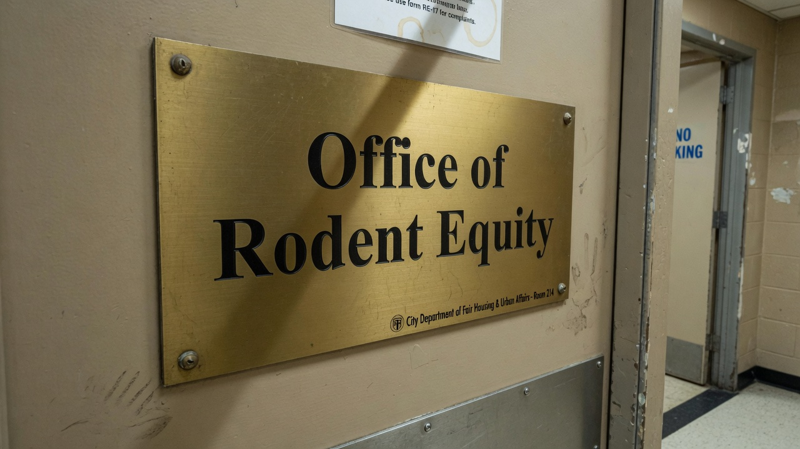

SEATTLE — After a Nextdoor post referred to a backyard squirrel as a **“tree rat,”** the City Council voted 9–0 to grant all urban squirrels **protected-class status**, making unflattering rodent comparisons a hate crime and elevating peanut distribution to a civil right.

The measure, **Ordinance 26-4417-SQR**, took effect at midnight. Feeding squirrels is now “affirmative community care.” Calling them rats is “species-coded verbal violence.” A new **Office of Rodent Equity (ORE)** will staff a Squirrel Equity Officer, three “foraging liaisons,” and a part-time translator for “tail-based communication.”

> “Language shapes habitat,” said **Dr. Juniper Voss**, the city’s first Squirrel Equity Officer, speaking beside a temporary “Protected Species” sandwich board on the City Hall plaza. “When you reduce a gray squirrel to ‘tree rat,’ you authorize every bird feeder lock, every motion-sensor sprinkler, every cruel bag of cayenne. That ends today.”

### What the ordinance actually does

Under 26-4417-SQR:

- Urban squirrels receive protected-class status under the municipal civil rights code  
- “Tree rat,” “roof rat-adjacent,” and “fluffy pest” are prohibited descriptors in public speech within city limits  
- Residents may not “aggressively empty” bird feeders without a 48-hour notice posted in both English and “forage-accessible pictograms”  
- City parks will install **Equity Acorns** — free snack stations restocked twice daily  

> “This is not about rodents,” Councilmember **Talia Moss** said at the vote. “This is about who gets to be named by their enemies.”

### Outrage from both sides

**People who want to feed them** celebrated with bulk peanut runs and laminated yard signs reading *Guests, Not Pests*.

> “I’ve been criminalized for generosity for years,” said Ballard resident **Margo Keene**, who keeps three dish stations and a GoPro for “accountability content.” “Finally the city sees the soft hands of history.”

**People who hate them for raiding bird feeders** formed a dusk picket outside the parks department.

> “They emptied my sunflower budget in forty-eight hours,” said **Ray Delgado**, holding a sign that read **NO MORE TREE RATS**. “Protected class? They already own the power lines.”

Across the sidewalk, counter-protesters waved **SQUIRREL LIVES MATTER** banners and a felt mascot with googly eyes.

> “Hate speech is hate speech even if it has a fluffy tail,” said organizer **Priya Anand**. “If your bird seed requires a fortress, interrogate the fortress.”

### Inside the Office of Rodent Equity

ORE’s temporary suite on the third floor already has a brass door plaque, a waiting-room bowl of unsalted cashews, and a complaint portal that auto-routes “species microaggressions” to a three-business-day review.

> “We process naming harm first, then property damage,” Voss explained. “A chewed patio umbrella is a conversation. A slur is a case file.”

First-week metrics, per ORE’s soft launch memo: 412 Nextdoor screenshots filed, 17 “emergency forage deficits,” and one formal mediation between a homeowner and a squirrel that “would not leave the birdbath.”

### Social media, briefly unwell

- **Nextdoor:** “Someone called my patio guest a tree rat. I have the thread. ORE please advise. Also has anyone seen a black squirrel with a limp near 85th?”  
- **Bluesky:** “If your ecology needs a hierarchy of cute, it was never ecology.”  
- **Reddit r/Seattle:** “I support rights. I do not support the one that lives in my attic and pays no HOA. Upvote if both can be true.”  
- **X (quoted into nowhere useful):** “THEY GAVE CIVIL RIGHTS TO SOMETHING THAT STOLE MY KIND BAR.”

### What happens next

Enforcement begins with education flyers shaped like acorns. Repeat “tree rat” offenses carry fines starting at $250, rising to community service at an Equity Acorn station. The parks board will study whether raccoons qualify for “adjacent dignity” in a fall work session.

Asked whether the ordinance covers the squirrel that bit a tourist at Pike Place, Voss did not blink.

> “Trauma is not a species,” she said. “Naming is.”
