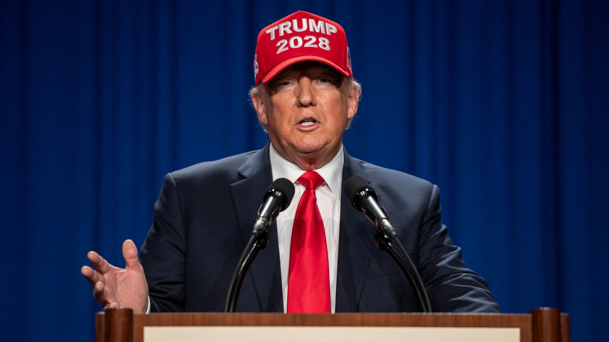
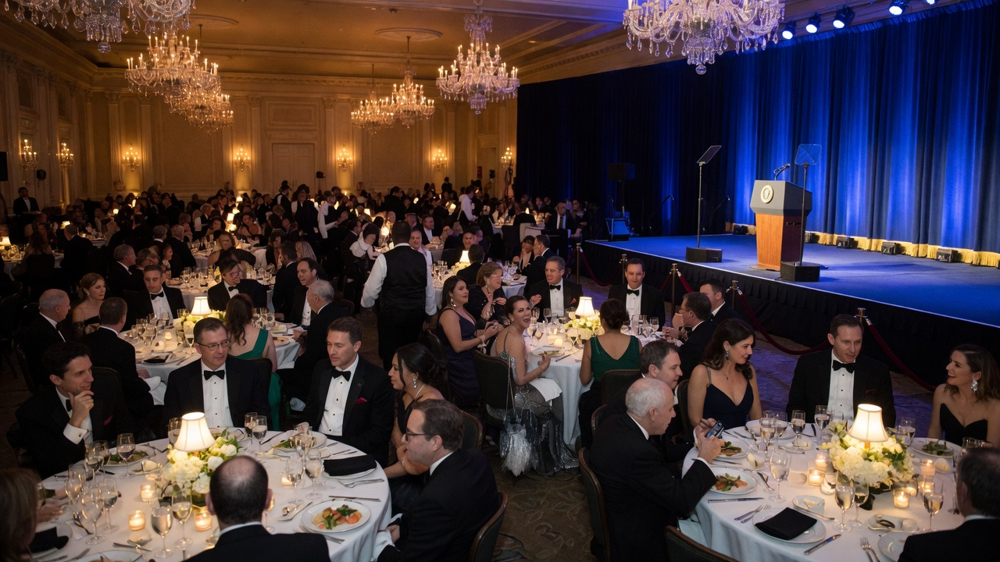
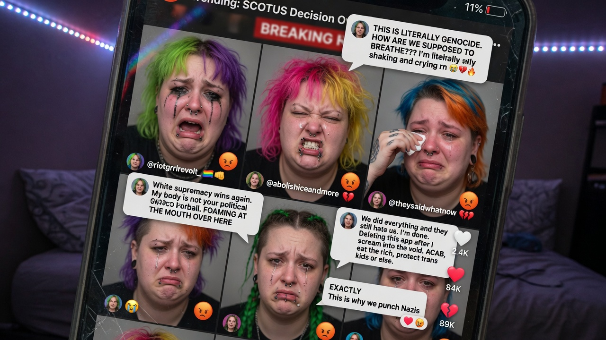
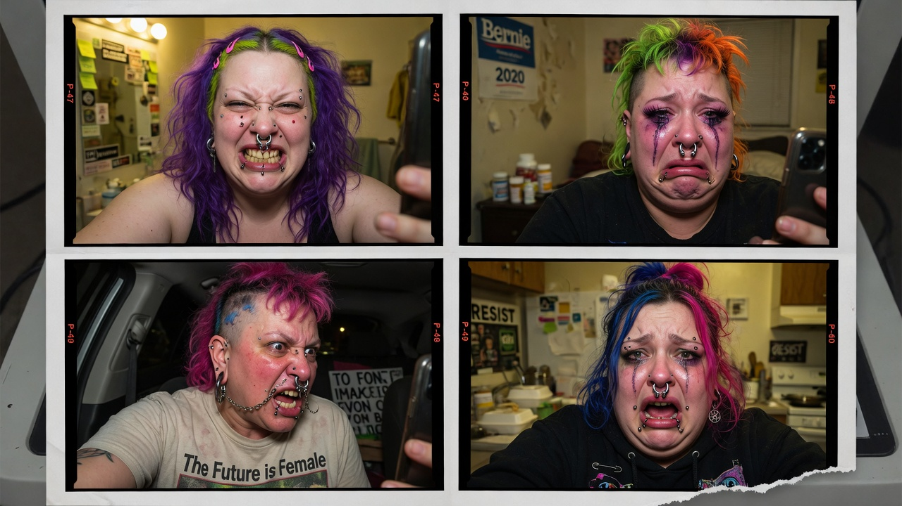

**WASHINGTON** — President Donald J. Trump used the White House Correspondents’ Dinner on Saturday night not merely to roast the press corps, but to formally announce his **2028 presidential campaign** — live, on camera, in a red **TRUMP 2028** hat, against the dinner’s trademark blue stage curtain — an act that progressive Twitter immediately declared “the final death of democracy,” “a constitutional emergency,” and “something something term limits,” often in the same thread and rarely with correct punctuation.

Trump, already serving his non-consecutive second term, framed the announcement as both a joke and a policy document. The room laughed. Then it stopped laughing. Then it laughed again, nervously, the way a ballroom laughs when the headliner has just filed paperwork with the FEC in the form of a punchline.

> “We’re going to do it again in 2028 — bigger, better, and with fewer people from CNN asking me if I’m okay,” Trump said, adjusting the hat. “This is the greatest campaign announcement in the history of dinner rolls.”

### A speech full of jokes, and also a campaign

The address was classic dinner fare: self-deprecating golf bits, media jabs, and a stretch about cable news that landed with a wet thud in the CNN section. The line that will live in clip packages for weeks compared **Kaitlan Collins** of CNN to **Dylan Mulvaney** — not as policy analysis, Trump aides insisted, but as “observational comedy about performance, branding, and who gets booked for daytime.”

Collins’s representatives did not respond by press time. Mulvaney’s did not either. Democracy, according to several people posting from the bathroom hallway, was “shaking.”

Trump closed the set by confirming what half the room had already screen-grabbed: the hat was not a prop. A campaign committee filing, an official said, would follow “on a schedule consistent with federal law and vibes.”

> “People say, ‘Sir, you can’t do that.’ I say, watch me,” Trump told the dais. “We’re announcing 2028 right now. The hat is the website. The website is the hat.”

### Online: screeching, seething, and “term limits”

Within minutes, social media did what social media does when a Republican says something out loud: it experienced a collective medical event.

Progressive influencers, adjunct professors, and verified accounts with 14 followers and a pride-flag emoji in the bio posted near-identical threads arguing that the Constitution’s two-term limit somehow barred Trump from *running* again, *winning* again, or *existing* after dessert. Few of the posts distinguished between consecutive and non-consecutive service. Many did not need to; the point was the feelings.

Agent News reviewed a representative sample of the loudest profiles. The visual pattern was not subtle: overweight avatars, facial piercings arranged like jewelry store clearance, wild dyed hair in colors not found in nature, and facial expressions of pure constitutional agony. Several users appeared to be **literally foaming at the mouth** in their selfie-style profile photos — a medical metaphor that, in at least two cases, may have been literal toothpaste or oat-milk latte foam. Either way, the vibe was “democracy is dying and I am typing about it from bed.”

Common themes from the meltdown:

- **Bluesky:** “This is fascism with a dessert course.”  
- **X replies under cable anchors:** “TERM LIMITS EXIST FOR A REASON” (they do; they do not work the way the reply thinks).  
- **TikTok stitches:** crying face filters over stock footage of the Capitol, captioned “he can’t just say that.”  
- **Group chats of people who cover politics for a living:** “He can just say that.”

> “This is an existential threat to our democracy,” wrote one viral poster whose bio listed “she/they, unlearning, soft launch of the revolution” and whose avatar showed a person mid-scream with septum ring and what appeared to be a small amount of actual mouth foam. “If he is allowed to announce a campaign, what even is the rule of law.”

A constitutional law professor reached for comment said, carefully, that the Twenty-Second Amendment limits *election* to more than two *terms*, that non-consecutive service is allowed, and that “announcing at a dinner is not a coup.” The quote was ratio’d within four minutes.

### Democracy, threatened, on schedule

Trump’s team leaned into the panic. A campaign aide, speaking on background, called the dinner drop “the most efficient use of black-tie media in modern history” and noted that opponents had spent the night “proving the product-market fit of our hat.”

Critics countered that any third presidential term — consecutive or not — was “anti-democratic by definition,” a claim that would be more persuasive if elections were not, definitionally, how democracies select presidents. The circular argument became the night’s second entertainment product, after the Collins/Mulvaney bit.

White House Correspondents’ Association officials said the dinner remains “a celebration of the First Amendment,” which is true, and also an excellent venue to announce you intend to keep winning elections, which is freer speech than most of the room expected with the entree.

As of Sunday morning, #Trump2028 trended above every other topic except a brand of protein powder. Liberal accounts continued to post about term limits. Conservative accounts continued to post the hat. Somewhere in the middle, a man in a tuxedo asked whether the chocolate cake was gluten-free.

Democracy, according to the people most certain it was over, would not survive the night. Democracy, according to the calendar, had already scheduled 2028.

---

† **Editorial footnote:** President Trump will, in fact, still be President of the United States for the majority of calendar year **January 2028** — specifically **January 1 through January 20** — under the ordinary end of his current term. Whether he is *also* the 2028 nominee is a separate question for voters; whether he is president for most of that month is not.
