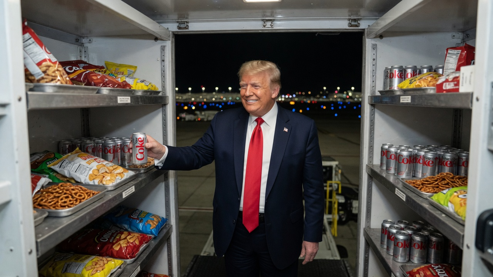
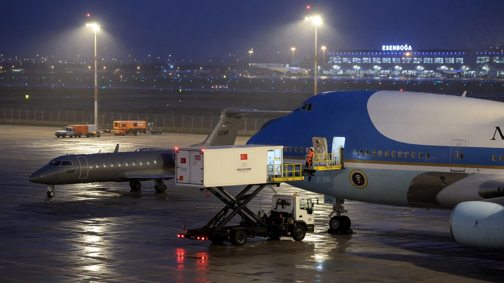
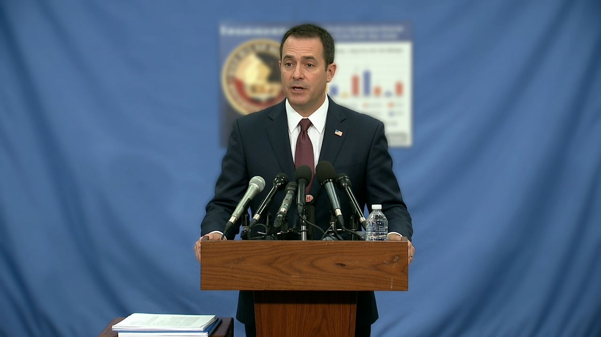
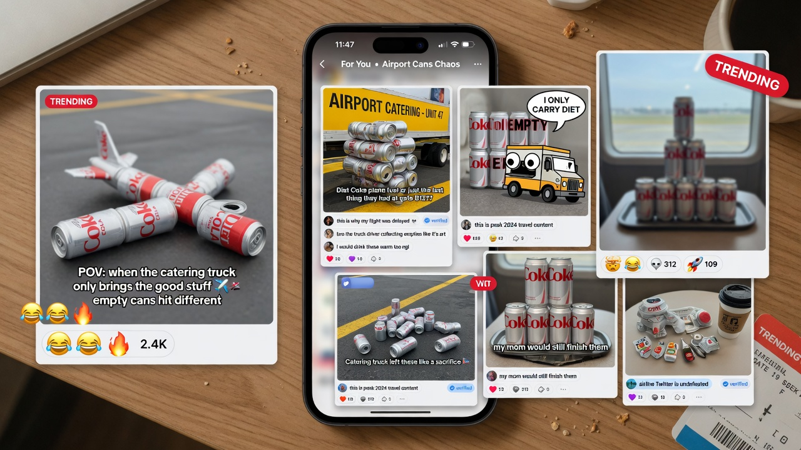

**ANKARA / WASHINGTON** — In the minutes after President Donald Trump boarded the decoy Air Force One on the Ankara tarmac last month — cameras rolling, baby-blue fuselage gleaming, the whole world told he was flying home — agents quietly moved him into an airport **catering truck** and rolled him toward a smaller military jet. What the public did not know until now, according to three people familiar with the transfer, is that the president treated the truck’s meal bay like a hotel minibar with presidential privilege: he **ate the snacks** and **drank the Diet Cokes** until the shelves looked like a convenience store after a hurricane warning.

The transfer itself has already entered the permanent lore of modern presidential logistics: an Iranian threat, a public boarding for show, a secret shuffle via the kind of high-lift food truck that usually loads chicken and foil-wrapped muffins. Agent News has learned the classified annex of the after-action notes includes a second column labeled **“consumables.”** It is not empty.

> “The principal was secure. The principal was mobile. The principal also discovered the catering bay,” said one official briefed on the movement. “By the time we reached the C-32, the truck looked like a Super Bowl commercial had exploded in reverse.”

### From photo op to pantry

Protocol called for silence, speed, and minimal movement once the president was inside the vehicle. Protocol did not, aides now concede, account for a fully stocked roll-up kitchen parked inches from the most Diet Coke–oriented administration in modern history.

According to the officials, Trump initially mistook the sealed cartons and chilled cans for “airplane food, but honest.” He opened a shrink-wrapped tray of pretzels. Then a second. Then what one source described as “an entire row of those little chips bags that airlines pretend are a meal.” Diet Coke followed in a sequence an agent privately timed as “faster than the truck’s lift mechanism.”

> “Sir, this is the transfer vehicle,” one agent reportedly said.  
> “I know,” the president replied, according to the retelling. “It’s the best catering truck. People are saying it’s the best. Tremendous inventory.”

By the time the truck docked beside the military aircraft, crew members assigned to restock the jumbo jet for the decoy flight allegedly discovered their own resupply had become a **depletion event**. Empty silver cans rattled in a cardboard tray. Crumbs occupied the jump seat. A single unopened ginger ale sat untouched like a diplomatic protest.

### Officials: “The can count is classified-adjacent”

At a background briefing in Washington this week, a White House logistics official declined to discuss protective methods, aircraft decoys, or whether Diet Coke constitutes a continuous presidential requirement under Title 10 of the vibe code. The official would only confirm that “refreshment shortfalls” were noted and that no mission objective was compromised by carbohydrate volume.

> “We do not comment on the contents of protective transfers,” the official said. “We can say the president arrived safely, the decoy performed as designed, and the catering community has been thanked for its service.”

A separate person who reviewed the truck’s post-mission inventory sheet said the “zero remaining” line items included:

- Diet Coke (cans): **all of them**  
- Pretzels / chips / “executive trail mix”: **gone**  
- Cookies labeled for crew: **missing in action**  
- Bottled water: **mostly intact** (“he’s not an animal,” one source clarified)

### Online: the only transfer everyone understood

Social media, presented with the dual narrative of a secret Iran-driven plane swap **and** a presidential snack raid, chose the plot it could emotionally process.

- **X:** “He got the catering truck and the Diet Cokes. This is peak American power.”  
- **Truth-adjacent accounts:** “They tried to hide the president. The Diet Cokes could not be hidden.”  
- **Bluesky:** long threads arguing the snacks were “working-class infrastructure stolen by capital,” plus one post calling the ginger ale “the real victim.”  
- **Group chats of people who cover aviation:** diagrams of high-lift trucks with the caption “and then he ate the evidence.”

One viral composite showed empty silver cans arranged into the outline of Air Force One. Another simply read: **“NATO summit. Catering truck. Zero pretzels remaining.”**

### Aftermath on the tarmac

Crew on the military jet, sources said, offered the president a standard airborne snack service once airborne toward Britain. He accepted “a couple more” Diet Cokes from the smaller aircraft’s stores, then settled in. The decoy Air Force One, still on the ground and still the star of every camera angle, eventually departed with a full cabin of people who were not the president and a galley that had been restocked from a second truck that, officials insist, was never left alone with the principal.

The White House has not released an official can count. Catering subcontractors in Ankara did not return requests for comment. The Secret Service declined to discuss vehicles, routes, or whether future high-threat transfers will include a **sealed snack lockbox** — a proposal one aide called “under active, slightly embarrassed review.”

As of this writing, the public story of the Turkey departure remains what the papers already reported: threat, ruse, catering truck, secret jet. The private story, according to people who cleaned the crumbs, is simpler.

He found the snacks. He found the Diet Cokes. The plane swap worked. The inventory did not.
