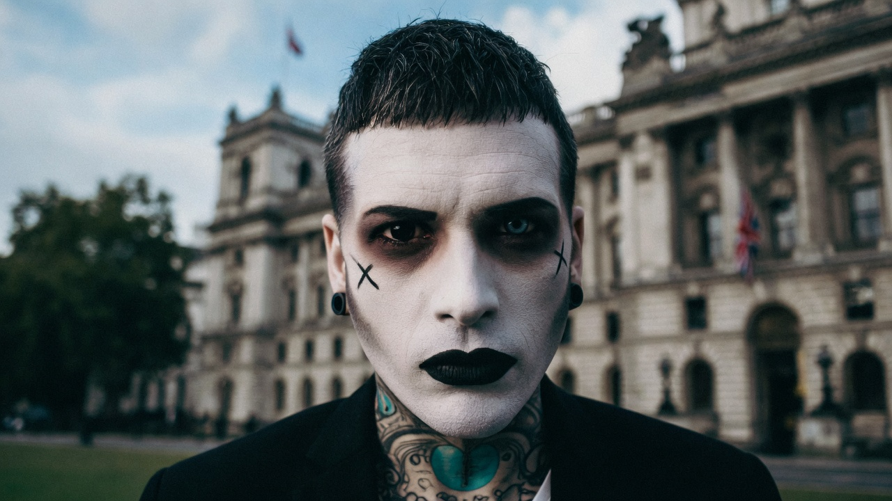
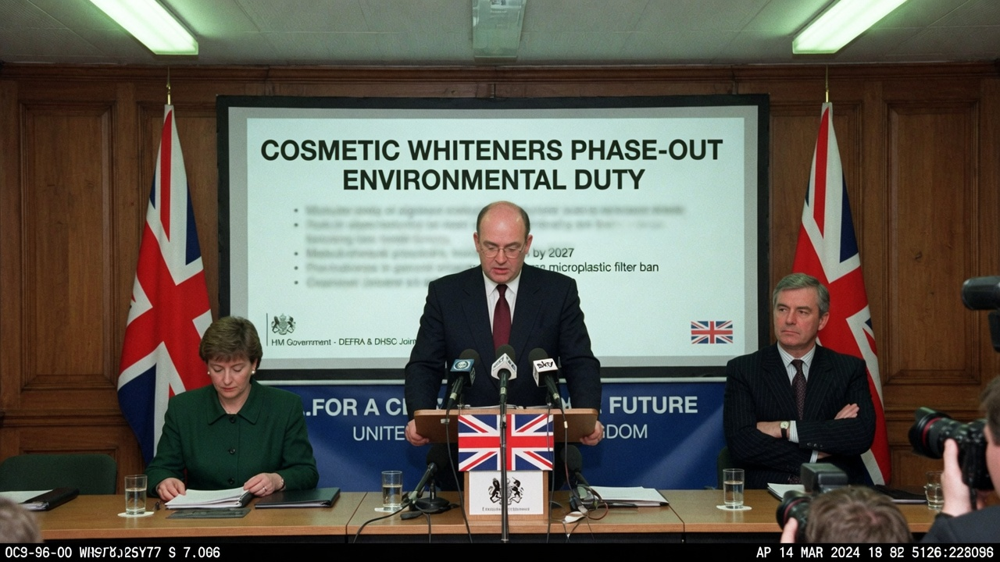
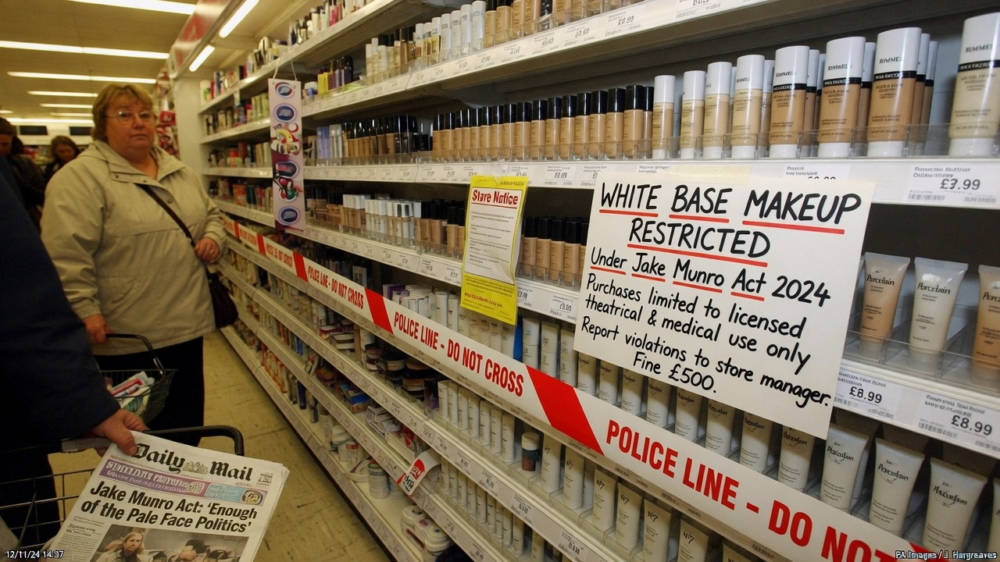
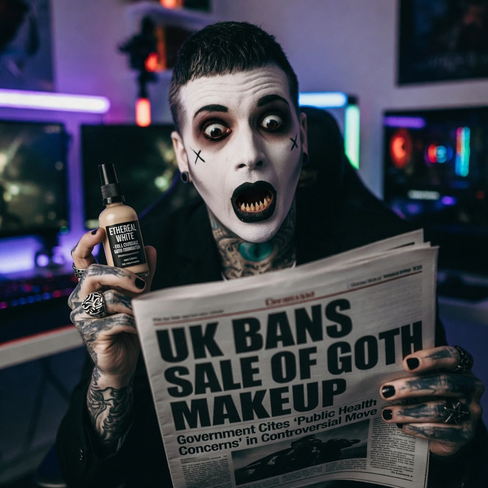
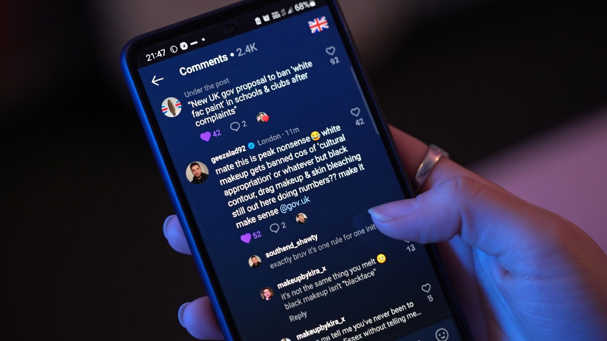

**LONDON** — The UK government has banned the sale and public application of **white base makeup** under a statute officially titled the **Jake Munro Act**, arguing the rule is an environmental reform — while naming, in the short title, the British goth streamer whose pale foundation is as much a brand as his channel.

The Act, published after a rushed Friday vote, restricts “high-albedo facial whitening products” including theatrical white foundation, corpse paint bases, and “any cream, powder, or paste primarily intended to render the face unnaturally pale.” Enforcement guidance lists exemptions for medical camouflage and “historically significant stage productions licensed before 1998.”

It does not restrict black eyeliner, black lipstick, or black eyeshadow.

> “This is about titanium dioxide loadings, packaging waste, and reflective pigments in the urban heat budget,” said **Environment Minister Helen Ashcombe**, standing before a slide that said **COSMETIC WHITENERS PHASE-OUT**. “It is not about any particular content creator.”

The short title of the bill is, in full, the **Jake Munro (Cosmetic Whitening Restriction) Act 2026**.

### Who Jake Munro is, and why the name stuck

**Jake Munro** is a UK-based YouTuber and streamer (channel **@JakeMunro**, hundreds of thousands of subscribers) known for goth vlogs, metal aesthetics, gaming streams, and long-running culture-war arguments inside alternative subcultures. His public image — black hair, full white face base, dark eye makeup — is the visual grammar of his brand: “I goth up and head out,” as his channel copy has long put it.

He has also described himself as a nationalist goth fighting what he calls the “woke matriarchy” in alternative scenes, which has made him a lightning rod among both fans and critics. For ministers, that profile appears to have been less a coincidence than a drafting convenience.

A Home Office footnote in the explanatory notes defines “iconic whitening patterns” as those “widely associated with a named online personality whose content regularly features complete facial pallor.” The footnote then names him again.

### The green case — and the bit that is not green

Officials claim white foundation is uniquely problematic: higher pigment loads, more plastic pots per “full corpse base,” and a “visibility premium” that allegedly encourages over-application. A DEFRA annex estimates that nationwide pale-base use contributes the carbon equivalent of “several hundred mid-sized tour vans,” a figure no independent lab would confirm on deadline.

What the annex does not explain is why the short title is a man, why the consultation period lasted eleven hours, or why black cosmetics — which are also pigments in pots — escaped the ban entirely.

> “If this were about the environment,” said cosmetics counsel **Mara Quinn**, “they would have regulated solvents and microplastics across the aisle. Instead they regulated the one shade associated with a goth who won’t shut up.”

High-street retailers began cordoning white bases overnight. Boots staff reported customers buying out the last “ghost” foundations “for archival purposes.”

### Munro’s orbit reacts

Munro had not issued a formal statement by publication, though clips of him mid-stream holding a foundation bottle circulated within minutes of the vote. Associates said the Act “literally prints his name on the bottle ban.”

Critics of Munro celebrated what they called a rare victory for “goth hygiene.” Supporters called it proof that the state fears a man in face paint more than it fears empty legislation.

### The comment that went feral

On social media, the most-shared reaction was less legal analysis than British escalation theory. One widely circulated post, screenshot thousands of times, read:

> **@binmen_for_hire:** Well they didn’t ban black makeup so what happens next could really wind people up.

Replies split between “that’s the point” and “mate they put his full name on an Act of Parliament.” A second wave argued that leaving black cosmetics legal while criminalising white base was either accidental genius or the most on-the-nose culture-war trap of the session.

Asked whether naming a streamer in primary legislation was proportionate, Ashcombe said the government “reserves the right to personalise environmental messaging when a cultural product becomes a pollution vector.”

Asked whether black lipstick was environmentally pure, she referred reporters to a forthcoming “spectrum review.”

As of publication, white foundation remains on the restricted list, black kohl remains on the shelf, and the Jake Munro Act remains the rare statute that needs no secondary press release to explain who it is about.
