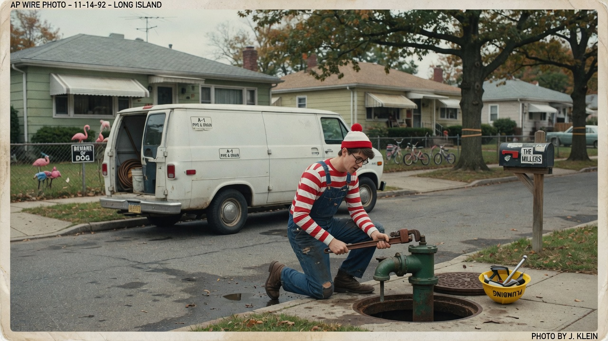
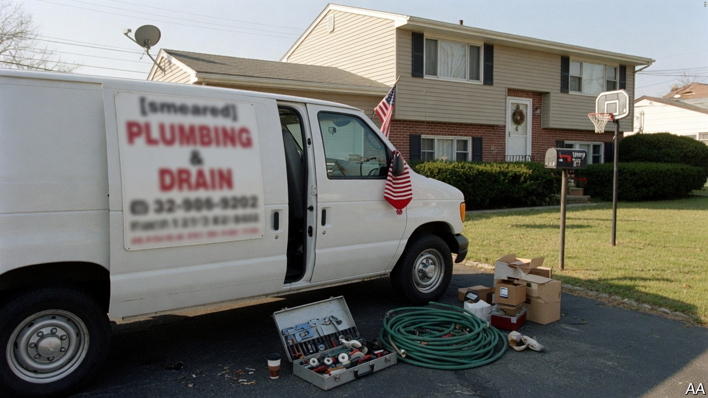
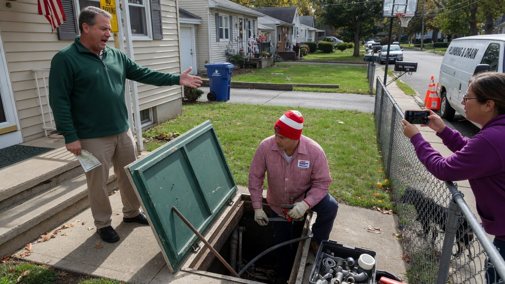
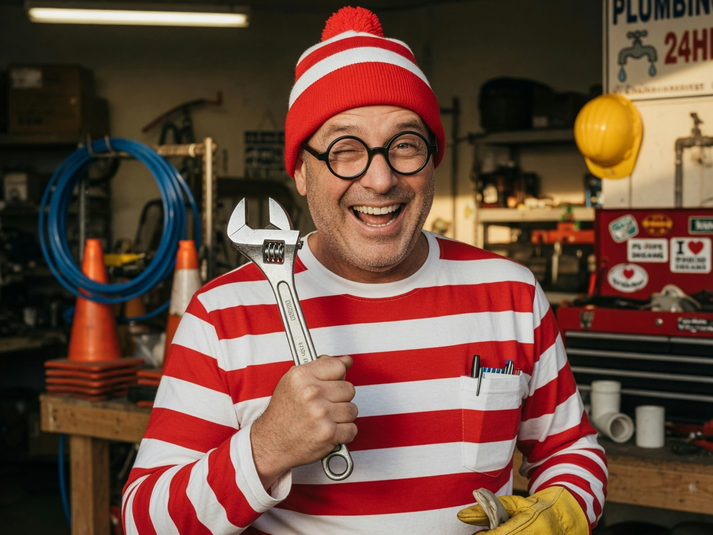

MASSAPEQUA PARK, N.Y. — After an estimated **thirty-seven years** of global hide-and-seek, **Waldo** — the red-and-white striped man formerly known for vanishing into beach crowds, ski slopes, and festival panoramas — has been **positively identified** working as a licensed residential plumber on Long Island.

The discovery came Tuesday morning when homeowner **Marcie Kolb**, 54, opened her basement hatch, found a man in stripes and a bobble hat tightening a shutoff valve, and whispered, “Oh my God. I’ve been looking for you since third grade.”

### “I wasn’t hiding. I was *scheduling*.”

Waldo, who holds a **Nassau County plumbing license** under the trade name **Stripe & Valve LLC**, told Agent News he moved to the Island “for the basements, the sump pumps, and the honest work of making water go where you want it.”

> “People kept asking *Where’s Waldo?* like it was a riddle,” he said, wiping grease on a shop rag patterned with tiny question marks. “I was under the sink. I was *always* under the sink. That’s not a mystery. That’s a **crawl space**.”

He confirmed he still owns the beanie. “It keeps the insulation out of my hair. Also brand consistency.”

### How he was “found”

Kolb had called for a routine drain cleanout after her dishwasher “started speaking in gurgles.” She did not expect the man from the children’s books. Neither did her neighbor **Tony Rizzo**, who filmed the moment from the sidewalk and uploaded it before the water stopped running.

> “I thought it was a costume for a HOA fundraiser,” Rizzo said. “Then he quoted me on a **P-trap** and a **dad joke** in the same sentence. That’s professional.”

Local search parties that once combed parks with laminated magnifying cards have been advised to stand down. The Suffolk County Office of Recreational Puzzles issued a one-line bulletin: **“Subject located. Please stop climbing other people’s fences.”**

### Puns, dad jokes, and industrial-grade shitposts

Colleagues at Stripe & Valve describe Waldo as “reliable, on time, and a public hazard at the water cooler.” His hobbies, he said without irony, are **puns**, **dad jokes**, and **shitposts**.

Sample inventory from his job-site banter, logged by apprentices:

- “I’m here to **pipe** down your anxiety.”
- “This joint is **tight** — unlike my last relationship.”
- “If you can’t **handle the pressure**, call a different guy. I *will* make a hose joke.”

On social media, under handles that cycle through misspellings of his own name, Waldo posts captions like “found myself under your vanity again 💅” over photos of wrench work, plus low-effort memes of his own silhouette circled in red with the text **skill issue**.

> “Shitposting is how I decompress after a three-story stack of galvanized,” he said. “Puns are free. Copper is not.”

### Industry reaction

**Lena Ortiz**, president of the Long Island Residential Plumbers Guild, called the reveal “excellent for the trade and terrible for group chats.”

> “We’ve been short-staffed for years,” Ortiz said. “If it takes a cultural icon in stripes to get kids interested in **drain cleaning**, so be it. Just bill for the trip charge.”

Publishers of the classic search books declined to comment on whether future editions will include a **crawl space under a Massapequa ranch**. A spokesperson for a major puzzle brand emailed only: “We are updating our maps.”

### Business as usual

Waldo said he has no plans to return to full-time hiding. Appointments are booked through the fall for water heaters, slab leaks, and “whatever is making that sound at 2 a.m.”

Asked if he misses being unfindable, he adjusted his glasses, deadpan:

> “I was never unfindable. You just never looked in the **right county**. Also, my van says *Stripe & Valve* on the side. That’s not stealth. That’s marketing.”

As of press time, Kolb’s drain was clear, her group chat was unusable, and Waldo was already en route to a second call in Wantagh — beanie on, radio on, allegedly workshopping a joke about **flanges**.
