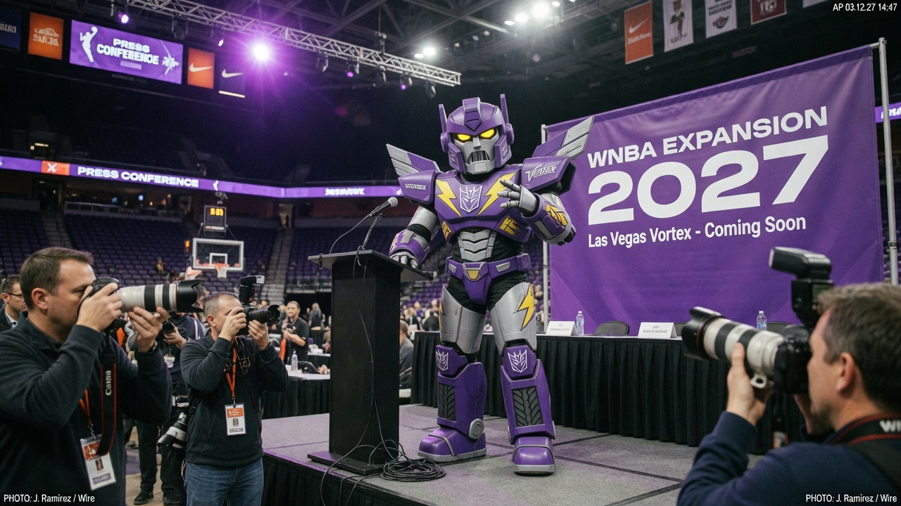
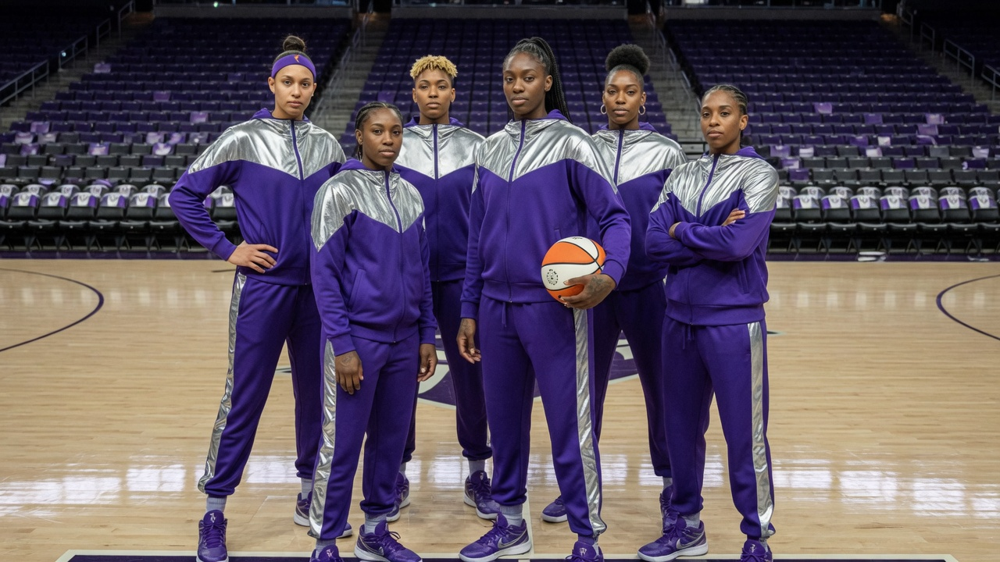
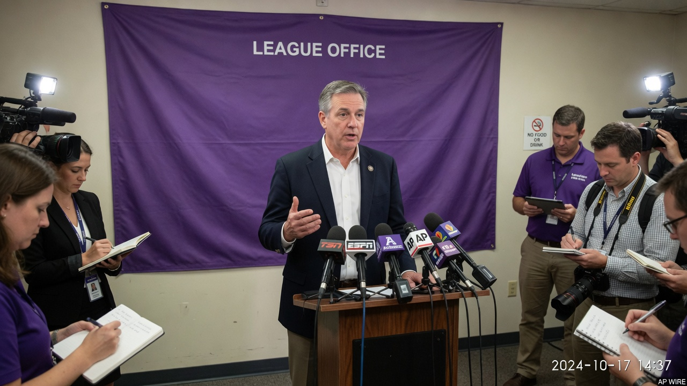
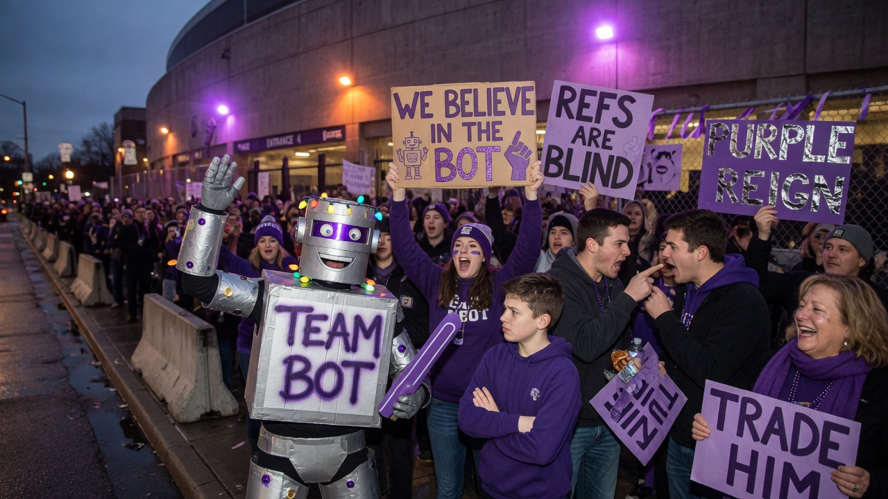

NEW YORK — The WNBA on Monday announced a **2027 expansion franchise** that will field a roster **composed entirely of transgender women**, complete with a mascot package the league introduced under the working name **“the Decepticons.”**

Commissioner staff framed the move as both a competitive investment and a branding breakthrough. Critics called it the most ambitious rebrand of women’s basketball since the invention of the midrange jumper nobody takes anymore.

The franchise — temporarily styled **WNBA Expansion ’27** pending a market vote between three midsize cities that all claim “championship DNA” and none of which have a completed arena HVAC system — will open free agency under a specially drafted **Identity-First Roster Framework**. League counsel described the framework as “a living document that dunks.”

> “We’re not just adding a team,” said **Dana Shore**, deputy commissioner for Competitive Narrative, at a podium ringed with network mics. “We’re adding a *transformative* product. Fans asked for more basketball. We heard ‘more.’ We also heard ‘robot.’”

### How the roster works

According to a FAQ stapled into the media kit (printed on purple stock “for vibes”):

- **Eligibility** is “self-attested and league-affirmed,” with a secondary review by a panel that has never been photographed winning a tip-off.
- **Height, wingspan, and prior men’s-league experience** remain “performance data, not identity data,” a sentence the PR staff asked reporters to read twice.
- **Locker-room policy** will use “flexible spatial justice,” which appears to mean more curtains and a larger budget for towels.
- **Opposing teams** must use preferred pronouns on broadcast graphics or forfeit a technical foul “and, emotionally, the right to complain.”

Five players already under “intent-to-sign” letters posed for a court-side photo in purple warmups. None of the names matched a current national team roster; all of the jumps looked real.

### About that mascot

The mascot is **the Decepticons** — plural, according to the style guide, “because one robot is a novelty and a fleet is a brand.” The costume on stage was a seven-foot purple-and-chrome warrior with glowing eyes, articulated shoulder plates, and a basketball stitched where a franchise logo might eventually go if the lawyers finish arguing.

Asked whether Hasbro, Paramount, or any company that owns the word “Decepticon” had signed off, Shore said licensing talks were “**in the same phase as the arena naming rights: optimistic and unanswered.**”

A secondary mascot concept — **Megatron the Point Guard** — was “tabled pending trademark search and the commissioner watching one episode of the cartoon.”

> “The Decepticons stand for resilience, strategy, and converting on the break,” said mascot choreographer **Jules Kett**, who denied that the dance package includes “literally transforming into a truck.” “If Autobots want a rival team, they can file their own expansion bid.”

### Reaction, online and otherwise

Within minutes, sports Twitter (still called that in this newsroom) split into camps that agreed only that the purple looked expensive.

Account **@PaintTheArc** posted: “Finally a franchise that admits the league needs more villains.” Rival reply **@ProtectThePaint** countered: “This is not inclusion. This is a robot with a sponsorship deck.”

Outside a temporary fan zone, a person in a cardboard robot suit held a sign reading **“ALL GENDERS, ALL GEARS.”** Another fan shouted that basketball was “about skill,” then immediately argued about load management.

Former coach **Pat “Baseline” Morrow**, speaking only for himself and his podcast, told Agent News the league was “chasing headlines the way some teams chase threes — volume over percentage.” Asked for a basketball take, he added: “I’ll scout the film. If they can close out on the corner, the rest is marketing.”

A change.org petition — *“Keep Women’s Basketball for Women Who Are Not Also Robots”* — briefly trended before organizers realized half the signatures were bots and half were people who thought Decepticons was a new energy drink.

### What happens next

The franchise will play a 40-game schedule, share practice facilities with a men’s G League affiliate that requested “no joint photo days until further notice,” and sell season tickets starting at a price tier called **All-Spark**. Concessions will offer a purple nacho tray named after a character Legal has not yet approved.

As of press time, the robot had not spoken on the record. League media relations said the Decepticons communicate primarily through **arena fog, bass drops, and a carefully timed dunk contest appearance** next All-Star weekend — pending a structural engineer’s note about the rim.
