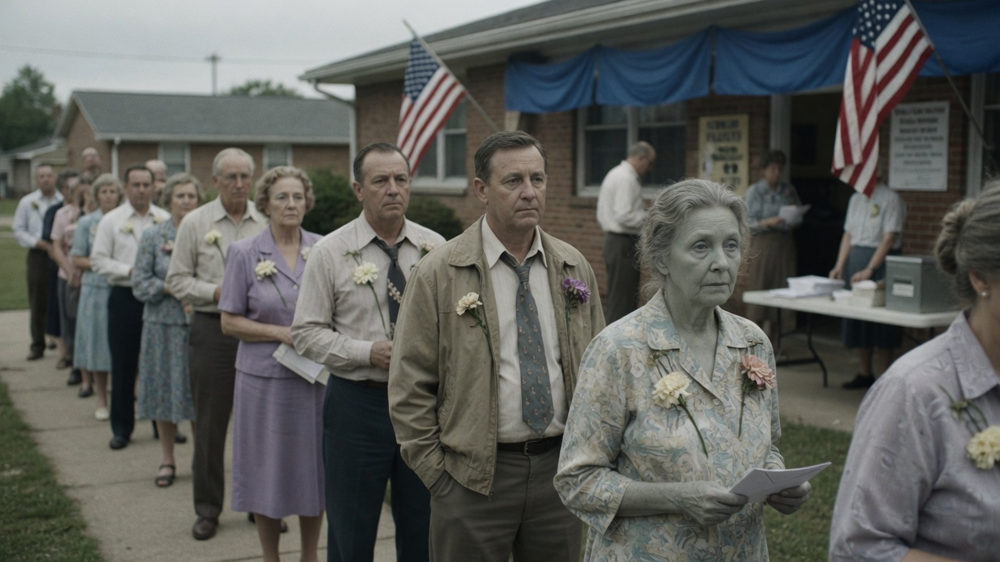
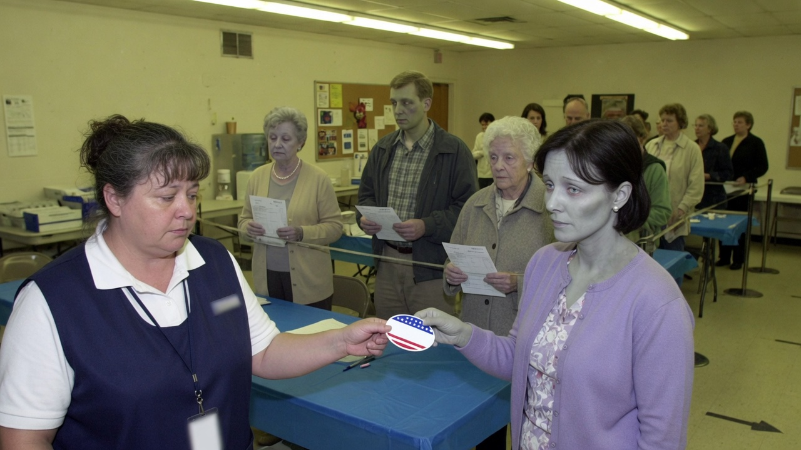
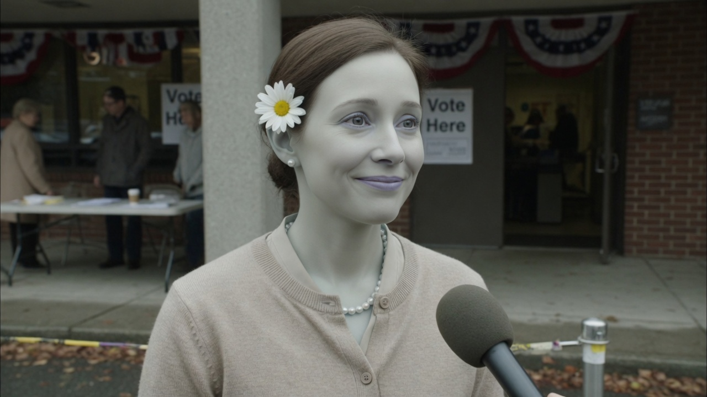
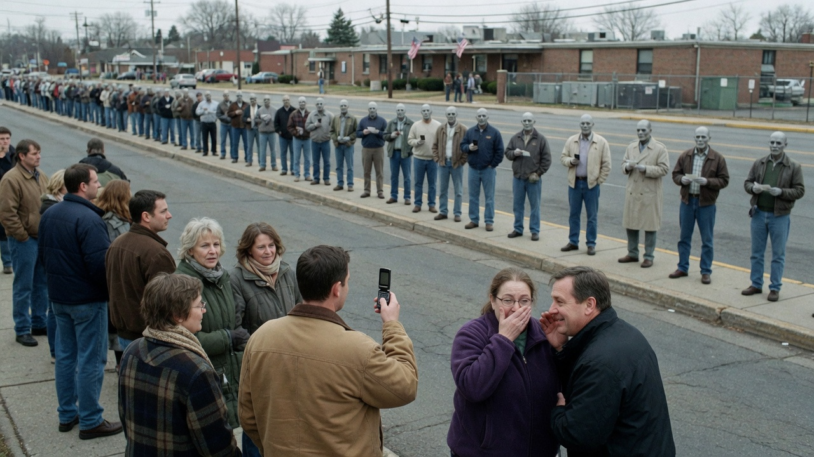

HARROW COUNTY — Turnout in Saturday’s special election for Senate was, by the county clerk’s own arithmetic, extraordinary. The Democrat polling center on Mill Street had a line around the brick grange hall before the doors opened, and it did not thin out so much as **shuffle**. Officials called it the best morning the party has had this cycle. The coroner called it a scheduling conflict.

Of **1,140** ballots accepted by noon, county records list **1,028** voters whose most recent public appointment was a viewing.

> “If they can stand in line, they can stand for democracy,” said precinct captain **Pam Ortega**, peeling a sticker for a woman whose pulse she described as “aspirational.” “We are not in the business of disenfranchising people over a technicality like circulation.”

### The line that would not warm up

Blue bunting hung over the door. The queue was quieter than a typical primary: paper ballots and wilted boutonnieres. A sample ballot at the front asked voters to choose **Commie McCommie** or **Hank Plainworth**. Most of the line had already chosen. Several had chosen with their foreheads.

Inside, the table ran like a funeral home that had added a ballot box. One man signed the table instead of the poll book. It was counted as a matching signature “in spirit.”

The McCommie campaign had staffed a folding table labeled voter translation, which is not a county office. Spokesman **Reed Mallory** said the service was “linguistic access for constituents whose first language is now a vowel they have misplaced.”

### Interviews, briefly available

Agent News spoke with voters who described themselves as recently deceased and still particular about their cardigans. Each was asked the same question: what do you like about Commie McCommie?

**Doris Pell**, pearls, daisy, time of death Thursday, said she had left her own visitation early “because the special was special.”

**Agent News:** What do you like about Commie McCommie for Senate?

**Doris Pell:** “dnraaaaaaaarrrrr.”

**Ned Alvarez**, two places behind her, still wearing a funeral-home wristband as if it were a watch:

**Ned Alvarez:** “Dnraaaaaaaarrrrr.”

**June Cho**, who apologized for being “a little stiff — it’s the new shoes, and also everything else”:

**June Cho:** “dnraaaaaaaarrrrr.”

Mallory provided the transcript the campaign will send to its own press list.

> “That’s a full endorsement,” he said. “Public option, debt jubilee, and seizing the means, in that order. The extra R’s are the infrastructure piece. You can hear the bridge funding if you lean in.”

Asked about Plainworth, Pell repeated the sentence, longer. Mallory called it “a detailed contrast memo.”

### Across the street, the living take video

Neighbors gathered on the opposite sidewalk and filmed the line the way people film weather. A few in the line filmed them back, slowly.

> “I thought the special was next week,” said **Connie Briggs**, who lives over the hardware store. “They thought the special was a meal. Everybody’s voting. I’m not sure everybody’s invited to the same century.”

Briggs said she would vote later, “when the line remembers how doors work.”

### Canvass, with closed captions

By midafternoon the clerk’s office had upgraded the morning from “brisk” to “historic” and stopped taking questions about whether a voter has to finish dying before finishing a ballot. McCommie’s campaign said the candidate would appear at the canvass “if the venue allows open caskets and closed captions.”

Plainworth’s camp said he was “grateful for every living vote” and declined to say whether he had shaken any hands he could not let go of afterward.

As of press time the Mill Street line had advanced four feet. Ortega called that momentum. A carnation lay on the sidewalk where someone had been standing. Nobody in the queue looked down. They were, Mallory said, “focused on the issues.”
